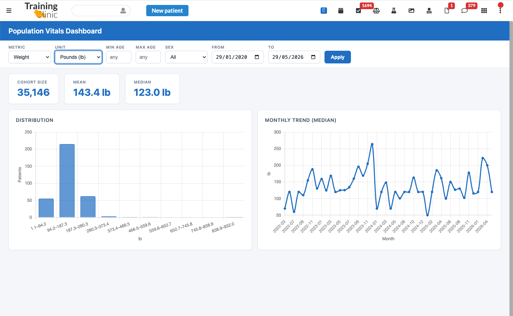

# Population Vitals Dashboard

A global staff dashboard for exploring aggregate vital-sign statistics across the patient population.

## What it does

Staff open **Population Vitals** from the Canvas app drawer. A full-page dashboard lets them pick a
vital-sign metric and a cohort (by age, sex, and date range) and immediately see summary statistics
(cohort size, mean, median), a distribution histogram, and a monthly trend line for that cohort —
without opening a single patient chart.

## Problem it solves

Today, understanding how a vital sign is distributed across a population means opening charts one
patient at a time and tallying values by hand — slow, error-prone, and impractical beyond a handful
of patients. There is no built-in way to ask "what does weight look like across my 30–35 year-old
patients over the last year?" This plugin answers that question in seconds, on demand, with
population-level aggregates instead of manual chart review.

## Who it's for

Clinical and operational staff doing population-health work — care managers, quality/operations
leads, and clinicians who need a cohort-level view rather than an individual chart. It is a
global (non-patient-specific) tool, so it is not tied to any single patient encounter.

## Supported metrics (v1)

- Weight
- BMI
- Height
- Blood pressure systolic (read from `ObservationComponent`, not the combined string)
- Blood pressure diastolic (read from `ObservationComponent`, not the combined string)

## Cohort filters

- Age range (min/max years → `birth_date` bounds)
- Sex at birth (F / M / O / UNK / All)
- Observation date window (default: last 12 months)

## Unit conversion

Canvas stores weight in ounces and height in inches. When the selected metric is weight or height, a
**Unit** dropdown appears:

- Weight: **Pounds (lb)** (default) or **Kilograms (kg)**
- Height: **Centimeters (cm)** (default) or **Feet + inches**

Conversion happens entirely client-side and updates every figure (summary mean/median, histogram
axis, and trend line) instantly — no server round-trip. The server always returns values in the
stored base unit; this is mathematically valid because mean, median, percentile, and histogram bin
edges all scale linearly. BMI and blood pressure have no conversion.

## How to install

1. Install the plugin with the Canvas CLI:
   ```
   canvas install population_vitals_dashboard
   ```
2. (Optional) Set the `MIN_COHORT_SIZE` secret on the plugin configuration page.
3. Open the Canvas app drawer and click **Population Vitals**.

The plugin works against any clean Canvas instance — it has no dependency on customer-specific data
or configuration.

## Configuration options

| Secret | Required | Default | Description |
|---|---|---|---|
| `MIN_COHORT_SIZE` | No | `11` | Minimum cohort size below which statistics are suppressed (PHI guardrail). Fails closed (falls back to `11`) if set to a non-integer or a value `< 1`. |

No code changes are required to adjust this threshold.

## Screenshots



## PHI guardrails

- **Small-cohort suppression**: if the filtered cohort falls below `MIN_COHORT_SIZE` (default 11),
  the stats endpoint returns a warning and **no statistics**. This prevents re-identification from
  small groups.
- Aggregates only — no per-patient rows or identifiers ever leave the server.
- No PHI is logged.
- Staff-only access, enforced by `StaffSessionAuthMixin` (fails closed for non-staff sessions).

## Architecture

- `PopulationDashboardApp` (`Application`, global scope) — app drawer entry that returns a
  `LaunchModalEffect` targeting the full page.
- `DashboardAPI` (`StaffSessionAuthMixin, SimpleAPI`) — serves the HTML shell, static assets,
  and the `/app/stats` JSON endpoint.
- `vitals_aggregation.py` — pure data/aggregation layer (DB queries, caching, cohort logic).

## v1 roadmap / out of scope

The following items are intentionally deferred to a future version:

- **Lab observations** — requires a curated LOINC code list and unit normalisation.
- **Active-condition cohort filter** — e.g., restrict to patients with a diabetes diagnosis.
- **Scatter / per-patient data points** — currently out of scope for PHI reasons.
- **Nightly precomputed snapshots via `CronTask`** — the current live-aggregation approach is
  sufficient for most instance sizes; a `CronTask` is the scale-out path if needed.

## License

MIT — see [LICENSE](../LICENSE).
