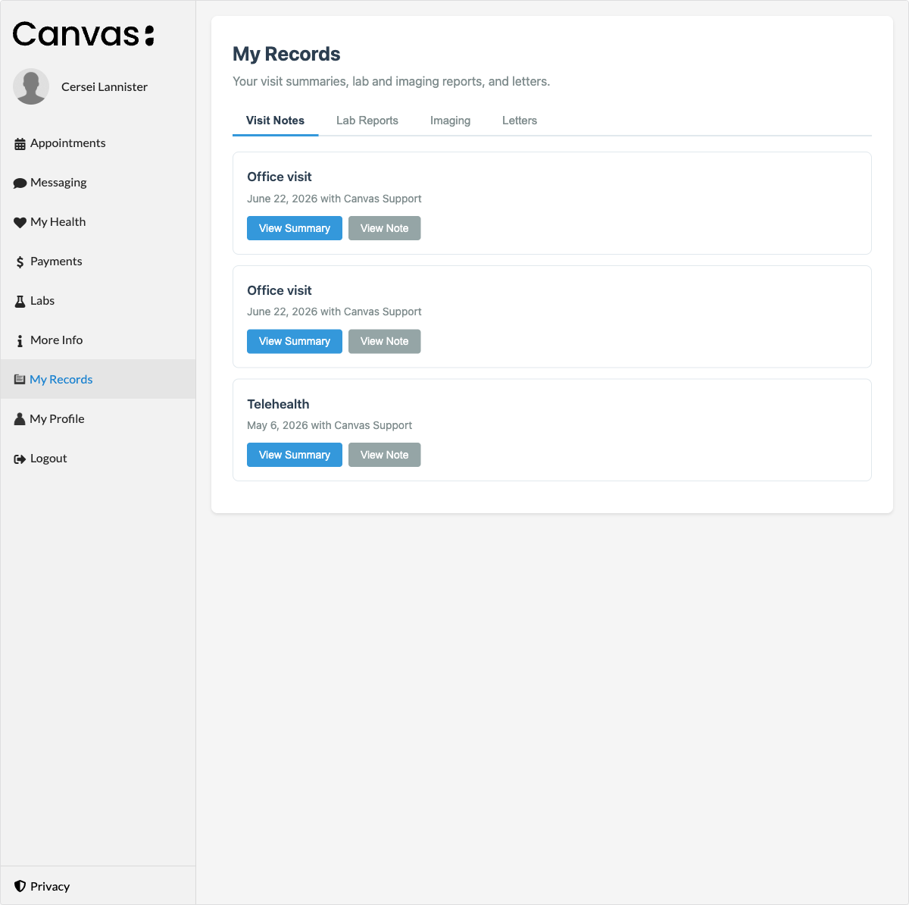
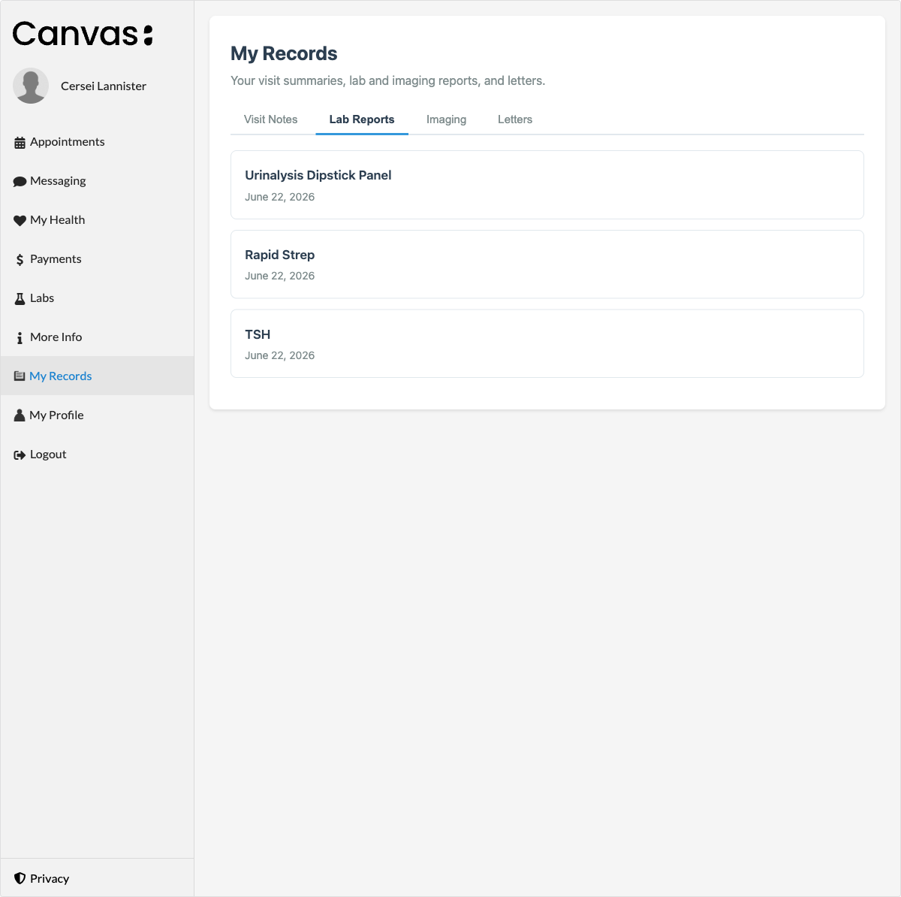
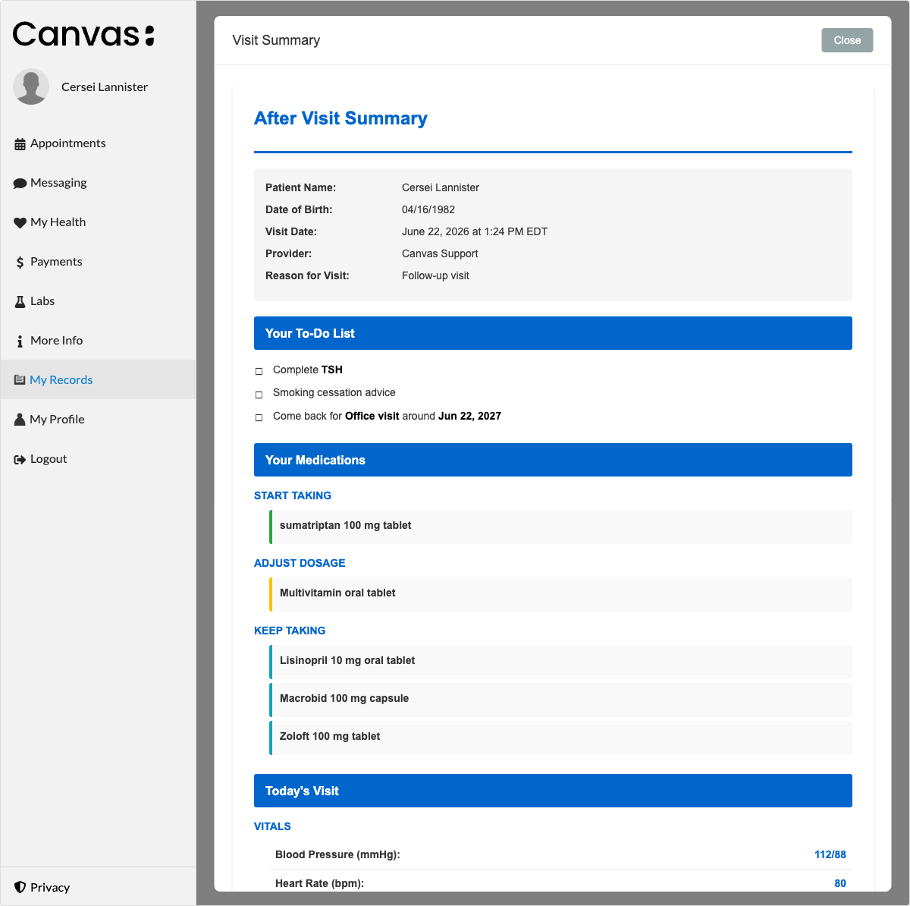
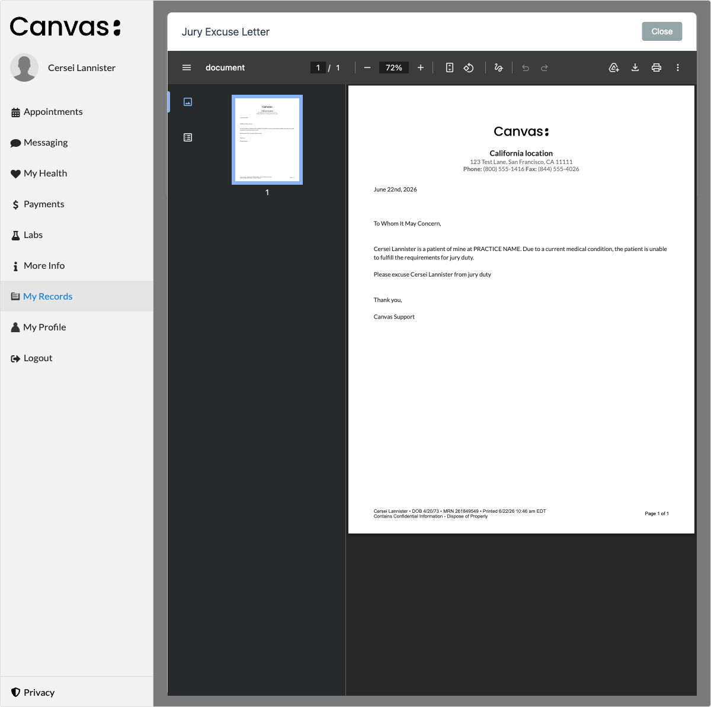
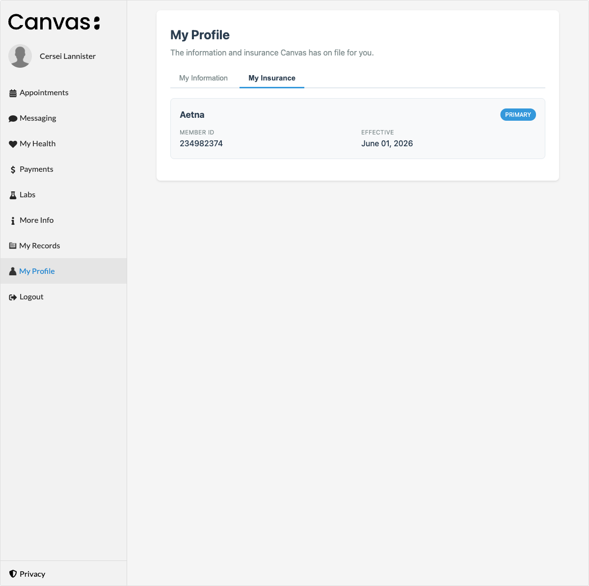

portal-content
==============

A consolidated patient-portal experience for Canvas. Adds two portal menu items
that give patients a single, organized place to see their records and the
profile information on file.

## What it does

- **My Records** - tabbed: Visit Notes (After Visit Summary plus the original
  note PDF), Lab Reports, Imaging, and Letters.
- **My Profile** - tabbed: My Information (demographics, care team, preferred
  pharmacy) and My Insurance (active coverage).
- Optional review-gating: when enabled, lab and imaging results that are waiting
  on a provider review are held back from the portal until the review is done.

## Problem it solves

Out of the box, a patient's results, visit documents, and coverage are spread
across separate portal sections, and unreviewed results can surface before a
provider has signed off on them. This plugin pulls visit summaries, labs,
imaging, letters, demographics, and insurance into two coherent menu items, and
gives the practice a switch to withhold results that are still waiting on
review.

## Who it's for

Practices that want a cleaner, consolidated patient-portal record view, and that
want control over whether results appear before a clinician has reviewed them.
It is generic - it reads standard Canvas data and works against any instance.

## Before enabling: disable the native portal Labs/Health sections

This plugin provides its own consolidated **My Records** (visit summaries, labs,
imaging, letters). To avoid showing patients duplicate, side-by-side lab/result
views, the practice should **disable the built-in patient-portal Labs / Health
result sections in admin** when this plugin is in use. That toggle isn't
self-serve - **reach out to Canvas support** to have the native portal
lab/result display turned off for the instance.

## How to install

```
canvas install portal-content
```

Then set the configuration values below (`--variable` / `--secret`, or in the
plugin's settings) for the surfaces you want enabled.

## Configuration options

Manifest `variables`:

- `NOTE_TYPES` (required for Visit Notes): comma-separated `note_type_version.code`
  values (SNOMED codes) eligible for an After Visit Summary. Fail-closed - unset
  means no visit notes are shown.
- `CLIENT_ID` / `CLIENT_SECRET` (sensitive; required for any document PDF): a
  Canvas API client used to stream document content via FHIR.
- `ENABLED_COMPONENTS` (optional): subset of `visits,labs,imaging,letters`.
  Unset = all enabled.
- `HOLD_UNREVIEWED_RESULTS` (optional; `true`/`false`, default false): when true,
  the portal hides only results that are *waiting on* a provider review - the
  result requires review (`review_mode == "RR"`) but none has happened yet.
  Results that don't require review (`review_mode == "RN"`) and reviewed results
  are shown as normal. Labs are gated precisely (FHIR doc ->
  `DiagnosticReport.lab`); imaging is gated conservatively by result date against
  an `ImagingReport` that is itself waiting on review (the FHIR imaging document
  has no direct SDK review link).

## Screenshots

| Surface | Screenshot |
|---|---|
| My Records - Visit Notes |  |
| My Records - Lab Reports |  |
| After Visit Summary |  |
| Document viewer (PDF) |  |
| My Profile - Insurance |  |

## Data sources

| Surface | Source |
|---|---|
| Visit list, After Visit Summary | SDK data models (`Note`, `Command`, `LabOrder`, `Medication`, `Appointment`) |
| My Information / My Insurance | SDK data models (`Patient`, `CareTeamMembership`, `Coverage`) |
| Lab / Imaging / Letter docs + visit "View Note" PDF | FHIR API |

Lab and imaging reports are exposed by the FHIR API as `DocumentReference`s
(rendered PDFs); they are not in the SDK data tables. Document PDFs are streamed
through the plugin's own `/document` endpoint rather than presigned S3 URLs,
which require media credentials an instance may not have. Ownership is enforced
by a patient-scoped FHIR token plus a subject check.

## Architecture

- `applications/` - the two `portal_menu_item` apps; each `LaunchModalEffect`s
  its page.
- `handlers/portal_api.py` - `SimpleAPI` (`PatientSessionAuthMixin`) serving the
  pages and patient-scoped JSON/PDF endpoints.
- `content_types/` - data per surface (visits, documents, coverage, demographics,
  review-gating).
- `services/` - After Visit Summary extraction + rendering.
- `shared/` - config + the FHIR document client.
- `templates/` - the portal pages and the AVS template.

## Running tests

```
uv run pytest tests/
```

Behavior-asserting; SDK querysets and the FHIR client are mocked.
