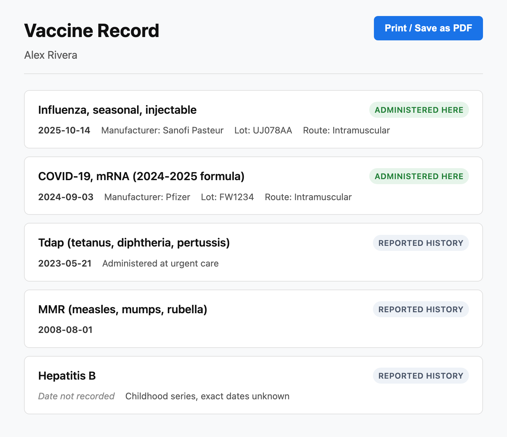

portal-vaccine-card
===================

## What it does

Adds a **My Vaccines** menu item to the Canvas patient portal. When a logged-in
patient opens it, the plugin renders a read-only, printable page listing their
complete immunization history — vaccines administered at the practice *and*
historical records reported from elsewhere — merged into one chronological view
(newest first). A **Print / Save as PDF** button produces a clean one-page
vaccine card straight from the browser.



## Problem it solves

Canvas's patient portal "My Health" section doesn't surface immunizations.
Patients routinely need a copy of their vaccine record — for school enrollment,
travel, employment, camp, or new-provider intake — and today have no
self-service way to see or print it. They call the practice and staff retrieve
and send it manually. This plugin gives patients self-serve access to their own
immunization record, with no staff intervention.

v1 is read-only; there is no data entry, ordering, or write-back.

## Who it's for

- **Practices** that want to reduce inbound "can you send me my vaccine record?"
  requests from their patient population.
- **Patients** using the Canvas patient portal who need to view or print their
  immunization history.
- **All specialties** — immunization records are universal patient data.

## How to install

```
canvas install portal-vaccine-card
```

No secrets, environment variables, or post-install configuration are required.
Once installed, every logged-in patient sees a **My Vaccines** entry in the
portal menu.

## Configuration options

None. This plugin has no secrets, settings, or thresholds — it works out of the
box with no per-instance configuration. The data shown is the logged-in
patient's own immunization record, read directly from Canvas.

## How it works

- `VaccineCardApplication` (scope `portal_menu_item`) handles
  `Application.on_open` and returns a `LaunchModalEffect` targeting `PAGE`. The
  iframed URL points to this plugin's own SimpleAPI endpoint.
- `VaccineCardWebApp` is a `SimpleAPI` protected by `PatientSessionAuthMixin`, so
  only logged-in patients can reach it. The patient is resolved **only** from the
  `canvas-logged-in-user-id` session header — never from a client-supplied id.
  It serves:
  - `GET /app/card` — server-rendered HTML for the currently authenticated
    patient.
  - `GET /app/main.js`, `GET /app/styles.css` — the static assets the page
    references.
- Immunizations are read from two SDK models and merged:
  - `Immunization` (administered here) — filtered to `deleted=False` and
    `status="completed"`, tagged **Administered here**.
  - `ImmunizationStatement` (reported history) — filtered to `deleted=False`,
    tagged **Reported history**.
  - Both queries use `prefetch_related` on their codings, so resolving the
    vaccine display name doesn't trigger per-row queries (no N+1).
- Rows are sorted newest-first; records without a date sort last. Manufacturer,
  lot number, route, and comments are shown only when present (no "None"
  strings).

## Layout

```
portal_vaccine_card/
├── CANVAS_MANIFEST.json
├── applications/
│   └── vaccine_card_application.py  # VaccineCardApplication (portal_menu_item)
├── handlers/
│   └── vaccine_card_web_app.py      # VaccineCardWebApp (SimpleAPI)
├── assets/
│   ├── icon.png                     # menu-item icon
│   ├── vaccine-card-icon.svg        # icon source
│   └── screenshot-my-vaccines.png   # README screenshot
└── static/
    ├── index.html                   # Django template rendered server-side
    ├── styles.css                   # includes a print stylesheet
    └── main.js                      # wires the Print button to window.print()
```
