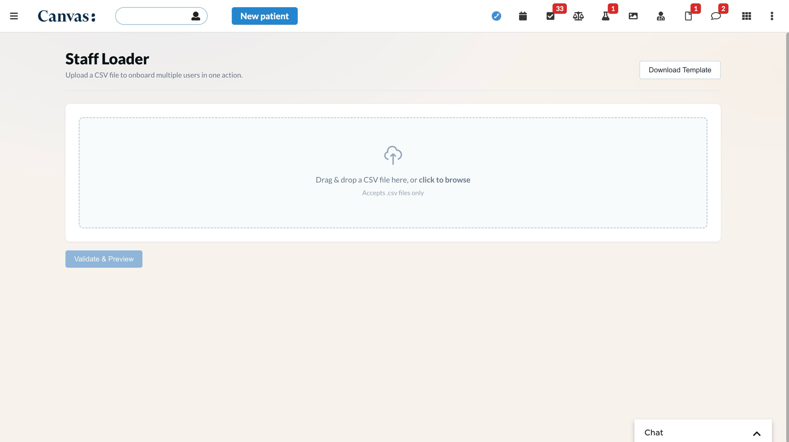
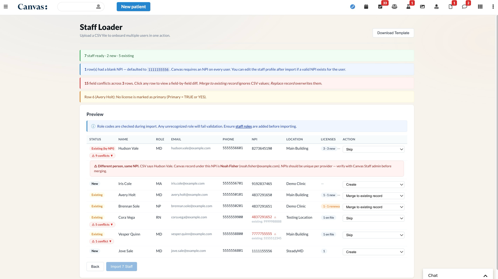
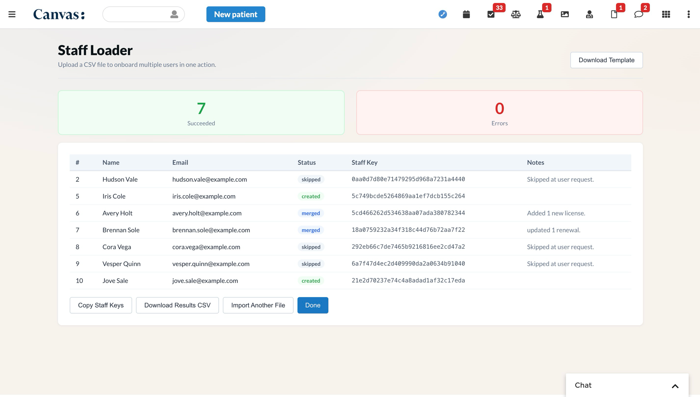

# Practitioner Bulk Loader

## What it does

Lets staff admins onboard multiple practitioners to Canvas at once via a single CSV upload. The plugin validates each row, detects duplicates against Canvas's existing Staff records, shows a preview table where the admin picks a per-row action (create, merge, replace, skip, etc.), and then creates or merges Practitioner FHIR resources in bulk. Results include staff keys, copy-to-clipboard, and a downloadable results CSV.

## Problem it solves

Onboarding practitioners one at a time through Canvas's Staff admin UI is fine for a handful of providers but doesn't scale. A clinic adding 50 nurses, a multi-state telehealth group with 200 providers each holding licenses in 20+ states, or a credentialing team importing a quarterly roster from Modio — all need a way to push the data in once, see what'll happen before committing, and resolve duplicates safely. The manual workaround (Staff admin UI, one provider at a time, then per-provider license entry) takes hours per batch and silently produces duplicates when the same person appears in two source systems with slightly different emails or names.

## Who it's for

Staff admins running practitioner onboarding workflows — typically credentialing leads, operations managers, or implementation engineers loading data from another EHR / staffing platform into Canvas. Particularly useful for organizations with multi-state licensure (large state license counts per provider), high-turnover staffing models, or recurring quarterly imports.

## Features

- Drag-and-drop or click-to-browse CSV upload (`.csv` only).
- Downloadable CSV template (21-column schema with multi-license example rows).
- Server-side validation with per-row error and warning reporting.
- Location name resolution against Canvas FHIR `Location` resources.
- Multi-tier duplicate detection against Canvas's Staff table: email → real NPI → name+DOB, with a name-only "possible duplicate" badge for weaker matches.
- Per-row action dropdown:
  - **New rows**: Create (default) or Skip.
  - **Existing rows** (matched by email, NPI, or name+DOB): one of five actions, defaulting to Skip when the row has a field conflict and Merge otherwise.

| Action | What it does on import |
|---|---|
| **Skip** | Row is left alone. Used to dismiss a possible-duplicate or to defer a row for manual handling. |
| **Merge to existing record** | Adds new licenses to the existing Practitioner and updates renewals (matching by license type + number). Demographics, address, phone, and NPI are left as Canvas has them — CSV values are not applied. |
| **Replace record** | Overwrites the existing Practitioner's name, DOB, phone, fax, NPI, **and** address with CSV values; also runs the same license merge. Email is never written (FHIR rejects email changes on PUT). |
| **Replace address only** | Overwrites the existing primary address with the CSV address; leaves name, DOB, phone, fax, and NPI alone. Licenses still merge in. |
| **Add address as additional** | Appends the CSV address as a new entry in the practitioner's address list; existing primary stays untouched. Useful for satellite-clinic addresses. |

License merge behaviour is shared across all four merge variants: an incoming license is treated as a **renewal** (date update only) when it matches an existing qualification on canonicalised license type plus license number; otherwise it's appended as a **new** license. On any merge that touches the address path, address fields the CSV is blank on are preserved from the existing record (Line 2 / apartment numbers, custom extensions, etc.).
- Progress indicator during bulk creation.
- Results table with status (Created / Merged / Skipped / Error), staff key, and notes.
- **Copy Staff Keys** button and **Download Results CSV** button.

## Trigger

Launched manually by staff admins from the Canvas app drawer. No patient context required.

## Secrets (Required)

| Secret Key | Description |
|---|---|
| `fumage-client-id` | OAuth2 client ID registered with Canvas for this plugin (client-credentials grant) |
| `fumage-client-secret` | OAuth2 client secret |

The Canvas instance host is derived automatically from `CUSTOMER_IDENTIFIER`, so no `fumage-host` secret is needed. Set the two values above on the plugin configuration page in Canvas after installing.

## Post-Import Manual Steps

Certain Staff fields are not writable via FHIR and must be set in the Canvas admin UI after bulk import:

- **Default supervising provider** — shown on the Staff admin page. Open each new Staff record and set this field manually. This field is not exposed on the FHIR `Practitioner` resource.

## CSV Schema

### Required Columns

| Column Header | Validation Rule |
|---|---|
| First Name | Non-empty string |
| Last Name | Non-empty string |
| Role | Must match a configured Staff Role internal code in this Canvas environment (case-insensitive). [Docs](https://canvas-medical.help.usepylon.com/articles/6649603926-staff-roles). |
| Email | Valid email (RFC 5322 pattern) |
| Phone | Digits only |
| DOB | `MM-DD-YYYY` (e.g. `03-15-1980`), valid calendar date. Slashes (`MM/DD/YYYY`) and ISO (`YYYY-MM-DD`) are also accepted. |
| Primary Practice Location | Free text. **Must match a configured Practice Location** in Canvas (hard error if not configured, and hard error if blank). |

### Optional Columns

| Column Header | Validation Rule |
|---|---|
| Fax | Digits only |
| NPI | Exactly 10 digits. Blank values are auto-filled with the placeholder `1111155556`. |
| Address Line 1 | Free text |
| Address Line 2 | Free text |
| City | Free text |
| State | Valid 2-letter US state code. Canvas's full license-state set: 50 states + DC + US territories (AS, GU, MP, PR, VI) + freely associated states (FM, MH, PW) — 59 codes. |
| Zip | Exactly 5 digits |
| License Type | One of: `CLIA`, `DEA`, `PTAN`, `STATE`, `TAXONOMY`, `OTHER`, `SPI` (case-insensitive). The legacy alias `State license` is also accepted and normalised to `STATE`. **Note:** Canvas's API currently stores `OTHER` and `SPI` as the generic label `License` regardless of casing — the qualification still gets created, just without the more specific type label. `CLIA`, `DEA`, `PTAN`, `STATE`, and `TAXONOMY` round-trip correctly. |
| License Name | Free text. **Required when License Type = Other.** |
| License State | Valid 2-letter US state code. **Required when License Type = State license or PTAN.** |
| License Number | Free text |
| License Issue Date | `MM-DD-YYYY`, valid date. Slashes and ISO also accepted. |
| License Expiration Date | `MM-DD-YYYY`, valid date. Slashes and ISO also accepted. |
| Primary | `TRUE` / `YES` (primary) or `FALSE` / `NO` / blank (not primary). Case-insensitive. The legacy header `License Primary` is also accepted. |

### Multi-License Support

One practitioner can have multiple licenses. Use multiple CSV rows per practitioner — one row per license. The first row for a practitioner defines all demographic fields; subsequent rows need only the license columns.

Two equivalent ways to indicate a continuation row:

1. **Leave Email blank** (recommended). The loader forward-fills the email from the most recent row above that had one, so rows 2..N of a multi-license practitioner can leave every demographic column empty.
2. **Repeat the Email**. If demographics are also repeated and all values match the first row, the row is attached to the same practitioner group with no warning. If any demographic value differs, a warning is emitted and the first-row value wins.

Role codes (MD, RN, NP, etc.) are validated by Canvas when each practitioner is created — not during CSV validation. A role that isn't configured in your Canvas environment will cause that row to fail on import with a clear error in the results table.

## API Endpoints

All endpoints require an authenticated Canvas staff session.

| Method | Path | Description |
|---|---|---|
| `GET` | `/plugin-io/api/practitioner_bulk_loader/bulk-upload/template.csv` | Download the CSV template |
| `POST` | `/plugin-io/api/practitioner_bulk_loader/bulk-upload/parse-and-validate` | Parse, validate, and detect duplicates |
| `POST` | `/plugin-io/api/practitioner_bulk_loader/bulk-upload/create-practitioners` | Execute creates/merges/skips |

## Installation

```bash
uv run canvas install practitioner_bulk_loader --host <target-instance>
```

After installation, open the plugin configuration page in Canvas and set the two secrets listed in [Configuration options](#configuration-options) below.

## Configuration options

| Secret | Required | What it's for |
|---|---|---|
| `fumage-client-id` | Yes | OAuth2 client ID for a Canvas plugin with read+write access to `Practitioner` and read access to `Location`. Generated in Canvas admin → API → Client Applications. |
| `fumage-client-secret` | Yes | Paired secret for the client above. |

The Canvas instance host is derived automatically from the `CUSTOMER_IDENTIFIER` environment variable Canvas provides to every plugin, so no per-environment host configuration is needed.

Behavioral defaults (not currently configurable without code changes):
- **Placeholder NPI** — `1111155556` is substituted for blank CSV NPI cells. Canvas requires an NPI on every Staff record; the placeholder is a recognizable sentinel meaning "no NPI on file" and is excluded from duplicate-detection indexing.
- **Default country** — `"US"` is applied when a CSV row supplies any address fields but no Country column (the CSV schema doesn't carry Country).
- **Continuation rows** — rows with blank Email are treated as continuation rows of the preceding practitioner *only* when First Name and Last Name are also blank. Rows with names but a missing email hard-error (Email required) rather than silently attaching to a prior row.

## Screenshots

**1. Upload screen** — drag-and-drop or click-to-browse CSV upload, with a Download Template button.



**2. Preview screen** — after validation. Banners across the top summarise the batch ("7 staff ready · 2 new · 5 existing"), the placeholder-NPI defaulting, field-conflict counts across rows, and any soft warnings. Each row shows status (New / Existing / Existing by NPI), name, role, email, phone, NPI (with red ⚠ and "existing: …" beneath when there's a real-vs-real NPI mismatch), location, license summary ("3 · 3 new", "1 · 1 renewal", "1 on file"), and an Action dropdown defaulting to a safe value. NPI-tier matches surface a full-width warning row explaining the same-NPI-different-person case so the admin can verify before merging.



**3. Results screen** — after Import. Counts up top, then a per-row table with status (created / merged / skipped / error), the resulting Canvas staff key, and notes describing what happened ("Added 1 new license.", "updated 1 renewal.", "Skipped at user request."). Buttons for Copy Staff Keys (clipboard) and Download Results CSV.



## Testing

```bash
cd practitioner-bulk-loader
uv run pytest
uv run mypy .
```
