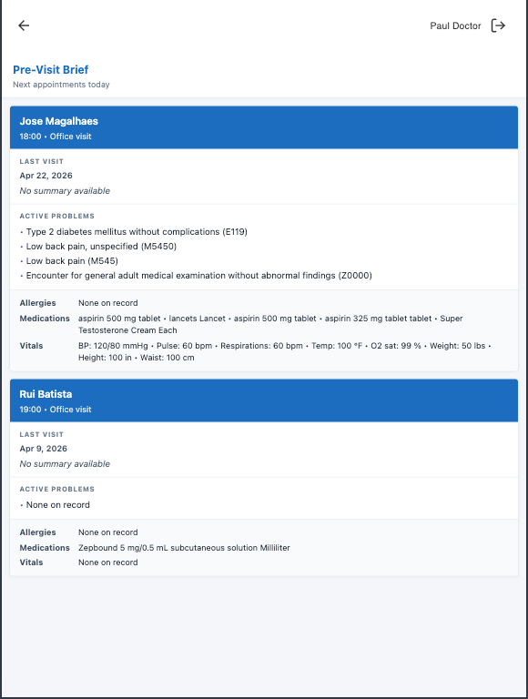

# Pre-Visit Brief

A global provider companion app that surfaces a concise pre-visit snapshot for the logged-in provider's next 1–3 appointments today.

## What it does

When a provider opens the Pre-Visit Brief from the companion launcher, a modal opens showing stacked prep cards — one per upcoming appointment (up to 3), ordered by start time. Each card contains:

- **Patient name** (deep-links to the patient's companion chart; tapping closes the brief and navigates the companion shell)
- **Appointment time and type**
- **Last visit** — date and HPI / reason-for-visit snippet from the most recent encounter note
- **Active problems** — conditions marked as `active` and not entered in error
- **Allergies** — active allergy intolerances not entered in error
- **Medications** — active medications not entered in error
- **Vitals** — the most recent reading per vital sign (BP, pulse, respirations, temperature, O₂ sat, weight, height, etc.), in clinical display order. Weight is converted from oz to lbs.

If a section has no data it renders a muted "None on record" rather than hiding the section. Cancelled and no-show appointments are excluded. If no appointments remain today, the modal shows "No upcoming appointments today."

## Problem it solves

Providers in back-to-back clinic days need a quick mental picture of who is arriving next without opening each chart. The native companion offers the schedule and the task list separately, but not a single clinical-glance view of the next few patients. Today the manual workaround is to open each patient's chart in advance, scroll past prior notes for HPI, then jump to the problem list, allergies, medications, and vitals tabs — a 30–60 second context switch per patient that compounds when running behind. Pre-Visit Brief collapses that into one screen that the provider opens once between visits.

## Who it's for

- **Primary care and specialty providers** seeing scheduled patients back-to-back in clinic
- Anyone who logs in as a **provider on the appointment record** — the brief surfaces only the calling provider's schedule, so non-providers (front desk, billing) will see an empty list
- Workflows where the **provider companion** is the daily driver (phones, tablets) rather than the desktop EMR

## How to install

```bash
canvas install pre_visit_brief
```

After install, the app appears as **Pre-Visit Brief** in the provider companion launcher at `/companion/`. No additional configuration is required.

## Configuration

- **Secrets:** none required.
- **Settings / thresholds:** none. The display cap (3 patients), section list, and vital-sign ordering are constants in the handler (`_VITAL_ORDER`, `_VITAL_LABELS` in `handlers/brief_api.py`).
- **Timezone:** the browser computes the local-timezone day window and sends ISO-8601 `start` and `end` query parameters to the server. The brief is always relative to the provider's local clock; no server-side timezone configuration is needed.

## Screenshots



## Architecture

| Component | Class | Role |
|---|---|---|
| Application | `PreVisitBriefApp` | Opens the modal from the companion launcher |
| SimpleAPI | `BriefAPI` | Serves the HTML shell, static assets, and JSON data |

All clinical data (conditions, allergies, medications, observations) is fetched in a single bulk query per model (`patient_id__in`) to avoid N+1 queries. The latest encounter note per patient is fetched with one targeted query per appointment (bounded to ≤3 by the appointment slice) so the brief doesn't drag the full chart history across the wire.

## Refreshing data

Close and reopen the modal. Each open triggers a fresh data fetch with the current day window.
