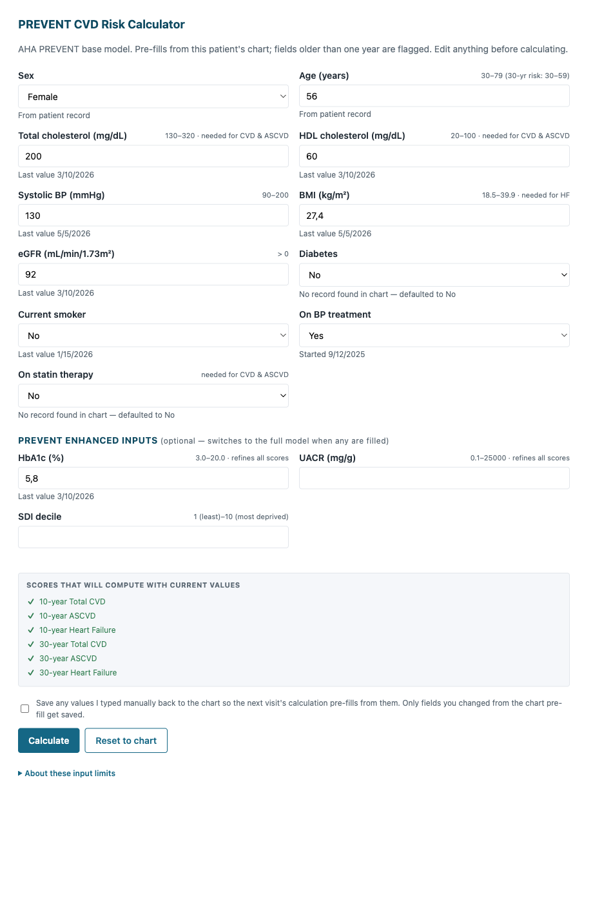
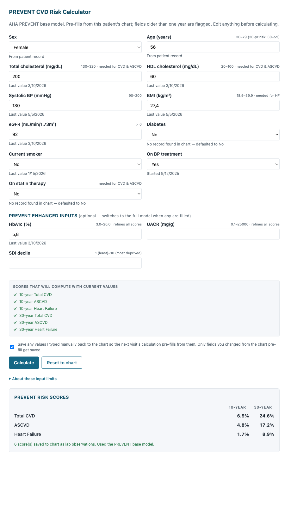

# prevent_calculator

Canvas plugin that embeds the AHA PREVENT cardiovascular-risk calculator
directly in the patient chart.

## What it does

Adds a **PREVENT CVD Score** action button to the chart conditions /
problem-list section. Clicking the button opens a modal pre-filled with
the latest patient values from the chart (TC, HDL, SBP, BMI derived from
height + weight, eGFR, diabetes, tobacco status, BP-treatment and statin
medications, plus optional HbA1c / UACR / SDI). The clinician edits as
needed, clicks **Calculate**, and sees the six AHA PREVENT risk
percentages (10-year and 30-year for Total CVD, ASCVD, and Heart Failure).
All six computed scores are written back to the chart as Observations
with the published LOINC codes.

The plugin supports both the AHA PREVENT **base model** and the **full
model** (UACR / HbA1c / SDI extension) — supplying any of the three
enhanced inputs flips the calculator into the full model, with missing
predictors handled via the published `*_missing` indicators.

## Problem it solves

PREVENT is the AHA's 2024-published replacement for the Pooled Cohort
Equations (PCE). Clinicians currently leave the chart, type the patient's
values into the [AHA online calculator](https://professional.heart.org/en/guidelines-and-statements/prevent-calculator),
copy the result back, and then manually attach it to the patient record.
That workflow:

- breaks the visit's chart context,
- re-types values that already live in the patient's labs / vitals,
- doesn't persist the result as a discrete observation that downstream
  CQMs or longitudinal trending can consume.

This plugin keeps the calculation in-chart, pre-fills from existing
observations (height + weight → BMI; LOINC-coded labs; SNOMED tobacco
status; active medications for BP-treatment and statin flags), and
emits each computed risk as a labeled `laboratory` Observation that
shows in the patient's chart for future visits.

## Who it's for

- **Primary clinical users** — primary-care physicians, internal
  medicine, cardiology, nephrology, endocrinology, and nurse
  practitioners running cardiovascular risk screening on adults aged
  30-79.
- **Care managers and population-health teams** — anyone reviewing a
  patient panel for CVD-risk stratification needs the six PREVENT
  percentages as discrete chart observations to drive cohorting and
  outreach.
- **Read-only context** — anyone reviewing the chart later sees the
  saved PREVENT scores in the labs section alongside the source
  observations they were computed from.

## How to install

```
canvas install ./prevent_calculator --host <your-canvas-host>
```

The plugin loads three handlers:

- `PreventCalculatorButton` — the chart conditions / Plugins-tab
  action button
- `PreventCalculatorAPI` — the SimpleAPI route that renders the
  modal and computes / saves scores
- `PreventCalculatorApp` — the patient-specific application entry
  in the Plugins tab

No post-install configuration is required for the base model.

## Configuration options

The plugin reads chart data and emits Observation effects; it does
not require any external API keys or secrets to function. The manifest
declares the following access:

| Surface | Reads | Writes |
| --- | --- | --- |
| `PreventCalculatorAPI` | `Patient`, `Observation`, `Condition`, `Medication`, `InterviewQuestionResponse`, `Note` | `Observation` |
| `PreventCalculatorButton` | (none — renders only) | (none) |

Optional clinical-input behaviour:

| Setting | Behaviour |
| --- | --- |
| **HbA1c / UACR / SDI inputs** | Optional. Leaving them blank runs the AHA PREVENT base model. Supplying any one flips to the full model; missing predictors use the published `*_missing` indicators. |
| **Save to chart** checkbox | Off by default. When ticked, only fields the clinician edited from the chart pre-fill are persisted as new Observations. Systolic BP is saved as a Canvas-native `blood_pressure` panel (LOINC 85354-9, composite `systolic/diastolic` value), not a standalone systolic row. |

The plugin doesn't need any environment variables, secrets, or external
service credentials.

## Screenshots

**Pre-fill state** — the modal opens with the latest chart values
filled in and a live preview of which scores will compute:



**Results state** — after clicking **Calculate**, the six PREVENT
risk percentages render alongside a confirmation that the scores
were saved to the chart as `laboratory` Observations:



## Source

The risk equations are a line-for-line port of the [AHAprevent
v1.0.0](https://github.com/AHA-DS-Analytics/PREVENT) R package
(GPL-3, DOI 10.1161/CIRCULATIONAHA.123.067626). Both the **base** and
**full** model coefficients are unchanged from the published reference
implementation; the full model uses the YAML republication by
[demetra-health/pyAHAPrevent](https://github.com/demetra-health/pyAHAPrevent)
which round-trips the official R-package binary `sysdata.rda`.

## Components

- `protocols/button.py` — `PreventCalculatorButton`: action button on
  the chart conditions section that launches the modal.
- `protocols/calculator_api.py` — `PreventCalculatorAPI`: SimpleAPI
  route.
  - `GET /calculator?patient_id=<id>` renders the pre-filled HTML
    modal.
  - `POST /calculate?patient_id=<id>` validates inputs, computes the
    six PREVENT scores, and emits a `laboratory` Observation effect
    for each one. When the user opts in via the "Save to chart"
    checkbox, also emits Observations for fields they edited from the
    pre-fill.
- `applications/prevent_app.py` — `PreventCalculatorApp`: the
  patient-specific application entry in the Plugins tab.
- `services/equations.py` — AHA PREVENT base-model coefficients +
  `compute_prevent_base`.
- `services/equations_full.py` — AHA PREVENT full-model coefficients
  (UACR / HbA1c / SDI extension) + `compute_prevent_full`.
- `services/chart_data.py` — chart-side pre-fill resolvers:
  height/weight → BMI with unit heuristics + sanity guard, eGFR with
  CKD-EPI 2021/2009 fallback, four-path tobacco resolver (LOINC
  39240-7 / 72166-2 → SNOMED-coded observation → name-based
  observation → Tobacco questionnaire `InterviewQuestionResponse`),
  diabetes via ICD-10 conditions, BP-treatment / statin via active
  medications. Pulls all LOINC-coded observations in a single batched
  fetch per modal render.
- `services/loinc.py` — LOINC code constants.
- `templates/calculator.html` — self-contained modal (inline CSS +
  JS), XSS-hardened against the chart prefill payload.

## Tests

```
uv run pytest
```

155 tests covering equations (base + full), chart-data resolvers,
unit-conversion heuristics, the four-path tobacco lookup, save-inputs
gating, SBP composite-panel save, XSS hardening, and the numerically-
tricky natural-log helper used for UACR.

## Info

*This plugin was developed and contributed by [Vicert](https://vicert.com).*
Contact: engineering@vicert.com
