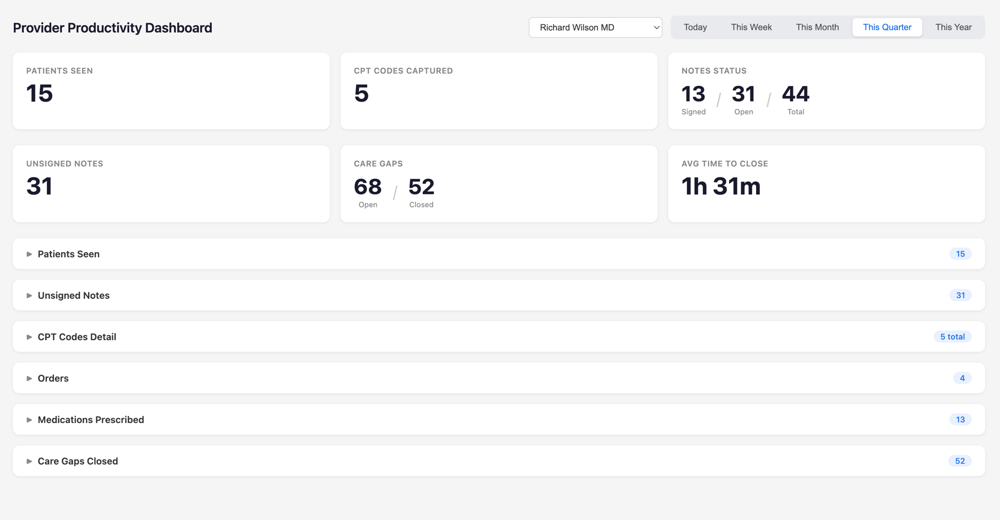
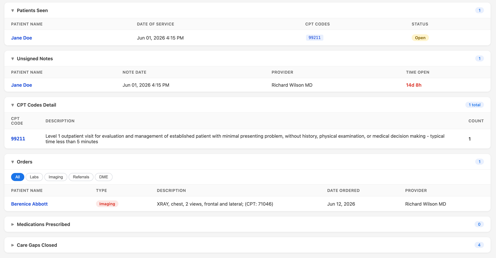
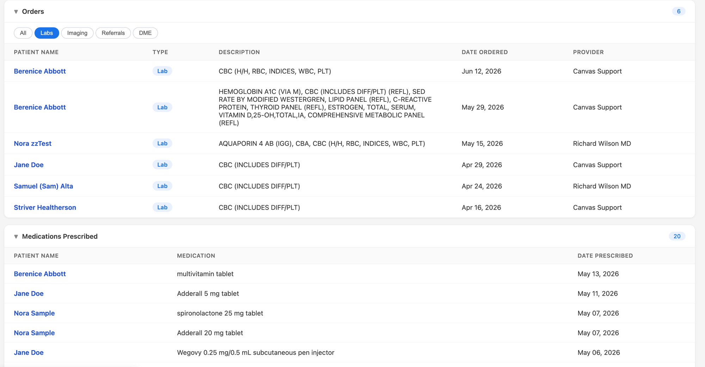
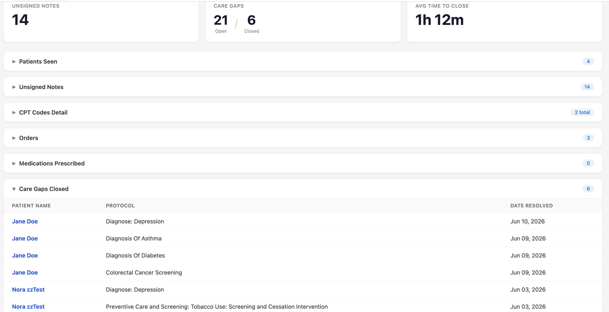

Panel Management Dashboard
==========================

## What it does

The Panel Management Dashboard gives clinical staff a single, at-a-glance view of practice-wide and provider-specific activity inside Canvas. From the left navigation panel, any user can see how many patients were seen, which CPT codes were captured, how many notes are signed versus still open (and how long the open ones have been waiting), which care gaps are open or recently closed, what orders and medications were placed, and the average time it takes to close a note — all filterable by provider and by time period.

## Problem it solves

This information is normally scattered across multiple Canvas screens and reports, or pulled manually into spreadsheets. A practice manager who wants to know "how many notes are still unsigned and who's behind?" or a provider checking "how many patients did I see this week and did I capture the right CPT codes?" has no consolidated place to look. This dashboard pulls those numbers together into one screen with drill-down detail, replacing the manual export-and-reconcile workflow.

## Who it's for

- **Providers** (all specialties) checking their own daily/weekly productivity, unsigned-note backlog, and CPT capture.
- **Practice managers / clinical operations** monitoring panel-wide throughput, note-signing compliance, and care-gap closure across providers.

## How to install

```bash
canvas install provider-productivity-dashboard
```

Once installed, a **Provider Productivity** item appears in the left navigation panel for all staff users. No additional configuration is required.

## Configuration options

No secrets or settings are required. All authenticated staff users can access the dashboard and filter by any active provider. There are no thresholds or environment variables to set.

## Screenshots or screen recordings

_Screenshots use synthetic demo-instance data; no real patient information._

**Summary view** — six metric cards and the collapsible detail sections, filtered by provider and time period:



**Detail sections** — Patients Seen, Unsigned Notes (with time-open), CPT Codes with descriptions, and Orders:



**Orders and Medications** — orders filtered by type (labs shown) and medications prescribed in the period:



**Care Gaps Closed** — protocols satisfied within the selected period, with the patient and resolution date:



## Features

- **6 summary cards** — Patients Seen, CPT Codes Captured, Notes Status (Signed/Open/Total), Unsigned Notes, Care Gaps (Open/Closed), Avg Time to Close Note
- **6 collapsible detail sections** — Patients Seen, Unsigned Notes, CPT Codes Detail, Orders, Medications Prescribed, Care Gaps Closed
- **5 time periods** — Today, This Week, This Month, This Quarter, This Year
- **Provider filtering** — all users can filter by any active provider or view "All Providers"
- **Orders section** with type filter toggles (All, Labs, Imaging, Referrals, DME)
- **Clickable summary cards** that scroll to their detail section
- **CPT drill-down** — click a CPT code row to expand and see associated patients

## How it works

| Component | Type | Purpose |
|-----------|------|---------|
| `ProductivityDashboardApplication` | Application (`provider_menu_item`) | Opens the dashboard from the left navigation |
| `ProductivityDashboardApi` | Protocol (SimpleAPI) | Serves 8 REST endpoints returning metrics data as JSON |

### API Endpoints

All endpoints are session-authenticated via `StaffSessionAuthMixin` and served under `/plugin-io/api/provider_productivity_dashboard`.

| Endpoint | Description |
|----------|-------------|
| `GET /api/providers` | Active providers list for the dropdown filter |
| `GET /api/metrics` | Summary counts: patients, CPTs, notes, care gaps, avg time to close |
| `GET /api/patients` | Note-level rows with patient info, CPT codes, and status |
| `GET /api/cpt-patients` | Patients for a specific CPT code |
| `GET /api/unsigned-notes` | Open notes sorted by longest open first |
| `GET /api/care-gaps-closed` | Protocols satisfied within the period |
| `GET /api/orders` | Labs, imaging, referrals, and DME with type filter |
| `GET /api/medications` | Medications prescribed within the period |

All endpoints accept `period` (day/week/month/quarter/year) and `provider_id` query parameters.

### Metrics Logic

- **Patients Seen** — distinct patients with encounters in the period (excludes MESSAGE and LETTER note types)
- **CPT Codes** — active billing line items on qualifying notes, grouped by code. Descriptions are resolved in order: the **Charge Description Master** (`cpt_code → name`, fast), then the **ontologies CPT catalog** via the SDK's `ontologies_http` client (the canonical AMA source, which also covers Category II `NNNNF` quality codes), then the charge line item's own free-text description. Ontologies lookups are cached per process and degrade gracefully (blank description) if the service is unreachable.
- **Notes Status** — signed (LOCKED/RELOCKED/SGN) vs. open (NEW/PUSHED/CONVERTED/UNLOCKED/RESTORED/UNDELETED); deleted notes excluded
- **Unsigned Notes** — notes in open states, sorted longest-open first
- **Care Gaps Open** — `ProtocolCurrent` with `STATUS_DUE`
- **Care Gaps Closed** — `ProtocolCurrent` with `STATUS_SATISFIED`, `modified` within the period
- **Avg Time to Close** — mean of (first signing event − note creation) for signed notes
- **Orders** — `LabOrder`, `ImagingOrder`, `Referral` with DME detection via keyword heuristic on referral notes
- **Medications** — `Medication` records with `start_date` in period, names from `MedicationCoding.display`

## Running Tests

```bash
cd provider-productivity-dashboard
uv run pytest tests/ -v
```

Coverage:

```bash
uv run pytest tests/ -v --cov=provider_productivity_dashboard --cov-report=term-missing
```
