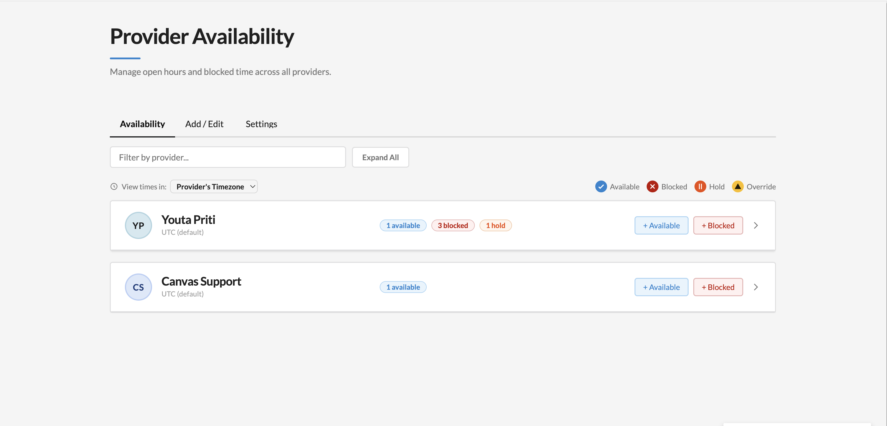
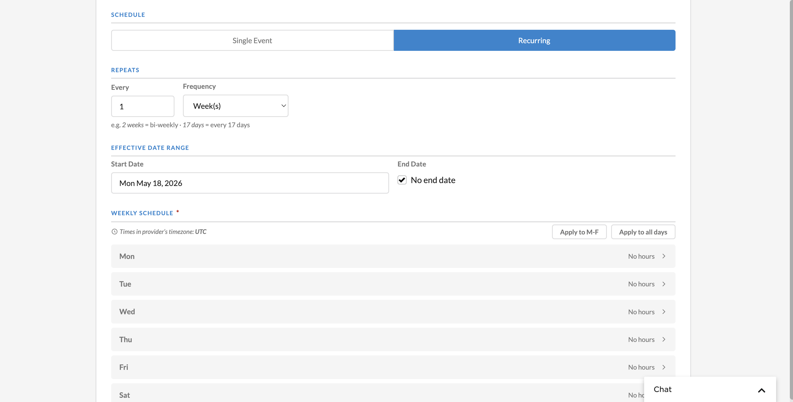
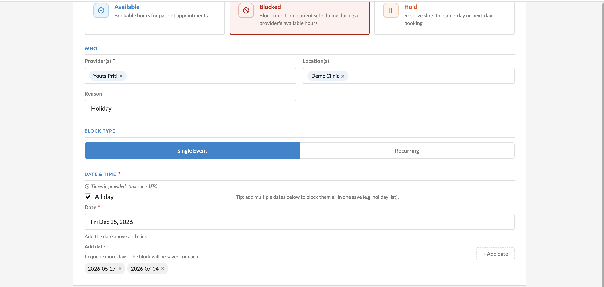

provider-availability
=====================

## Description

Provider availability engine with rule-based scheduling, real-time slot calculation, and an admin configuration UI. Manages open appointment slots across providers, locations, and visit types - including one-off blocks, recurring blocks with hold types, appointment buffers, and timezone-aware calendar sync.

## Problem it solves

Keeping each provider's bookable hours correct across locations, visit types, recurring time off, and appointment buffers usually means hand-editing calendars and re-checking for conflicts every time something changes. Mistakes show up as double-bookings or slots that should have been blocked. This plugin computes bookable slots from each provider's rules and existing appointments, syncs those rules to Canvas calendar events, and adds buffer time automatically when appointments are booked, rescheduled, or canceled - so scheduling staff set the rules once instead of maintaining calendars by hand.

## How to install

```
canvas install provider_availability
```

Set the `simpleapi-api-key` and `allowed-staff-keys` secrets before use (see Configuration).

## Screenshots

**Availability overview** — at-a-glance view of every provider's rules, blocks, and holds:



**Recurring availability rule** — flexible recurrence with `Every N Week(s) / Day(s)` (bi-weekly, every 17 days, etc.):



**Multi-date holiday batch** — All-day toggle plus a chip picker to queue several dates and save them in one action:



## Features

- **Admin UI**: Configure availability rules, blocks, and recurring blocks via an in-app panel (provider menu item)
- **REST API**: Query available slots, list providers, and manage rules/blocks programmatically
- **Calculation Engine**: Computes bookable time slots from weekly schedules, booking constraints, buffer times, and existing appointment conflicts
- **Calendar Sync**: Syncs rules and blocks to Canvas Calendar Events (Clinic = available, Administrative = blocked)
- **Hold Types**: Recurring blocks with same-day or next-day hold release on a rolling 30-day window
- **Appointment Buffers**: Automatic pre/post buffer events on Administrative calendars when appointments are created/rescheduled/canceled
- **Timezone Support**: Practice-level default with per-provider overrides; all times stored UTC internally. Changing a provider's timezone re-syncs all their calendar events.
- **Cache-backed Storage**: Rules stored in plugin cache with TTL refresh every 5 minutes

## Architecture

| Component | Handler Type | Description |
|-----------|-------------|-------------|
| `ProviderAvailabilityApp` | Application | Provider menu item that opens the admin UI |
| `AvailabilityAPI` | SimpleAPI | REST endpoints for availability queries, rule/block CRUD, and admin UI/asset serving |
| `ProvisionAPI` | SimpleAPI | API key-authenticated provisioning and practice-timezone management |
| `CacheRefreshTask` | CronTask | TTL refresh, lead-time block generation, hold block rolling window (every 5 min) |
| `OnStaffActivated` | Protocol | Creates Clinic calendar when a provider is activated |
| `OnStaffDeactivated` | Protocol | Cleans up rules and calendar events when a provider is deactivated |
| `OnPluginInstalled` | Protocol | Full sync of all cached rules/blocks to Calendar Events on install and redeploy |
| `OnAppointmentCreated` | Protocol | Creates buffer events on Administrative calendar |
| `OnAppointmentRescheduled` | Protocol | Updates buffer events when appointment is rescheduled |
| `OnAppointmentCanceled` | Protocol | Removes buffer events when appointment is canceled |

## API Endpoints

### AvailabilityAPI (session-authenticated)

| Method | Path | Description |
|--------|------|-------------|
| GET | `/available-slots` | Query available slots for a provider and date range |
| GET | `/available-providers` | Find providers with availability for a date/visit type |
| GET | `/providers/list` | List all active providers |
| GET | `/providers/search` | Search providers by name/ID |
| GET | `/locations` | List all active locations |
| GET | `/visit-types` | List all scheduleable visit types |
| GET | `/overview` | Aggregate overview of all providers with rules/blocks |
| GET | `/rules` | List all rules |
| GET | `/rules/<provider_id>` | Get rules for a specific provider |
| POST | `/rules` | Create an availability rule |
| PUT | `/rules` | Update an availability rule |
| DELETE | `/rules/<provider_id>/<rule_id>` | Delete a single rule |
| DELETE | `/rules/<provider_id>` | Delete all rules for a provider |
| GET | `/blocks/<provider_id>` | Get one-off blocks for a provider |
| POST | `/blocks` | Create a one-off block |
| PUT | `/blocks` | Update a one-off block |
| DELETE | `/blocks/<provider_id>/<block_id>` | Delete a block |
| GET | `/recurring-blocks/<provider_id>` | Get recurring blocks for a provider |
| POST | `/recurring-blocks` | Create a recurring block |
| PUT | `/recurring-blocks` | Update a recurring block |
| DELETE | `/recurring-blocks/<provider_id>/<block_id>` | Delete a recurring block |
| GET | `/timezone` | Get practice timezone and available options |
| PUT | `/timezone` | Set practice timezone (re-syncs all rules/blocks) |
| GET | `/provider-timezone?provider_id=` | Get provider-specific timezone |
| GET | `/provider-timezones/all` | Get all provider timezone overrides |
| PUT | `/provider-timezone` | Set a provider timezone (re-syncs all their rules, blocks, and recurring blocks) |
| PUT | `/provider-timezones/bulk` | Set timezones for multiple providers at once |
| GET | `/availability-admin` | Serve admin UI HTML with preloaded data |
| POST | `/form-action` | CSP-compliant form dispatch for admin UI writes |
| GET | `/admin.css` | Admin UI stylesheet |
| GET | `/admin.js` | Admin UI JavaScript |
| GET | `/tokens.css`, `/typography.css`, `/canvas-components.js` | Canvas design-system static assets |

### ProvisionAPI (API key-authenticated)

| Method | Path | Description |
|--------|------|-------------|
| POST | `/provision/run` | Create Clinic calendars and Available events for all active providers |
| GET | `/provision/timezone` | Get practice timezone |
| PUT | `/provision/timezone` | Set practice timezone |

## Configuration

### Secrets

| Secret | Purpose |
|--------|---------|
| `simpleapi-api-key` | API key for ProvisionAPI authentication |
| `allowed-staff-keys` | Comma-separated staff UUIDs allowed to open the admin UI and edit rules. Dashed or undashed UUIDs both work. Leave empty/unset to allow any logged-in Canvas staff member (bootstrap). |

### Data Model

**ProviderAvailabilityRule** — Defines when a provider is available:
- Weekly schedule (time windows per day), location/visit type filters
- Booking interval (min lead hours, slot granularity)
- Buffer times (pre/post appointment minutes)
- Effective date range, group ID for bulk edits

**AdminBlock** — One-off time block when a provider is unavailable:
- Start/end datetime, reason, location filter
- Group ID for bulk edits

**RecurringBlock** — Weekly recurring block with optional hold:
- Weekly schedule, reason, location filter, effective date range
- Hold type: `none` (immediate block), `same_day` (releases day-of), `next_day` (releases day before)

### Calendar Integration

- **Clinic calendars**: Events define when a provider IS available for booking
- **Administrative calendars**: Events define when a provider is NOT available
- Buffer and blocking events are placed on Administrative calendars
- Hold blocks are dynamically created/released on a rolling 30-day window


## Info

*This plugin was developed and contributed by [Vicert](https://vicert.com).*
Contact: engineering@vicert.com