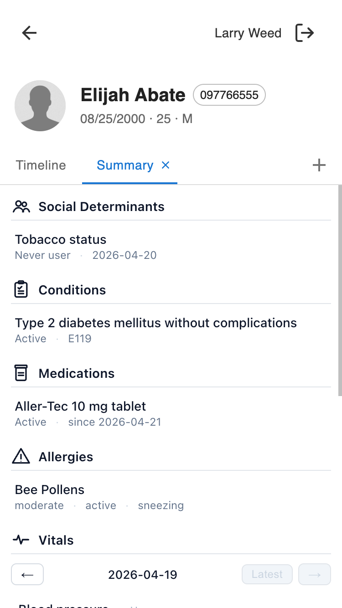

# provider_clinical_summary_companion

A patient-scope provider companion app that renders a compact, read-only clinical summary of the open patient — social determinants, conditions, medications, allergies, vitals, immunizations, and surgical history — and keeps itself fresh over a WebSocket when the chart changes server-side.

## What providers see



An icon titled **Summary** appears on the patient's companion view. Tapping it opens a modal with seven stacked sections, each preceded by a monochrome icon:

- **Social Determinants** — question / response pairs from any interview whose questionnaire is marked "use in SHX."
- **Conditions** — non-surgical committed conditions, newest onset first.
- **Medications** — committed medication list items with status and sig.
- **Allergies** — committed allergies with severity, status, and narrative.
- **Vitals** — the vital types captured by the Vitals command (blood pressure, pulse, respiration, O₂ saturation, body temp, weight, height, waist) for a single reading. A pager above the table (`←` / `→` with the reading's date in the middle, plus a **Latest** shortcut) steps through the most recent readings — up to 12 panels are available. When new vitals arrive, the pager keeps its current reading; tap **Latest** to jump to the new one.
- **Immunizations** — merged list of administered immunizations and reported statements, most recent first.
- **Surgical History** — committed conditions flagged as surgical.

Every row is read-only. No actions, no filters, no edit. When a chart change happens (a provider commits a prescription, a new allergy is added, an interview is submitted), the affected section refreshes in place within a few hundred milliseconds — no reload required. The section header briefly flashes so the provider can tell something changed.

## Installation

No environment variables or secrets required.

```sh
canvas install --host <host> \
    ~/src/plugin-development/msf-canvas/extensions/provider_clinical_summary_companion/provider_clinical_summary_companion
```

After install, the plugin registers against the `provider_companion_patient_specific` scope and appears on every patient's companion view.

---

## For developers

### Scope

`provider_companion_patient_specific`. The application receives `patient.id` in `self.event.context`; it does not receive note context and does not need it.

### Architecture

```
provider_clinical_summary_companion/
├── CANVAS_MANIFEST.json                       # scope: provider_companion_patient_specific
├── README.md
├── LICENSE
├── applications/
│   └── summary_app.py                         # ClinicalSummaryApp → LaunchModalEffect
├── handlers/
│   ├── summary_api.py                         # SimpleAPI: HTML shell, static, /data.json
│   ├── chart_event_publisher.py               # BaseHandler: broadcasts refresh pings
│   └── chart_subscription_auth.py             # WebSocketAPI: staff-session gate
├── static/
│   ├── index.html                             # shell with section container
│   ├── main.js                                # fetch, render, WebSocket, inline SVG icons
│   └── styles.css                             # mobile-first, flash animation
├── assets/
│   ├── icon.png                               # 256×256 launcher tile
│   └── clinical-summary-icon.svg              # source SVG
└── screenshots/                               # README screenshots go here
```

### Request flow

1. Provider taps the launcher → `ClinicalSummaryApp.on_open()` reads `patient.id` from the event context and returns `LaunchModalEffect(url="/plugin-io/api/provider_clinical_summary_companion/app/?patient_id=<uuid>")`.
2. `SummaryAPI.index()` serves `static/index.html` with `Cache-Control: no-store` so iframe redeploys always reach the browser.
3. `main.js` reads `patient_id` from its own URL, fetches `GET /app/data.json?patient_id=<uuid>` for the full bundle, and renders every section.
4. `main.js` opens `wss://<host>/plugin-io/ws/provider_clinical_summary_companion/patient-<uuid>/` (staff session required) and listens for section pings.
5. Each ping is coalesced for ~100 ms and triggers `GET /app/data.json?patient_id=<uuid>&sections=<key>`; the returned rows replace the section in place with a flash animation.
6. `ChartEventPublisher` (`BaseHandler`) subscribes to the chart-change event types listed below. On each event it looks up the target record, extracts the patient ID, and emits one `Broadcast(channel="patient-<uuid>", message={"section": "<key>"})` per affected section key.
7. On window `focus` / `visibilitychange`, `main.js` does a full refetch as a dropped-socket backstop.

### Why a client-side poll + WebSocket rather than a push-the-data payload

The WebSocket messages carry only a section key — never the section's data. The iframe refetches through the JSON endpoint, which runs with the staff session's permissions and returns exactly what that user is allowed to see. That keeps the authorization surface in one place (`StaffSessionAuthMixin` on `SummaryAPI`) instead of duplicating it in the publisher.

### Chart events the publisher listens for

| Section(s) affected | Event types |
|---|---|
| `conditions`, `surgicalHistory` (both always refetched; server filter decides each list's content) | `CONDITION_CREATED`, `CONDITION_UPDATED`, `CONDITION_RESOLVED`, `CONDITION_ASSESSED` |
| `medications` | `MEDICATION_LIST_ITEM_CREATED`, `MEDICATION_LIST_ITEM_UPDATED` |
| `allergies` | `ALLERGY_INTOLERANCE_CREATED`, `ALLERGY_INTOLERANCE_UPDATED` |
| `immunizations` | `IMMUNIZATION_CREATED`, `IMMUNIZATION_UPDATED`, `IMMUNIZATION_STATEMENT_CREATED`, `IMMUNIZATION_STATEMENT_UPDATED` |
| `socialDeterminants` | `INTERVIEW_CREATED`, `INTERVIEW_UPDATED` |
| `vitals` | `VITAL_SIGN_CREATED`, `VITAL_SIGN_UPDATED` |

For each event, the publisher resolves `patient_id` by loading the target record from the appropriate model and reading its `patient.id`. If the record (or its patient) can't be found, the publisher returns no effects and the change simply doesn't broadcast — the iframe's focus/visibility backstop picks it up on the next foregrounding.

### WebSocket contract

- URL: `/plugin-io/ws/provider_clinical_summary_companion/patient-<uuid>/` (trailing slash required; the path segment *is* the channel name).
- Auth: `ChartSubscriptionAuth.authenticate()` requires a staff session. Patient or anonymous sessions are refused at the handshake.
- Wire format: the platform wraps `Broadcast.message` as `{"message": {...}}`; the client unwraps before reading `payload.section`.
- Channel naming: `patient-<uuid>`. The plugin name is already in the URL path, so the channel name doesn't need to repeat it.

### Data access

All queries go through `canvas_sdk.v1.data` model querysets:

| Section | Queryset |
|---|---|
| Conditions | `Condition.objects.for_patient(pid).committed().filter(surgical=False).order_by("-onset_date")` |
| Surgical History | `Condition.objects.for_patient(pid).committed().filter(surgical=True).order_by("-onset_date")` |
| Medications | `Medication.objects.for_patient(pid).committed().order_by("-start_date")` |
| Allergies | `AllergyIntolerance.objects.for_patient(pid).committed().order_by("-recorded_date")` |
| Vitals | up to 12 `Observation` rows matching `name="Vital Signs Panel"` (newest first); for each panel, its `.members` are fetched and mapped onto the table's vital-type keys (weight auto-converted from ounces to pounds, `blood_pressure` → `bp`, etc.) |
| Immunizations | union of `Immunization.objects.for_patient(pid).filter(deleted=False)` + `ImmunizationStatement.objects.for_patient(pid).filter(deleted=False)`, sorted newest first. These two models lack the `committer` / `entered_in_error` columns that `.committed()` expects, so `deleted=False` is the soft-delete signal the builder uses instead. |
| Social Determinants | `Interview.objects.for_patient(pid).committed().filter(questionnaires__use_in_shx=True).distinct()` → `.interview_responses.select_related("question", "response_option")` |

`.committed()` (from `CommittableQuerySetMixin`) keeps the summary free of uncommitted or entered-in-error records wherever the model supports it. Each row's display name comes from the primary coding row — `obj.codings.first().display` on most models; `ImmunizationStatement` uniquely exposes its coding under `.coding` (singular), so the helper checks both. Malformed records without a primary coding show as `(unnamed)` rather than crashing.

### Auth

- `StaffSessionAuthMixin` on `SummaryAPI` — all five endpoints reject non-staff sessions.
- `ChartSubscriptionAuth.authenticate()` gates WebSocket subscribers to staff sessions.

The `canvas-logged-in-user-id` header is available to the handler but this plugin doesn't use it for row-level filtering — patient authorization is whatever the SDK enforces for `for_patient(...)` queries in the staff session.

### Cache busting

Two layers:

- **JS / CSS**: the HTML shell appends `?v={{cache_bust}}` to `main.js` and `styles.css`, where `cache_bust` is a module-level UTC timestamp generated at plugin-process start. A redeploy or worker restart mints a new token.
- **HTML shell itself**: `GET /` sends `Cache-Control: no-store`. Without that, the browser can cache the shell across opens and serve stale HTML (with an old `cache_bust`), which would undo the JS/CSS refresh for any markup-level changes.

### Endpoints

All under `/plugin-io/api/provider_clinical_summary_companion/app/`.

| Method & path | Purpose |
|---|---|
| `GET /` | HTML shell (`Cache-Control: no-store`) |
| `GET /data.json?patient_id=<uuid>` | Full bundle: `{patient_id, sections: {…all seven…}}` |
| `GET /data.json?patient_id=<uuid>&sections=conditions,vitals` | Only the named sections (unknown keys are silently dropped) |
| `GET /main.js` | Served JS |
| `GET /styles.css` | Served CSS |

### Section icons

Inline SVGs in `main.js`, 24×24 viewBox, `stroke="currentColor"` so they inherit the section-header text color. The set: people silhouettes (social determinants), clipboard with checked rows (conditions), pill bottle (medications), warning triangle (allergies), heartbeat pulse (vitals), syringe (immunizations), tilted scalpel (surgical history).

### Known considerations

- **Social determinants coverage.** The plugin filters interviews by `questionnaires__use_in_shx=True`. If the instance hasn't marked the right questionnaires that way, this section will be empty.
- **Vital-type coverage.** The vitals table surfaces the `VitalsCommand` fields that map cleanly to scalar values: BP, pulse, respiration, O₂ saturation, body temp, weight, height, waist. Enum-valued fields on the command (`body_temperature_site`, `blood_pressure_position_and_site`, `pulse_rhythm`) and the free-text `note` are intentionally skipped — this is a scan-and-go summary, not a full commit viewer.
- **Vital panel depth.** The pager walks up to the latest 12 panels. Beyond 12 you'd need another plugin or the chart's full observation history.
- **One-shot patient lookup on every event.** `ChartEventPublisher` does one `Model.objects.filter(id=target).select_related("patient")` per incoming event. For very hot chart-change streams the publisher's own footprint scales with event volume; tune (batch, debounce) at the platform level if that becomes an issue.
- **WebSocket reconnect.** The client retries every 4 seconds on close and falls back to full refetch on focus/visibility. If both fail (network partition), the summary goes stale until the next foregrounding or reconnect.

## Testing

```sh
cd ~/src/canvas-plugins && uv run pytest \
    ~/src/plugin-development/msf-canvas/extensions/provider_clinical_summary_companion/tests \
    --cov=provider_clinical_summary_companion --cov-branch --cov-report=term-missing
```

Current coverage: **100%** (182 stmts, 42 branches, 61 tests).

## License

MIT. See [LICENSE](./LICENSE).
