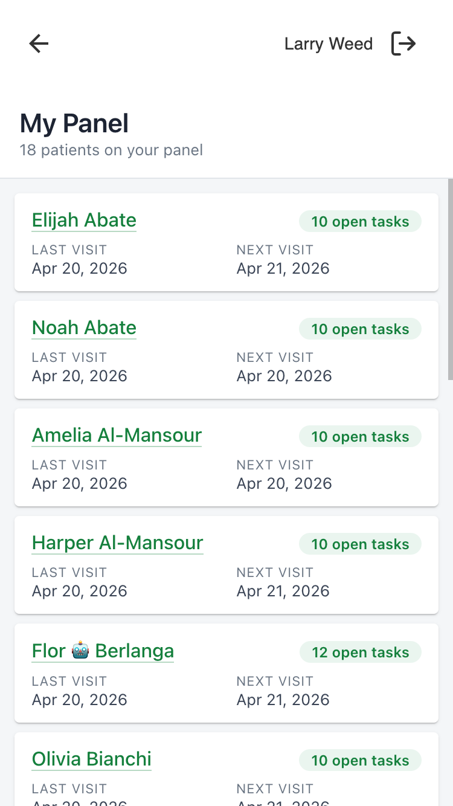

# provider_my_panel_companion

A mobile-friendly patient panel that lives on the provider companion main page. Shows the logged-in provider every patient whose active care team includes them, with last visit, next visit, and a running count of open tasks.

## Problem it solves

A provider working from a phone has no quick way to see just their own patients along with when each was last seen, when they are due back, and how many tasks are still open. Answering that today means running separate searches and counting tasks by hand. This plugin assembles that panel view in one screen on the provider companion, pulled from active care-team membership, so providers stop stitching the picture together across multiple screens.

## What providers see



An icon titled **My Panel** appears in the provider companion launcher. Tapping it opens a modal with:

- A header showing the title **My Panel** and a running count (e.g., "42 patients on your panel").
- A scrollable list of patient cards, sorted alphabetically by last name, then first name.

Each card shows:

- The patient's name as a link that leaves the modal to open their patient companion page.
- **Last visit** — the date of the most recent appointment strictly before now. Italicized _No prior visits_ when the patient has never been seen.
- **Next visit** — the date of the earliest appointment at or after now. Italicized _None scheduled_ when the patient has no upcoming appointment.
- A green badge in the top-right with the count of open tasks linked to that patient (e.g., "3 open tasks"). Cards with zero open tasks show no badge.

## How to use it

- Tap the patient name to jump into that patient's companion page — the modal closes and the top frame navigates.
- Scroll the list to browse your panel; only the content region scrolls, so the header stays pinned.
- The list is read-only — there's no editing or filtering UI. Anything that changes the panel (care-team changes, new appointments, new tasks) shows up on the next time the modal is opened.

## Installation

No environment variables or secrets are required.

```sh
canvas install --host <host> \
    ~/src/plugin-development/msf-canvas/extensions/provider_my_panel_companion/provider_my_panel_companion
```

After install, the plugin registers itself against the `provider_companion_global` scope and will appear in the provider companion launcher on next page load.

The panel is built from `CareTeamMembership` records with `status=active` and `staff=<you>`. Configure care-team memberships in your instance to control which patients surface here.

---

## For developers

### Scope

This plugin uses the `provider_companion_global` `ApplicationScope` — it surfaces on the provider companion main page and does not receive patient or note context.

### Architecture

```
provider_my_panel_companion/
├── CANVAS_MANIFEST.json           # plugin manifest (scope: provider_companion_global)
├── README.md                      # this file
├── LICENSE                        # MIT
├── applications/
│   └── my_panel_app.py            # Application subclass; on_open → LaunchModalEffect
├── handlers/
│   └── my_panel_api.py            # SimpleAPI: UI shell + JSON endpoints + cache-bust token
├── static/
│   ├── index.html                 # SPA shell (header + content slot)
│   ├── main.js                    # vanilla-JS; fetch + render patient cards
│   └── styles.css                 # mobile-first, Material-style cards w/ elevation
└── assets/
    ├── icon.png                   # 256×256 launcher icon
    └── panel-roster-icon.svg      # source SVG for the icon
```

### Request flow

1. Provider taps the app in the companion launcher.
2. `MyPanelApp.on_open()` returns a `LaunchModalEffect` pointing to `/plugin-io/api/provider_my_panel_companion/app/`.
3. `MyPanelAPI.index()` serves `static/index.html`, passing `_CACHE_BUST` as `cache_bust` so the HTML's `<link>` / `<script>` references bust browser caches on every process restart.
4. `main.js` loads and fetches `/app/patients`.
5. `MyPanelAPI.patients()` runs the four underlying queries and returns the serialized list.
6. `main.js` renders into `#content`.

### Data access

All reads; no writes.

- `CareTeamMembership.objects.filter(staff__id=<uuid>, status="active").select_related("patient").order_by("patient__last_name", "patient__first_name")` → gives the ordered, deduplicated patient list.
- Two batched `Appointment` queries — `values("patient__id").annotate(last=Max("start_time"))` for the "before now" bucket and the symmetric `Min` for "at or after now" — so there's never more than one query per side regardless of panel size.
- One batched `Task.objects.filter(patient__id__in=…, status="OPEN").values("patient__id").annotate(count=Count("id"))` query for the open-task badges.

Total DB round-trips per load: 4 (one care-team, two appointments, one task-count). No N+1.

### Auth

- `StaffSessionAuthMixin` — non-staff sessions are rejected with `InvalidCredentialsError` at the auth layer.
- The logged-in staff UUID is read from the `canvas-logged-in-user-id` header (set by the platform on every request into `/plugin-io/`).

### Cache-busting

`_CACHE_BUST` is a module-level UTC timestamp generated when the plugin process starts. It's passed into the rendered HTML as `cache_bust`, and the HTML shell appends `?v={{cache_bust}}` to its `main.js` / `styles.css` references. A plugin redeploy or process restart gives a new token, so stale JS/CSS never gets served to users.

### Endpoints

All mounted under `/plugin-io/api/provider_my_panel_companion/app/`.

| Method & path | Purpose |
|---|---|
| `GET /` | HTML shell |
| `GET /patients` | JSON list of panel patients with last visit, next visit, and open-task count |
| `GET /main.js` | served JS |
| `GET /styles.css` | served CSS |

Patient JSON shape:
```json
{
  "id": "<uuid>",
  "name": "Jane Doe",
  "last_appointment": "2026-03-12T14:00:00+00:00",
  "next_appointment": "2026-04-22T09:00:00+00:00",
  "open_task_count": 3
}
```

### Known considerations

- **De-duplication** — a patient with multiple active care-team memberships for the same provider (e.g., two roles) only appears once on the panel. Ordering comes from the first `CareTeamMembership` row seen, which is the alphabetically-first by the patient's last + first name.
- **`active` only** — patients whose sole membership is `proposed`, `suspended`, `inactive`, or `entered-in-error` are not shown. This is a deliberate narrow definition of "panel"; a future setting could relax it.
- **Patient link path** — hard-coded to `/companion/patient/<uuid>/`. If the patient companion URL changes, update `main.js` accordingly.

## Testing

```sh
cd ~/src/canvas-plugins && uv run pytest \
    ~/src/plugin-development/msf-canvas/extensions/provider_my_panel_companion/tests \
    --cov=provider_my_panel_companion --cov-branch --cov-report=term-missing
```

Target: 100% statement + branch coverage.

## License

MIT. See [LICENSE](./LICENSE).
