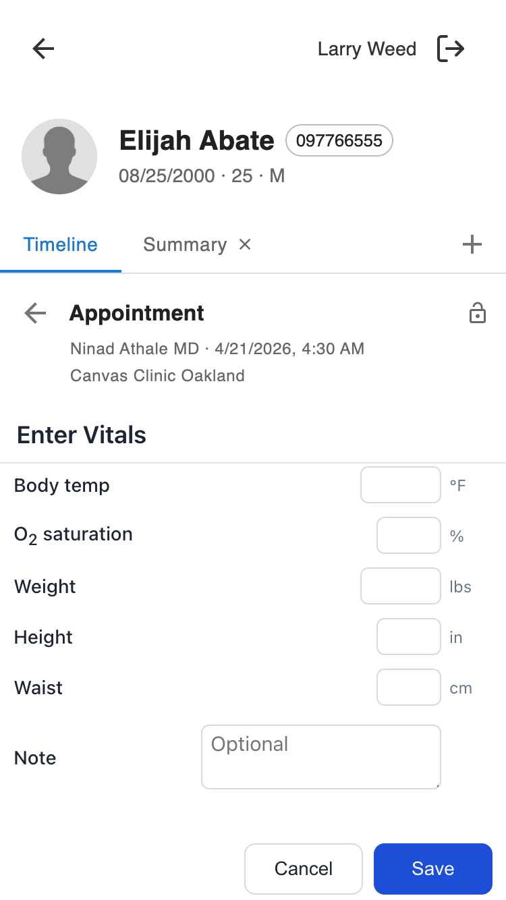

# provider_note_vitals_companion

A mobile-friendly vitals entry form that lives on the provider companion view of a specific note. On submit, it originates a Vitals command into that note — so a provider can take vitals on the bedside with their phone, tap Save, and see the Vitals command appear in the note they launched from.

## What providers see



An icon titled **Enter Vitals** appears on the companion view of an expanded note. Tapping it opens a modal with:

- A list of vital-sign fields (BP, pulse, respiration rate, body temp, O₂ sat, weight, height, waist, and an optional short note).
- Each input is range-limited to match the Vitals command schema (e.g. BP systolic 30–305 mmHg).
- **Save** — validates, originates a Vitals command on the note, and auto-dismisses the modal.
- **Cancel** — closes the modal without saving.

After saving, the new Vitals command is in the note ready for the provider to review / edit / commit.

## How to use it

1. Open the note you're working in; tap **Enter Vitals** in the companion launcher.
2. Fill in whichever measurements you just took — every field is optional, but at least one is required.
3. Tap **Save**. The modal closes and the Vitals command is now in the note body.

Values that fall outside the accepted range are rejected at submit time; fix and retry.

## Installation

No environment variables or secrets are required.

```sh
canvas install --host <host> \
    ~/src/plugin-development/msf-canvas/extensions/provider_note_vitals_companion/provider_note_vitals_companion
```

After install, the plugin registers itself against the `provider_companion_note_specific` scope and will appear on every note's companion view on next load.

---

## For developers

### Scope

This plugin uses the `provider_companion_note_specific` `ApplicationScope` — it surfaces on the companion view of an expanded note and receives both the patient and the note in its event context. Only `note.id` is used by this plugin.

### Architecture

```
provider_note_vitals_companion/
├── CANVAS_MANIFEST.json               # plugin manifest (scope: provider_companion_note_specific)
├── README.md                          # this file
├── LICENSE                            # MIT
├── applications/
│   └── vitals_app.py                  # Application subclass; on_open → LaunchModalEffect with ?note_id=<uuid>
├── handlers/
│   └── vitals_api.py                  # SimpleAPI: UI + POST /vitals that originates the command
├── static/
│   ├── index.html                     # form shell
│   ├── main.js                        # MessageChannel + submit logic
│   └── styles.css                     # mobile-first; Material-style field rows
└── assets/
    ├── icon.png                       # 256×256 launcher icon
    └── vitals-icon.svg                # source SVG
```

### Request flow

1. Provider taps the app in the note's companion launcher.
2. `VitalsApp.on_open()` reads `note.id` from the event context and returns a `LaunchModalEffect` pointing to `/plugin-io/api/provider_note_vitals_companion/app/?note_id=<uuid>`.
3. `VitalsAPI.index()` serves `static/index.html`.
4. `main.js` listens for the Canvas `INIT_CHANNEL` postMessage, grabs the transferred `MessagePort`, and stashes it for later use.
5. On **Save**, `main.js` collects non-blank fields, POSTs JSON to `/app/vitals?note_id=<uuid>`.
6. `VitalsAPI.submit_vitals()` coerces the fields to their expected types, builds a `VitalsCommand(note_uuid=<uuid>, …)`, and returns `[command.originate(), JSONResponse({status: "originated"}, 202)]`.
7. On a 2xx response, `main.js` sends `{type: 'CLOSE_MODAL'}` through the stored port and the platform dismisses the modal. The originated Vitals command is then visible in the note.

### Supported fields

All optional; at least one must be provided. Ranges are enforced on the server via `VitalsCommand`'s pydantic validators.

| Field | Units | Range |
|---|---|---|
| `blood_pressure_systole` | mmHg | 30–305 |
| `blood_pressure_diastole` | mmHg | 20–180 |
| `pulse` | bpm | 30–250 |
| `respiration_rate` | /min | 6–60 |
| `body_temperature` | °F | 85.0–107.0 |
| `oxygen_saturation` | % | 60–100 |
| `weight_lbs` | lbs | 1–1500 |
| `height` | inches | 10–108 |
| `waist_circumference` | cm | 20–200 |
| `note` | free text | ≤ 150 chars |

Enum-valued Vitals fields (`body_temperature_site`, `blood_pressure_position_and_site`, `pulse_rhythm`) are intentionally omitted from this form to keep quick bedside entry friction-free. If the provider needs them, they can edit the originated command in the note.

### Auth

- `StaffSessionAuthMixin` — non-staff sessions are rejected with `InvalidCredentialsError` at the auth layer.
- The logged-in staff UUID is read from the `canvas-logged-in-user-id` header but not used here (no provider-scoped filtering).

### Modal dismissal

The platform transfers a `MessagePort` to the modal iframe via a `postMessage` event of shape `{type: 'INIT_CHANNEL'}` with `event.ports[0]` set. The plugin stores that port and, on successful submit, calls `port.postMessage({type: 'CLOSE_MODAL'})` to dismiss itself. The same path handles the Cancel button. If the port was never delivered (e.g. older host), submit still works — the modal just needs to be closed manually.

### Cache-busting

`_CACHE_BUST` is a module-level UTC timestamp generated when the plugin process starts. It's passed into the rendered HTML as `cache_bust`, and the HTML shell appends `?v={{cache_bust}}` to its `main.js` / `styles.css` references. A redeploy or process restart gives a new token, so stale JS/CSS never gets served.

### Endpoints

All mounted under `/plugin-io/api/provider_note_vitals_companion/app/`.

| Method & path | Purpose |
|---|---|
| `GET /` | HTML shell |
| `POST /vitals?note_id=<uuid>` | Accepts JSON body of vital fields; originates a `VitalsCommand` on the note |
| `GET /main.js` | served JS |
| `GET /styles.css` | served CSS |

Request body (all keys optional, at least one required):

```json
{
  "blood_pressure_systole": 120,
  "blood_pressure_diastole": 80,
  "pulse": 72,
  "respiration_rate": 16,
  "body_temperature": 98.6,
  "oxygen_saturation": 99,
  "weight_lbs": 165,
  "height": 70,
  "waist_circumference": 86,
  "note": "Short optional free-text note (<=150 chars)"
}
```

Success response:

```json
{ "status": "originated" }
```

with HTTP 202 Accepted, plus a side-effect: an `ORIGINATE_VITALS_COMMAND` effect on the note.

### Known considerations

- **Units are US-centric** (lbs, inches, °F) to match `VitalsCommand`'s primary input fields. Height in cm and weight in kg are not offered.
- **No edit/delete** — this form only originates new commands. Editing happens in the note UI as usual.
- **Modal close fallback** — if the host never delivers the `INIT_CHANNEL` port, `closeModal()` falls back to `window.close()`; failing that, the provider can dismiss the modal with the host's close control.
- **Wheel over number inputs** — `<input type="number">` increments/decrements on wheel while focused, which silently mutates values when scrolling with a focused input. Each number input is blurred on `wheel` so scroll falls through to the form container and the value stays put.

## Testing

```sh
cd ~/src/canvas-plugins && uv run pytest \
    ~/src/plugin-development/msf-canvas/extensions/provider_note_vitals_companion/tests \
    --cov=provider_note_vitals_companion --cov-branch --cov-report=term-missing
```

Current coverage: **100%** (68 stmts, 18 branches).

## License

MIT. See [LICENSE](./LICENSE).
