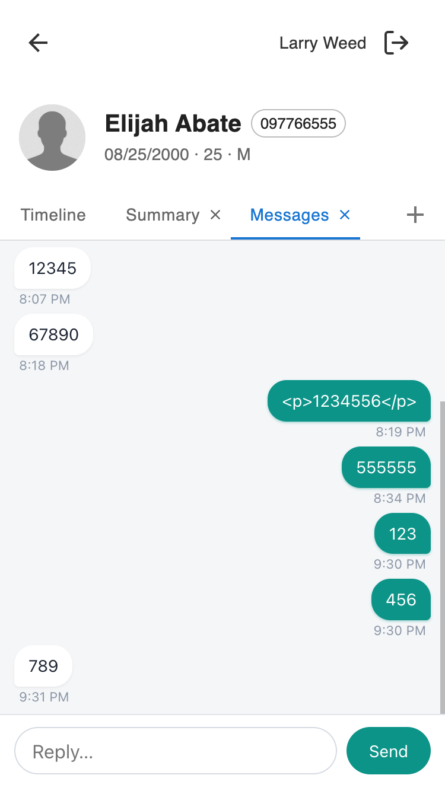

# provider_patient_messages_companion

A mobile-friendly messaging surface with live WebSocket updates. Ships in two surfaces: a global-scope **My Messages** thread list on the provider companion main page and a patient-scope **Messages** launcher on the patient page.

## Problem it solves

Providers working from a phone or tablet have no quick way to see and answer messages from the patients on their panel: the standard inbox is built for the desktop, and there is no panel-scoped thread list on the companion. This plugin puts an SMS-style messaging surface in the provider companion, with live updates, so a provider can read and reply to their panel's messages from a mobile-friendly screen instead of switching back to the full Canvas web app.

## What providers see



### My Messages — thread list (global scope)

The **My Messages** icon appears in the provider companion launcher. Tapping it opens a header with the title, a subtitle showing the panel size (e.g., "42 patients on your panel"), and a live-status pill ("Live" when connected; "Reconnecting…" if the WebSocket drops). Below is a scrollable list of thread cards — one per patient on the provider's active care-team panel, sorted alphabetically by last name, then first name.

Each thread card shows:

- The patient's name.
- A preview of the most recent message (with a "You:" prefix if the provider sent it) and a relative timestamp ("now", "15m", "3h", "2d", or a date for older).
- A teal unread badge with the count of inbound messages that haven't been read yet. Threads with no unread messages show no badge.

### My Messages — conversation (SMS-style)

Tapping a thread card navigates to a dedicated conversation screen. The header becomes a back arrow + the patient's name + an "Open patient page" link that breaks out of the modal to the patient companion page. Below the header is the full-height message scroll area; below that, pinned to the bottom, is the composer.

Messages are grouped by day with "Today / Yesterday / <weekday> / <date>" dividers. Inbound messages from the patient appear as white bubbles on the left; outbound messages appear as teal bubbles on the right. Each bubble has a time-of-day timestamp underneath.

Tap the back arrow to return to the thread list.

### Messages (patient scope)

On a patient's companion page, a **Messages** launcher opens the conversation with that patient directly — no thread list to go through, no plugin-rendered header (the harness already shows the patient chrome), and no back button (there's nothing to go back to — closing the modal returns to the patient page). The composer, SMS-style bubbles, and day dividers are the same as in global scope. Live updates via the same WebSocket still apply.

The plugin does not restrict this surface to the provider's panel: any staff session on any patient's companion page can open and see the conversation thread between themselves and that patient.

## How to use it

### Opening a conversation

Tap any thread card in the list. The conversation view slides in with the most recent 100 messages (oldest at top, newest at bottom; auto-scrolled to the bottom). Any unread inbound messages are automatically marked as read when the conversation opens — the badge on the thread card clears immediately on the UI side, and the server records the read timestamp on each message.

### Sending a message

In the conversation view, type into the composer at the bottom and tap **Send**. Your message appears immediately as an optimistic teal bubble, and the server processes the send asynchronously. If the send fails, the optimistic bubble is removed and an error is surfaced.

### Live updates

While the modal is open, the plugin holds a WebSocket to the Canvas platform. When anyone sends a new message that involves the logged-in provider and a patient on their panel, the thread list refreshes within a second; if the conversation view is currently open to that patient, its message list also refreshes and unread messages are auto-marked read. The live-status pill reflects the WebSocket state.

### Attachments

Attachments are currently not supported on the provider send side. Patients can include attachments from their portal; those appear in the conversation via the Canvas message machinery. A later revision will add provider-side attachment uploads once the SDK exposes that capability.

## Installation

No environment variables or secrets are required.

```sh
canvas install --host <host> \
    ~/src/plugin-development/msf-canvas/extensions/provider_patient_messages_companion/provider_patient_messages_companion
```

After install, the plugin registers itself against the `provider_companion_global` scope and will appear in the provider companion launcher on next page load.

Panel membership is driven by `CareTeamMembership` rows with `status=active`. Configure care-team memberships in your instance to control which patients appear here.

---

## For developers

### Scopes

This plugin registers two `Application`s:

- `MessagesApp` — scope `provider_companion_global`. Launches `/app/` (thread list + conversation routing).
- `PatientMessagesApp` — scope `provider_companion_patient_specific`. Reads `patient.id` from the event context and launches `/app/?patient_id=<uuid>` so the client opens directly to the conversation with that patient.

Both share the same `SimpleAPI` + `WebSocketAPI` + `BaseHandler` notifier, and the same static assets; the UI branches on whether `patient_id` is in the URL.

### Architecture

```
provider_patient_messages_companion/
├── CANVAS_MANIFEST.json               # two Applications (global + patient scope); 3 handlers
├── README.md                          # this file
├── LICENSE                            # MIT
├── applications/
│   └── messages_app.py                # MessagesApp + PatientMessagesApp
├── handlers/
│   ├── messages_api.py                # HTTP SimpleAPI: shell, threads, conversation, send, mark-read
│   ├── messages_websocket.py          # WebSocketAPI: accepts channel = "staff-<caller uuid>"
│   └── new_message_notifier.py        # BaseHandler on MESSAGE_CREATED → Broadcast to staff channel
├── static/
│   ├── index.html                     # SPA shell (threads + conversation views)
│   ├── main.js                        # vanilla JS; fetch + WebSocket client
│   └── styles.css                     # teal accent, chat bubble styling
└── assets/
    ├── icon.png                       # 256×256 launcher icon
    └── messages-teal-icon.svg         # source SVG for the icon
```

### Realtime architecture

1. On modal open, the HTTP shell endpoint (`GET /`) renders `index.html` with a computed `ws_url` of the form `/plugin-io/ws/provider_patient_messages_companion/staff-<staff_uuid>/` (trailing slash required — server pattern is `plugin-io/ws/<plugin_name>/<channel_name>/$`). The server sets this based on the `canvas-logged-in-user-id` header.
2. `main.js` opens a WebSocket to that URL. The path's `channel_name` segment is `staff-<staff_uuid>`.
3. The platform fires `SIMPLE_API_WEBSOCKET_AUTHENTICATE` at `PatientMessagesWebSocket.authenticate()`, which accepts only if:
   - the session is `type == "Staff"`, and
   - `self.websocket.channel == f"staff-{self.websocket.logged_in_user['id']}"`.
   This enforces "you can only subscribe to your own channel."
4. Anywhere in Canvas, a `MESSAGE_CREATED` event fires when a Message record is created. `NewMessageNotifier` (a `BaseHandler` subscribed to that event) loads the message, identifies which side is Staff and which is Patient, and emits a `Broadcast(channel=f"staff-{staff.id}", message={type: "new_message", patient_id, message_id})` effect.
5. The platform wraps the broadcast payload as `{"message": {...}}` on the wire. The client unwraps (`envelope.message`) and, if the inner `type` is `"new_message"`, re-fetches `/threads` (global mode only — skipped in patient scope) and the affected conversation.

There is no per-connection registry or custom-data namespace. The channel name is deterministic on both sides (`staff-<uuid>`), which is also how the broadcast handler knows where to push without any lookup.

### Data access

All reads; sends and mark-read go through SDK effects (no direct ORM writes).

- **Panel**: `CareTeamMembership.objects.filter(staff__id=<uuid>, status="active").select_related("patient")` — ordered, de-duplicated.
- **Thread latest message**: `Message.objects.filter(Q(sender__patient__id__in=<panel>, recipient__staff__id=<staff>) | Q(sender__staff__id=<staff>, recipient__patient__id__in=<panel>)).annotate(thread_patient_id=Case(...)).order_by("thread_patient_id", "-created").distinct("thread_patient_id")`. Postgres-native `DISTINCT ON` bounds the result size to one row per panel patient, independent of message volume.
- **Unread counts**: one `Message.objects.filter(recipient__staff__id=<staff>, sender__patient__id__in=<panel>, read__isnull=True).values_list("sender__patient__id").annotate(Count("id"))`.
- **Conversation**: `Message.objects.filter(Q(sender__patient__id=<id>, recipient__staff__id=<staff>) | Q(sender__staff__id=<staff>, recipient__patient__id=<id>)).select_related(...).order_by("-created")[:limit]`. Defaults to 100 messages, max 200 per fetch; supports `?before=<iso>` for paging older messages.
- **Send**: `canvas_sdk.effects.note.message.Message(sender_id=<staff_uuid>, recipient_id=<patient_uuid>, content=...).create_and_send()`. `.create()` alone is insufficient — the patient portal only surfaces staff-authored messages that have an accompanying `MessageTransmission` row with `delivered` or `failed` set, and plugins can't create transmissions directly (SDK-model writes are sandbox-disallowed). `.create_and_send()` is the only SDK path that results in a transmission. **Prerequisite:** the patient must have a deliverable contact point on file (phone for SMS, email for email) — or the instance must have NOOP transmission enabled via `ENABLE_EXTERNAL_MESSAGE`. Without one of those, the effect fails server-side with `ValueError("Channel not supported")` and the patient never sees the message.
- **Mark read**: for each inbound unread, an `EDIT_MESSAGE` effect with `read=<now>` and the existing content (unchanged).

Total DB round-trips for the thread list: **3** (memberships, `DISTINCT ON`, unread counts) — regardless of panel size.

### Auth

- HTTP endpoints: `StaffSessionAuthMixin` rejects non-staff sessions with `InvalidCredentialsError`.
- WebSocket: custom `authenticate()` that verifies the session is staff AND the URL-chosen channel name matches `staff-<caller uuid>`.
- **Panel gating is on `GET /threads` only.** The conversation, send, and mark-read endpoints are intentionally not panel-restricted, so the patient-scope launcher (and a staff session with the right patient UUID in general) can access any conversation the caller is a party to. Conversation visibility is bounded by the SQL filter `Q(sender=caller) | Q(recipient=caller)`, not by panel membership.

### Endpoints

All HTTP endpoints mounted under `/plugin-io/api/provider_patient_messages_companion/app/`.

| Method & path | Purpose |
|---|---|
| `GET /?patient_id=<uuid>` (query optional) | HTML shell; `ws_url`, `cache_bust`, `patient_id`, and `patient_name` template vars (the client reads patient-id/name from `<meta>`) |
| `GET /threads` | JSON: `{threads: [{patient_id, patient_name, last_message, unread_count}]}` |
| `GET /threads/<patient_id>/messages?limit=&before=` | JSON: `{messages: [{id, content, sent_by_me, created, read}]}`; limit defaults to 100, max 200; `before` is ISO-8601 |
| `POST /threads/<patient_id>/messages` | body `{content}`; emits `create_and_send()`; returns 202 with `{pending: {content, sent_by_me:true}}` |
| `POST /threads/<patient_id>/mark-read` | emits `EDIT_MESSAGE` per unread inbound; returns `{marked: N}` |
| `GET /main.js`, `GET /styles.css` | served static assets (cache-busted) |

WebSocket URL: `/plugin-io/ws/provider_patient_messages_companion/staff-<staff_uuid>/` (trailing slash is required — the server pattern is `plugin-io/ws/<plugin_name>/<channel_name>/$`).

### Known considerations

- **Live refresh granularity**: on a broadcast in global mode, the client refetches the full thread list. In patient scope the thread list isn't rendered, so the client only refetches the one open conversation. The thread-list query is already 3 round-trips and scales with panel size, not message volume.
- **Broadcast envelope shape**: the platform delivers `Broadcast.message` wrapped as `{"message": {...}}` on the wire. The client's `onmessage` handler must unwrap (`JSON.parse(e.data).message`) before checking its own `type` field. Forgetting is silent — the connection stays green but your type check never matches.
- **Patient-first sender for reads**: "mark-read" sets `read=<now>` via `EDIT_MESSAGE` effects. The effect's `Message` class requires `sender_id` and `recipient_id` to be provided even on edit; we pass the Patient and Staff UUIDs respectively and re-submit the message's existing `content` unchanged to satisfy the effect schema.
- **No attachments on send**: patients can attach via their portal (handled by Canvas's message machinery); providers cannot send attachments here. A follow-up can add provider-side attachments once the SDK exposes that surface.
- **Notifier breadth**: `NewMessageNotifier` fires on every `MESSAGE_CREATED` event and emits at most one `Broadcast` per message. Messages that are staff↔staff or patient↔patient are silently skipped.
- **Patient-scope chrome**: when the UI is launched with `?patient_id=<uuid>`, `main.js` seeds a single thread entry, hides the back button, and suppresses the conversation header (patient name + "Open patient page" link) since the harness renders equivalent chrome. The WebSocket's "Live" indicator lives in the global-mode header, so it's not shown in patient scope.

## Testing

```sh
cd ~/src/canvas-plugins && uv run pytest \
    ~/src/plugin-development/msf-canvas/extensions/provider_patient_messages_companion/tests \
    --cov=provider_patient_messages_companion --cov-branch --cov-report=term-missing
```

Target: 100% statement + branch coverage.

## License

MIT. See [LICENSE](./LICENSE).
