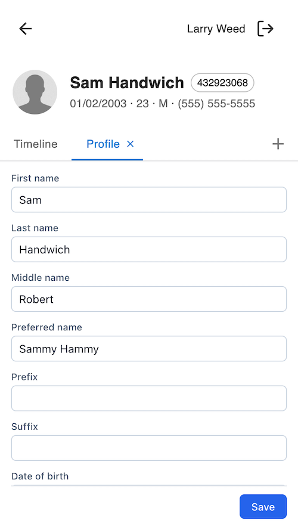

# provider_patient_profile_companion

## What it does

Adds a **Profile** application to the patient companion view. Tapping it opens a tab where the provider can edit the patient's basic identity fields — first, middle, last, prefix, suffix, preferred name, date of birth, sex at birth, and Social Security Number — and save without leaving the chart. After save, the modal repaints with whatever was actually persisted.



## Problem it solves

Allows providers to modify patient profile information in a mobile-friendly
interface.

## Who it's for

Any clinical staff with chart access — physicians, NPs, PAs, RNs, MAs — who notice a profile error mid-encounter and want to fix it on the spot. Not specialty-specific. Especially useful in practices where the front-desk team isn't the only one who corrects patient demographics.

## How to install

```sh
canvas install --host <host> provider_patient_profile_companion
```

After install, a **Profile** icon appears on every patient's companion view. No configuration steps required.

## Configuration options

None. The plugin has no secrets and settings. The set of editable fields is fixed and documented above.

## License

MIT. See [LICENSE](./LICENSE).
