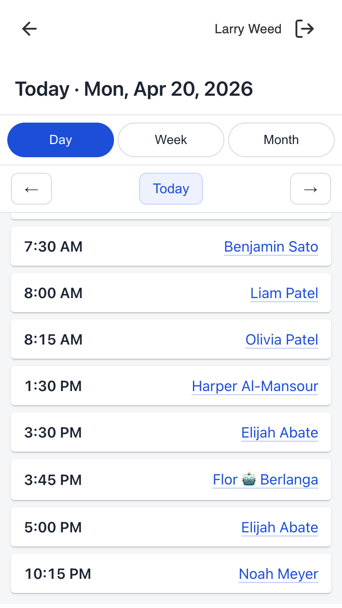

# provider_schedule_companion

A mobile-friendly "at-a-glance" schedule that lives on the provider companion main page. Opens the logged-in provider's own upcoming visits in a modal with day, week, and month views.

## Problem it solves

A provider checking their own day from a phone otherwise has to open the full scheduling view and pick themselves out of everyone else's appointments. This plugin puts the logged-in provider's own visits, and only theirs, one tap away in the companion launcher with day, week, and month views.

## What providers see



An icon titled **My Schedule** appears in the provider companion launcher. Tapping it opens a modal with:

- A header showing the currently-selected date (or date range) and a Day / Week / Month view switcher.
- Prev / Next arrows that step by one day, week, or month depending on the active view, and a **Today** button that snaps back to today's date in the current view.
- A scrollable content area that re-renders when you change the view or the date range.

Only appointments where you are the provider are shown.

## How to use it

**Day view** (the default, centered on today)
- Each appointment is a card showing its start time and the patient name.
- Tap a card to expand it and reveal the appointment type, reason for visit, duration, and status. Tap again to collapse.
- Tap the patient's name (underlined link) to leave the modal and jump to that patient's companion page.

**Week view**
- Seven stacked day sections, one per day of the week.
- Each day's header shows the day-of-week and date, centered. Tap the header to jump into Day view for that date.
- Under each header, the day's appointments appear as the same tap-to-expand cards used in Day view.
- A day with no appointments shows an italicized "No appointments" note under its header.
- If the displayed week contains today, today's section scrolls into view automatically when the week renders.

**Month view**
- A standard calendar grid. Days with appointments show a small count badge.
- Tap any date to jump into Day view for that date.
- Today's cell is outlined in the plugin's accent color.

## Installation

No environment variables or secrets are required.

```sh
canvas install --host <host> \
    ~/src/plugin-development/msf-canvas/extensions/provider_schedule_companion/provider_schedule_companion
```

After install, the plugin registers itself against the `provider_companion_global` scope and will appear in the provider companion launcher on next page load.

---

## For developers

### Scope

This plugin uses the `provider_companion_global` `ApplicationScope` — it surfaces on the provider companion main page and does not receive patient or note context.

### Architecture

```
provider_schedule_companion/
├── CANVAS_MANIFEST.json               # plugin manifest (scope: provider_companion_global)
├── README.md                          # this file
├── LICENSE                            # MIT
├── applications/
│   └── schedule_app.py                # Application subclass; on_open → LaunchModalEffect
├── handlers/
│   └── schedule_api.py                # SimpleAPI: UI shell + JSON endpoints
├── static/
│   ├── index.html                     # SPA shell (header, view tabs, nav, content slot)
│   ├── main.js                        # vanilla-JS, no framework; view state + fetch + render
│   └── styles.css                     # mobile-first; Material-style cards w/ elevation
└── assets/
    ├── icon.png                       # 256×256 launcher icon
    └── schedule-calendar-icon.svg     # source SVG for the icon
```

### Request flow

1. Provider taps the app in the companion launcher.
2. `ScheduleApp.on_open()` returns a `LaunchModalEffect` pointing to `/plugin-io/api/provider_schedule_companion/app/`.
3. `ScheduleAPI.index()` serves `static/index.html` rendered through `render_to_string`.
4. `main.js` loads and fetches `/app/appointments?start=<iso>&end=<iso>` for the current view's range.
5. `ScheduleAPI.appointments()` runs the query, serializes, and returns JSON.
6. `main.js` renders into `#content`.

### Data access

- Read: `Appointment`, `Patient`, `NoteType` (via `Appointment.select_related("patient", "note_type")`).
- No writes.
- `data_access` in the manifest is empty because queries happen through the SDK's ORM surface, not through event subscriptions.

### Auth

- `StaffSessionAuthMixin` — non-staff sessions are rejected with `InvalidCredentialsError` at the auth layer.
- The logged-in staff UUID is read from the `canvas-logged-in-user-id` header (set by the platform on every request into `/plugin-io/`).

### Cache-busting

`_CACHE_BUST` is a module-level UTC timestamp generated when the plugin process starts. It's passed into the rendered HTML as `cache_bust`, and the HTML shell appends `?v={{cache_bust}}` to its `main.js` / `styles.css` references. A plugin redeploy or process restart gives a new token, so stale JS/CSS never gets served to users.

### Timezone handling

The client computes view boundaries as local `Date` objects and sends their `.toISOString()` representations (UTC). The server parses those with `datetime.fromisoformat` (`Z` suffix supported) and filters by `start_time__gte` / `start_time__lt`. Appointments come back as ISO strings; the client renders them with `toLocaleTimeString` / `toLocaleDateString` so display follows the device's locale and timezone.

### Endpoints

All mounted under `/plugin-io/api/provider_schedule_companion/app/`.

| Method & path | Purpose |
|---|---|
| `GET /` | HTML shell |
| `GET /appointments?start=<iso>&end=<iso>` | JSON list of appointments (provider = logged-in user, `start_time` in `[start, end)`) |
| `GET /main.js` | served JS |
| `GET /styles.css` | served CSS |

Appointment JSON shape:
```json
{
  "id": "…",
  "start_time": "2026-04-17T09:00:00+00:00",
  "duration_minutes": 30,
  "patient_id": "<uuid>",
  "patient_name": "Jane Doe",
  "appointment_type": "Follow-up",
  "reason_for_visit": "Back pain",
  "status": "confirmed"
}
```

### Known considerations

- **Icon scale** — rendered at 256×256 because the 48×48 default for `cpa:icon-generation` looks fuzzy in the launcher.
- **Browser locale for date math** — the "today" boundary is derived from the browser clock; a user browsing in a timezone far from the practice may see off-by-day edge cases at midnight.
- **Modal scroll isolation** — `body` is a full-height flex column with `overflow: hidden`; only `#content` scrolls, so the header, view tabs, and date nav stay pinned.

## Testing

```sh
cd ~/src/canvas-plugins && uv run pytest \
    ~/src/plugin-development/msf-canvas/extensions/provider_schedule_companion/tests \
    --cov=provider_schedule_companion --cov-branch --cov-report=term-missing
```

Current coverage: **100%** (46 stmts, 2 branches).

## License

MIT. See [LICENSE](./LICENSE).
