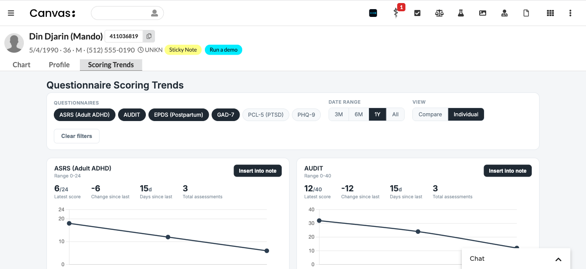
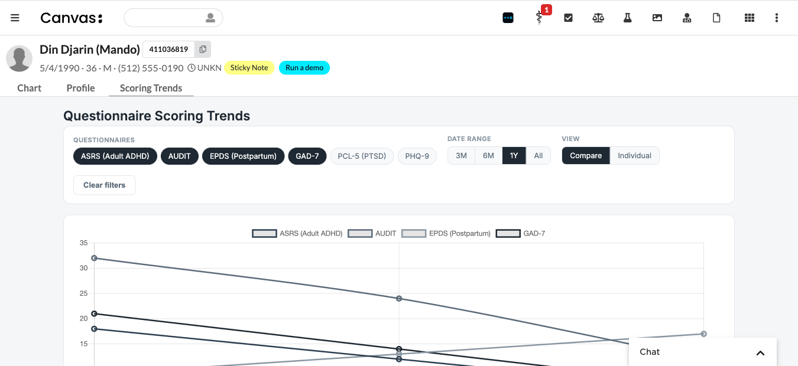
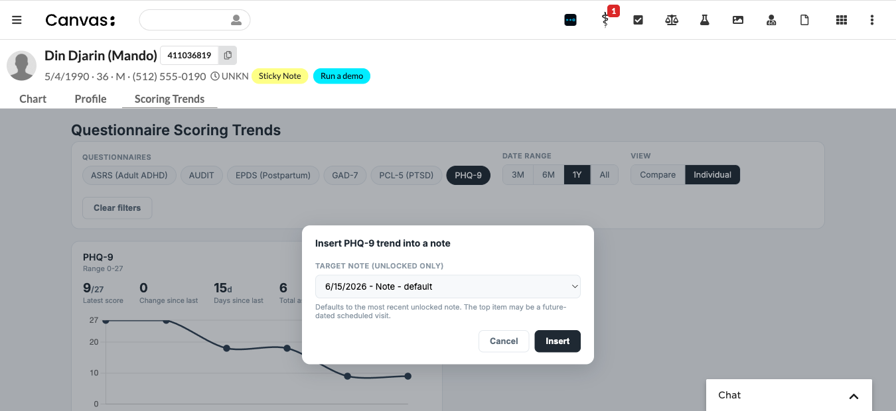

# Questionnaire Scoring Dashboard



## What it does

Charts a patient's scored-questionnaire results over time on a single page in the chart. A provider picks one or more questionnaires and a date range and sees, per questionnaire, the latest score, the change since the last assessment, days since the last assessment, the total number of assessments, and a trend line. Any single trend can be dropped into a note as a read-only command.

## Problem it solves

Scored screeners (PHQ-9, GAD-7, and the like) pile up across many visits, and there is no quick way to see whether a patient is improving. Today a provider hunts through individual notes or exports observations to a spreadsheet to compare scores by hand. This puts every score for a patient on one screen and lets the provider attach the picture to the visit note in one click.

## Who it's for

Behavioral health and primary care providers who administer scored questionnaires and track them over a course of treatment (measurement-based care). Useful for any specialty that uses scored survey instruments.

## How to install

```
canvas install --host <your-instance> questionnaire_scoring_dashboard
```

Open a patient chart and select the **Scoring Trends** tab. No configuration required.

The dashboard surfaces any scored questionnaire that has at least one survey-category score observation on the patient's chart. It reads those scores wherever they come from - Canvas's native scored questionnaires or any plugin that writes scored survey observations - so no companion plugin is required.

## Configuration options

None. The plugin has no secrets or settings. Instrument display names, score ranges, and the questionnaire codes it recognizes are defined in `config.py`; add an entry there to support an additional instrument. It presents data only - no severity thresholds or clinical interpretation are configured or shown.

## Screenshots

| Individual view | Compare view | Insert into note |
|---|---|---|
|  |  |  |

## How it works

| Component | Role |
|---|---|
| `applications/dashboard_app.py` | `Application` (`full_chart`) - opens the dashboard full-page via `LaunchModalEffect(PAGE)` |
| `api/routes.py` | `SimpleAPI` (staff-authed) - serves the UI, a JSON `/data` endpoint, the note list, and the insert endpoint |
| `services/` | pure logic: build per-instrument series, compute metrics, render the static SVG, choose the default note |
| `data/` | thin SDK queries: scored survey observations, open/editable notes |
| `commands/scoring_trend.py` | the read-only `CustomCommand` inserted into the note |

Scores are read from `Observation` rows with `category="survey"` (excluding `entered_in_error`), dated by the note's date-of-service. Multiple scores for the same instrument on the same date are collapsed to one point. The inserted command renders a static inline-SVG chart (no JavaScript) so it works inside the read-only command sandbox.

## License

MIT - see [LICENSE](LICENSE).
