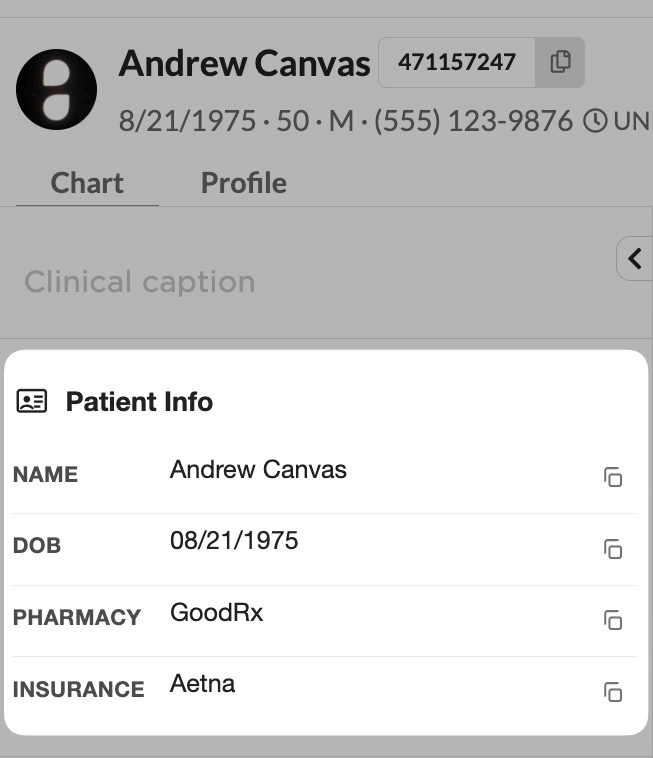

# Quick Copy Patient Info

A patient chart summary section that pins the four most-copied patient
fields - **Name**, **Date of Birth**, **Preferred Pharmacy**, and
**Primary Insurance** - to the top of every patient chart, each with a
one-click copy button.



## What it does

Adds a custom **Patient Info** section pinned to the top of the patient
chart summary, above all standard chart sections. For each populated
field, the section renders a row with a label, the value, and a small
copy button. Clicking the button writes the field's payload to the
clipboard and briefly swaps the button icon to a check mark.

- **Name** - patient's first and last name. Copies the same string that
  is displayed.
- **DOB** - patient's date of birth in `MM/DD/YYYY` format. Copies the
  same string.
- **Pharmacy** - the patient's preferred pharmacy organization name.
  Sourced from the `pharmacy` patient setting; if multiple preferred
  pharmacies are on file, the one marked default wins. Copies the same
  string that is displayed (name only).
- **Insurance** - the payer name (`Transactor.name`) of the patient's
  primary active in-use coverage. "Primary" means `coverage_rank=1`.
  We also filter on `state=active` and `stack=IN_USE` so coverages that
  have been removed from the chart never surface. Copies the same string
  that is displayed.

If a field is empty (no preferred pharmacy on file, no primary coverage,
etc.), its row is omitted entirely from the section - no placeholder,
no greyed-out "Not on file" text. The section keeps a compact footprint
and only shows what is actually available to copy.

## The problem this solves

Clinicians, MAs, and front-desk staff routinely copy patient
identifiers out of Canvas to paste into external messages, faxes,
pharmacy callbacks, prior-authorization forms, and insurance
eligibility tools. The existing path is multi-step: open Demographics
or the coverage card, highlight the value, copy it, scroll back. Doing
that several times per call (name to a Slack message, DOB to a
pharmacy, payer name to a prior-auth form) adds up.

This plugin replaces that workflow with a one-click action at the very
top of the chart.

## Who it's for

- Providers, MAs, and care navigators who copy patient identifiers
  into Slack, email, or scribed notes during or after a visit.
- Front-desk staff who relay patient info to pharmacies, labs, and
  payors over the phone.
- Anyone who runs a lot of prior-auth or referral paperwork and
  pastes patient demographics, pharmacy, or insurance details into
  external forms.

## How to install

Standard Canvas plugin install, run from the repository's `extensions/`
directory:

```bash
canvas install --host <your-instance> quick_copy_patient_info
```

No secrets, environment variables, or external API keys are required -
the plugin only reads internal Canvas patient demographic, pharmacy
setting, and coverage data.

## How it works

Two handlers, both responding to chart-summary events:

- `handlers/section_config.py` registers a
  `CustomSection("quick_copy_patient_info")` in
  `PatientChartSummaryConfiguration` so Canvas knows to ask for the
  section's content. The section is listed first in the configuration
  so it pins to the top.
- `handlers/section_content.py` queries the `Patient` model via the
  Canvas SDK, reads the preferred pharmacy via the `Patient.preferred_pharmacy`
  property, queries `Patient.coverages` for the primary active in-use
  coverage with `select_related("issuer")`, formats the four fields,
  builds a row dict per populated field, and returns a
  `PatientChartSummaryCustomSection` effect with HTML rendered from
  `static/section.html`.

Markup, styling, and the client-side copy logic live as separate files
under `static/`:

- `static/section.html` - Django template for the section body and
  per-row copy buttons.
- `static/section.css` - visual styles tuned to match native chart
  sections (Lato, 14px, rgba color hierarchy).
- `static/section.js` - delegates clicks on `.qcpi-copy` buttons to
  `navigator.clipboard.writeText`, with a `document.execCommand`
  fallback for older embedded browsers.

The custom section ships as a single inline content blob, so the CSS
and JS are loaded via `render_to_string` and inlined into the HTML at
render time rather than referenced by URL.

## Field formatting rules

| Field | Source | Display | Copy payload |
| --- | --- | --- | --- |
| Name | `first_name`, `last_name` | `first_name last_name` | same as display |
| DOB | `birth_date` | `MM/DD/YYYY` | same as display |
| Pharmacy | `Patient.preferred_pharmacy` JSON dict | `organization_name` value, trimmed | same as display |
| Insurance | First `Coverage` with rank=1, state=active, stack=IN_USE, `select_related("issuer")` | `issuer.name`, trimmed | same as display |

## Caveat: coverage stack vs state

Canvas's coverage UI surfaces a "Remove" button that sets a coverage's
`stack` to `REMOVED` without changing its `state`. A state-only filter
would therefore surface coverages the user thought they removed. The
insurance helper filters on **both** `state=active` AND `stack=IN_USE`
to honor the "Remove" gesture. The same invariant is documented in the
auto-memory and was the root cause of a prior validation bug in
`lab_order_validation`.

## Caveat: section ordering

`PatientChartSummaryConfiguration` is all-or-nothing - emitting it
overrides the default chart summary section list. This plugin
therefore emits the full default section list with the custom section
pinned to the top. If another plugin also emits a configuration for
the same patient (for example, `last_reviewed` or another summary
customization), the last-applied configuration wins. To combine
plugins, edit the section list in `handlers/section_config.py` to
match your desired layout.

## Privacy and security

The plugin reads patient PHI directly from the Canvas SDK ORM and
renders it into HTML that is served only inside the authenticated
Canvas chart UI. Nothing is sent to external services. The clipboard
write happens entirely in the user's browser via the standard
Async Clipboard API.

## Development

Run the tests from the plugin's outer directory:

```bash
cd extensions/quick_copy_patient_info
uv sync
uv run pytest
```
