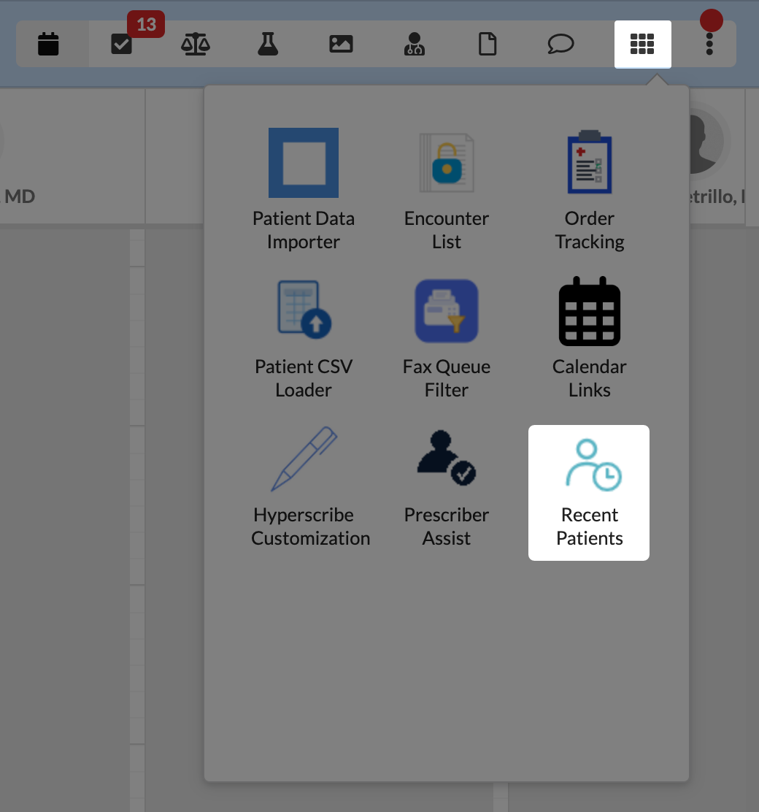
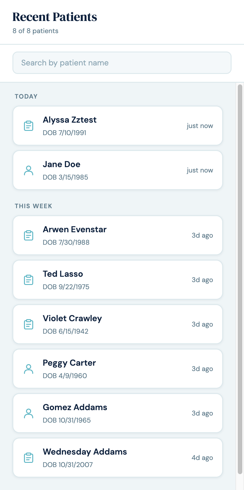

# Recent Patients

A per-staff "recently interacted patients" recall surface for Canvas. Closes
the "lost patient context" gap after inbox-style workflows where the chart
modal closes and the staff member loses the breadcrumb back to the patient
they just acted on.

## What it does

Adds a **Recent Patients** launcher to Canvas (in the global app drawer and
inside any patient chart). Clicking it opens a side panel listing the last 50
patients the logged-in staff member has personally touched, sorted most-recent
first. Each row shows the patient's name, DOB, relative time, and an icon
indicating whether the touch was a chart open or a profile open. One click on
a row opens that patient's chart.

## The problem it solves

A staff member is in their inbox or schedule view and sees an imaging or lab
result waiting for review. They click it, the result-review modal opens, they
sign off, the modal closes — and they're back in the inbox with no visible
context about which patient that was. To follow up (send a message,
double-check, add an order), they have to remember the patient's name and
search from scratch.

With this plugin installed, the staff member clicks **Recent Patients** in
their Canvas launcher and the patient they just acted on is at the top of the
list. One click and they're in that patient's chart.

The same recall path works for any workflow where Canvas's UI strips patient
context — replying to a message from the inbox, completing a task from a
global list, signing a regular note, viewing a profile, etc.

## Who it's for

Any Canvas staff role — clinicians (providers, MAs, RNs) and administrative
staff (schedulers, billers, intake). Each staff member's list is **personal**:
they only see patients they themselves interacted with. The plugin is not
patient-facing.

## How to install

```bash
canvas install recent_patients
```

After install, the **Recent Patients** icon appears in:

1. The Canvas app launcher (visible from any page)
2. Patient chart pages (the patient-specific Application surface)

Both icons open the same panel.

## Configuration options

None. The plugin is install-and-go — no secrets, no environment variables,
no Canvas settings to flip.

Retention is fixed at 7 days; the plugin's `RecentPatientInteraction`
CustomModel table is pruned nightly at 03:00 UTC by the included CronTask.

## Screenshots

The launcher icon in the Canvas app drawer:



The panel itself — patients grouped by day with the chart icon for chart
opens and the person icon for profile opens:



## What gets captured

The plugin records *which patient* the staff member touched, classified as
**chart** or **profile**.

| Event | Captures | interaction_type |
|---|---|---|
| `PATIENT_CHART_SUMMARY__SECTION_CONFIGURATION` | Chart opened | `chart_view` |
| `PATIENT_PROFILE__SECTION_CONFIGURATION` | Profile opened | `profile_view` |
| `NOTE_STATE_CHANGE_EVENT_CREATED` (state=LKD, category=review) | Chart-review note signed via the inbox/schedule path (which doesn't fire chart-load) | `chart_view` |

The icon on a row reflects the surface (clipboard for chart, person card for
profile). Each row is collapsed to **one per (staff, patient) pair** — the
most recent touch wins. Entries older than 7 days are pruned nightly.

## Architecture

```
recent_patients/
├── __init__.py                     # CACHE_BUST version constant
├── CANVAS_MANIFEST.json
├── assets/
│   ├── icon.png                    # 48x48 launcher icon
│   └── recent_patients_icon.svg    # source
├── models/
│   └── recent_patient_interaction.py   # the CustomModel
├── protocols/
│   ├── track_interactions.py       # 3 tracking handlers + shared _record()
│   └── prune_history.py            # CronTask, nightly at 03:00 UTC
├── applications/
│   └── recent_patients_app.py      # 2 Applications (global + patient_specific)
├── handlers/
│   └── recent_patients_api.py      # SimpleAPI: HTML shell + JSON data
└── static/
    ├── index.html
    ├── main.js                     # vanilla JS, no framework
    └── styles.css
```

- Both `Application` classes return a `LaunchModalEffect` pointing at
  `/plugin-io/api/recent_patients/app/?v=<CACHE_BUST>`. The SimpleAPI serves
  the HTML shell, the JSON `/data` payload, the JS, and the CSS.
- `StaffSessionAuthMixin` rejects patient sessions at the auth layer.
- Each `/data` response is scoped to the logged-in staff via the
  `canvas-logged-in-user-id` request header — staff only ever see their own
  interaction history.
- The tracking handlers store opaque `staff_id` / `patient_id` strings
  (UUIDs), not FK rows. The CustomModel table is decoupled from staff/patient
  deletes.

## Surfaces

| Application | Scope | Where the icon appears |
|---|---|---|
| `RecentPatientsApp` | `global` | Canvas app launcher (across all contexts) |
| `RecentPatientsPatientApp` | `patient_specific` | Inside any patient chart |

Both open the same modal — the patient context (when launched from a chart)
is not passed in; the modal always shows the logged-in staff's own recent
patients.

## Data scope

| Read | Write |
|---|---|
| `Patient` (for name/DOB hydration), `NoteStateChangeEvent` / `Note` (for the chart-review-sign safety net) | `RecentPatientInteraction` (plugin-owned CustomModel) |

## Limitations

- The plugin doesn't distinguish "you took action on this patient" from "you
  just looked." All touches show with the same icon.
- Patient-profile *updates* (vs opens) aren't currently tracked because
  Canvas's `PATIENT_UPDATED` event lacks a reliable actor reference.
- Cross-staff sharing of "recent patients" is not supported — each staff
  member sees only their own list.

## Running Tests

```bash
uv run pytest tests/
```

The test suite covers handler dispatch, SimpleAPI route behavior, the prune
CronTask, and helper functions. Target is 100% line + branch coverage.

## License

MIT — see [LICENSE](./LICENSE).
