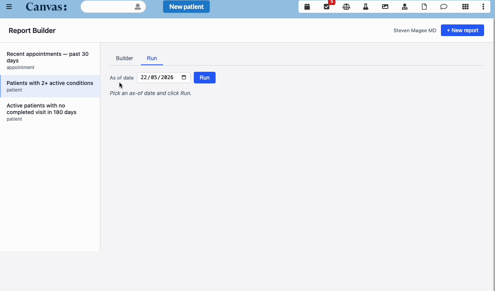
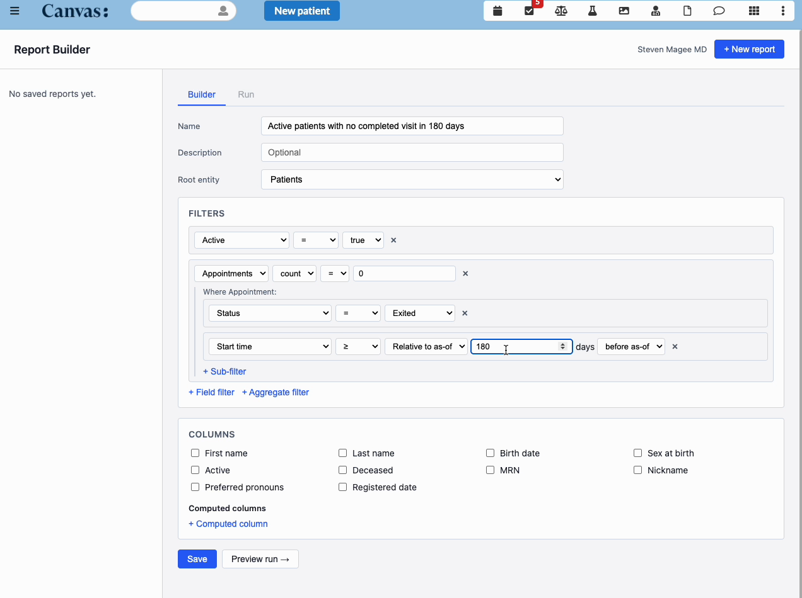
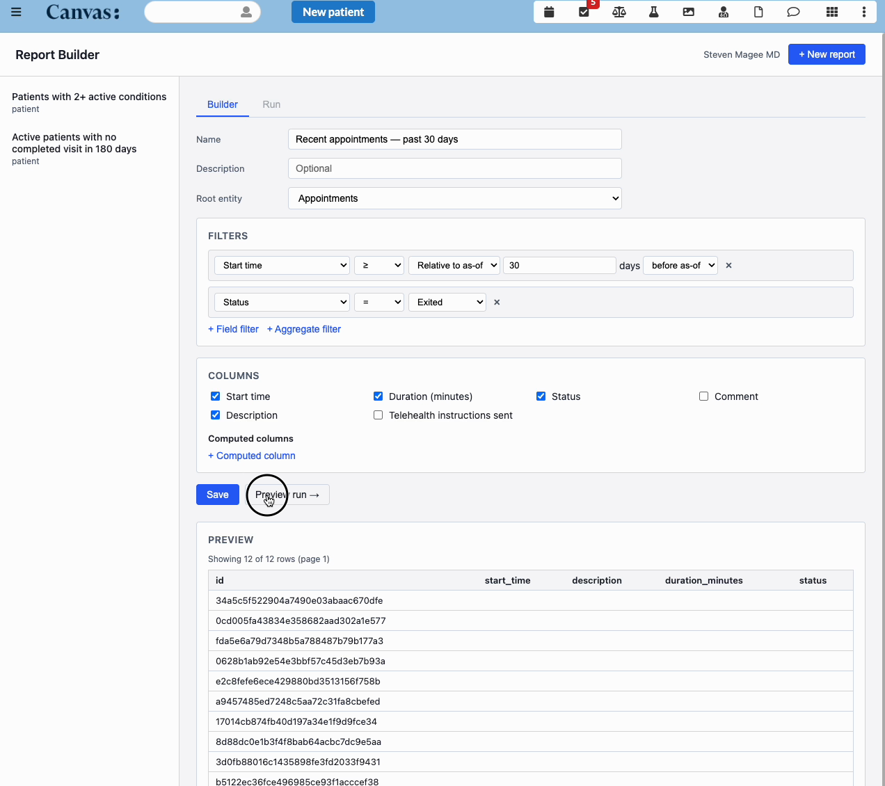

report-builder
=======================

## What it does

A point-and-click report engine for Canvas. Staff pick an entity (Patients,
Appointments, Conditions, Notes, Lab Orders), add filters and one-hop
aggregates ("patients with zero completed appointments in the last 90 days"),
choose the columns to show, and run the report. Results render as a paginated
table; CSV export is one click. Reports are saved per instance and visible to
all staff. An `as_of_date` parameter resolves relative date filters at run
time, so the same saved report keeps working as a rolling care-gap or outreach
list.

## Problem it solves

Clinic ops, care management, quality, and outreach teams routinely need
ad-hoc patient lists — "everyone overdue for an annual visit", "patients with
diabetes who haven't had an A1c in 12 months", "no-show risk by panel". Today
those lists come from one of three places: a one-off SQL request to
engineering, a workflow built in another system, or a spreadsheet that someone
maintains by hand. The first is slow, the second drifts out of sync with the
chart, and the third is unauditable. Report Builder lets non-engineers build
those lists directly against Canvas data, save them so they can be re-run as
the population changes, and export to CSV when the next step is outside the
EMR.

## Who it's for

Designed for clinic operations, care management, quality, and outreach teams
who need to build patient and clinical lists without writing code. Useful
across primary care, behavioral health, specialty practices, and DTC clinics.
Anyone who can build a saved Salesforce report can build a Canvas report.

## Screenshots

Saved reports list with the Run tab open — pick an `as_of_date` and run the
report:



The builder mid-edit. This report — "Active patients with no completed visit
in 180 days" — filters Patients where `active = true` AND the count of
Appointments with `status = Exited` and `start_time ≥ 180 days before
as-of-date` equals zero. Field filters and aggregate filters are both
schema-driven; the form knows what fields and relationships each entity
exposes:



A preview of the results — rows materialize directly under the builder
without leaving the page. Capped at 10,000 rows; pagination clamped to 100
per page; CSV export streams the same data:



## Installation

```
canvas install report_builder
```

Launch from the app drawer once installed. There is no per-instance
configuration to apply.

## Configuration options

None. The plugin has no secrets or instance-level settings. Row caps and
pagination limits are defined in code (`MAX_ROWS=10000`, `per_page` clamped to
`[1, 100]`).

## ⚠️ PHI exposure risk

**This plugin gives every authenticated staff member the ability to list
patients by arbitrary clinical criteria.** That is the entire point of a
report builder, but it also means anyone with access can construct a list of
patients with sensitive conditions (HIV, mental health, substance use, etc.)
and export it as a CSV.

**v1 enforces no role-based gating.** A `PRE_RUN_HOOKS` extension point exists
in `reports/query.py` for downstream consumers to wire role checks without a
refactor. Until that is wired, **deployers are responsible for restricting
access at the Canvas role level** — for example, by only granting the
app-drawer permission to staff who would otherwise be authorized to run
patient reports against this data.

Audit log entries are emitted per create/update/delete/preview/run/export
through the standard Canvas plugin log facility:

```
report-builder audit: {"event": "run", "staff_id": "...", "report_id": "...",
                       "as_of_date": "2026-05-22", "result_count": 42}
```

No patient data is included in the audit log.

## Safety

- Result sets are capped at 10,000 rows. Past that, the UI refuses to render
  and asks the user to refine.
- All field, relationship, and operator references are whitelisted against the
  schema registry before reaching the ORM — there is no path for user-supplied
  strings to land directly in a `.filter()` call.

## Architecture

```
report_builder/
├── handlers/
│   ├── application.py    # ReportBuilderApp — app-drawer entry
│   └── api.py            # ReportBuilderAPI — SPA shell + JSON endpoints
├── schemas/              # Entity Schema Registry — extension point for new entities
│   ├── base.py
│   ├── registry.py
│   ├── patient.py
│   ├── appointment.py
│   ├── condition.py
│   ├── note.py
│   └── lab_order.py
├── reports/              # Domain logic
│   ├── models.py         # Report / *Condition / AggregateColumn dataclasses
│   ├── validate.py       # validate_report
│   ├── query.py          # build_queryset, safe_run, paging
│   ├── storage.py        # CRUD wrapper around the SavedReport CustomModel
│   └── export.py         # streamed CSV
├── models/
│   └── saved_report.py   # SavedReport (Canvas CustomModel)
└── static/               # Preact + HTM SPA, no build step
    ├── index.html
    ├── app.js
    └── …
```

### Adding a new entity

The schema registry is the single extension point. To add an entity:

1. Create `report_builder/schemas/<entity>.py` exposing an `EntitySchema`.
2. Add it to `_ENTITY_LIST` in `report_builder/schemas/registry.py`.

No UI code changes needed.

### Schema deviation: Encounter → Note

The original spec listed an "Encounter" entity, but Canvas's `Encounter` model
has no direct `Patient` FK — it reaches Patient through `Note`. To stay inside
the v1 one-hop-only constraint, the registry exposes `Note` instead. The two
concepts overlap almost completely in Canvas (every encounter has exactly one
note), so this is a no-op for the user-visible reports.

## Out of scope (v1)

- Multi-hop relationship traversal.
- OR / nested filter logic. All filters are AND.
- GROUP BY reports / aggregation-only outputs.
- Charts and visualizations.
- Per-user reports, sharing controls, scheduled runs.

## Testing

```bash
uv run pytest                                # run all tests
uv run pytest --cov=report_builder           # with coverage
```

Tests cover the schema registry, validator, query builder, storage layer,
CSV export, Application handler, and every JSON endpoint. UI is not covered
by the Python test suite.

## CANVAS_MANIFEST

The `CANVAS_MANIFEST.json` is used when installing the plugin. Keep it in
sync with the code: when handler class paths, application metadata, or the
custom_data namespace change, update the manifest.
