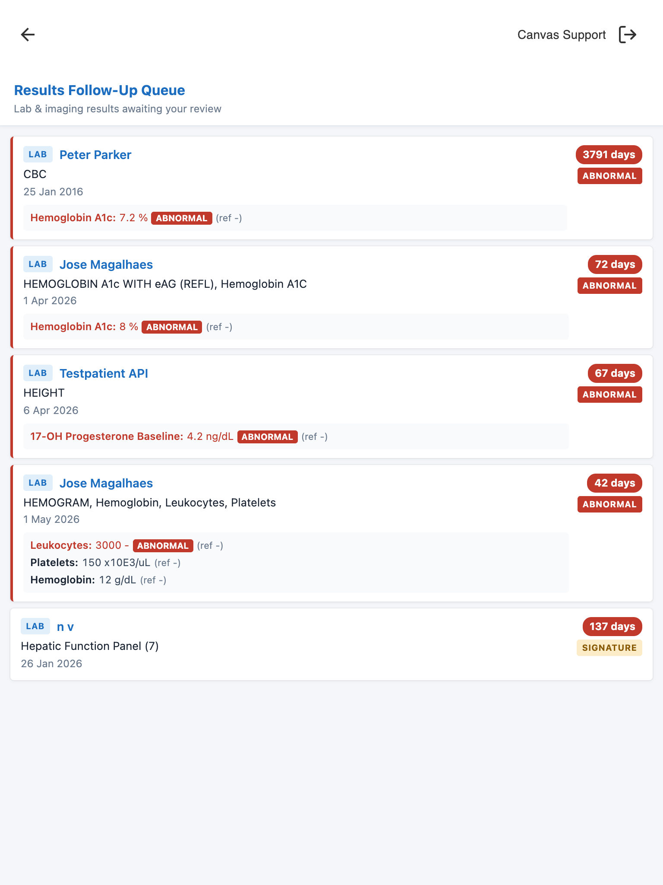

Results Follow-Up Queue
=======================

## What it does

Results Follow-Up Queue is a global **provider companion app** that gives a
clinician one compact list of the lab and imaging results that are still waiting
for their review. Each result shows the patient, the test or study, the
individual lab values (with abnormal ones highlighted), how many days it has been
pending, and badges for abnormal results and results that need a signature.
Abnormal results sort to the top, then the longest-waiting ones, so the most
important follow-ups are always first. Clicking a patient opens their chart so
the provider can complete the review natively.

## Problem it solves

Closing the diagnostic loop — making sure ordered tests actually get reviewed —
is a patient-safety and compliance responsibility. Canvas surfaces unreviewed
results in the provider inbox, but there is no single, provider-scoped view that
spans **both labs and imaging**, highlights **abnormal** results, and shows how
**long** each has been waiting.

Today the manual workaround is to scan the inbox item by item (or open charts one
patient at a time) to figure out "what diagnostics am I still on the hook for, and
which are most urgent?" Results that sit unreviewed can slip through the cracks.
This app is the bookend to the **Pre-Visit Brief** app: that one preps the start
of the visit, this one closes the loop afterward.

## Who it's for

Clinical providers who order diagnostics and are responsible for reviewing the
results — physicians, nurse practitioners, and physician assistants, across any
specialty. The queue is scoped to the **logged-in provider** and shows only the
results where they are the ordering provider.

## What the queue shows

For the ordering provider, the queue lists every lab or imaging result that:

- has **no review record yet** (`review` is unset),
- is not junked / deleted / entered-in-error, and
- is not marked "review not required" (`review_mode != "RN"`).

Each row shows:

- **Patient name** — links to the patient chart (`/companion/patient/<key>`).
- **Type badge** — `Lab` or `Imaging`.
- **Result name** — the lab test name(s) or imaging study name.
- **Result values** — for labs, the discrete values (name, value, units,
  reference range) listed inline, with abnormal values highlighted in red.
  (Imaging has no discrete values, so none are shown.)
- **Result date** and **days pending**, with an aging highlight
  (≥ 7 days amber, ≥ 14 days red).
- **Abnormal badge** — for labs, when any lab value carries an abnormal flag.
  (Imaging has no structured abnormal flag, so it never shows the badge.)
- **Signature badge** — when the result requires a signature.

**Sort order:** abnormal results first, then oldest-pending first.

## Screenshots



## How to install

```bash
canvas install results-followup-queue
```

After installing, the **Results Follow-Up Queue** app appears in the provider
companion drawer.

## Configuration options

None. The app requires no secrets, settings, or thresholds — it identifies the
provider from the active Canvas session and reads results directly from the
Canvas data models. (The aging thresholds — amber at 7 days, red at 14 days — are
fixed in the frontend.)

## How it works

- **Application** (`ResultsQueueApp`, scope `provider_companion_global`) adds the
  app to the companion drawer. Opening it launches a modal pointing at the
  plugin's API.
- **SimpleAPI** (`QueueAPI`, prefix `/app`) serves the HTML/JS/CSS shell and a
  `GET /data` endpoint that returns the JSON list of results for the logged-in
  provider (identified via the `canvas-logged-in-user-id` session header, which
  Canvas sets only for an authenticated staff session).
- Two bulk queries (one labs, one imaging) — no per-result queries, no N+1.
- No write actions: the app links the provider to the chart to perform the
  review natively.

## Development

```bash
uv sync
uv run pytest        # run tests
uv run ruff check .  # lint
uv run mypy .        # type-check
```

## License

MIT — see [LICENSE](LICENSE).
