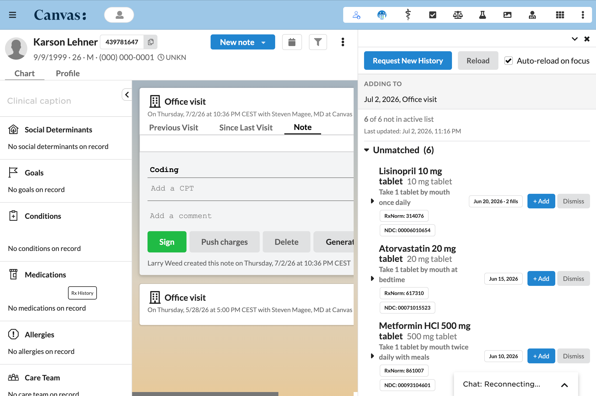
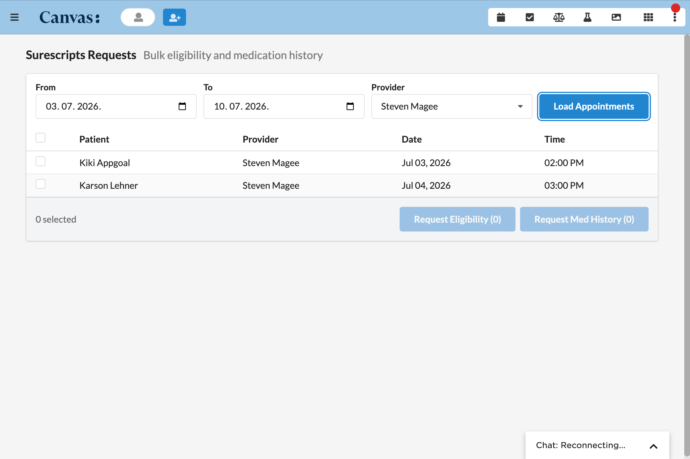

rx_history
==========

Automates Surescripts medication history requests for upcoming appointments and surfaces that history inside the patient chart.

## What it does

1. Two daily cron tasks send Surescripts eligibility and medication history requests for patients with appointments 1 and 7 days out.
2. An action button in the chart medications section opens a side panel that groups Surescripts history by drug, flags each row as matched or unmatched against the active medication list, and lets the provider add a missing medication to the open note or dismiss a row.
3. A provider menu item application opens a bulk requests page where staff trigger eligibility and medication history requests for any patient set inside a date range.

## Problem it solves

At the point of care a provider often lacks a complete picture of what a patient is actually filling at the pharmacy. Surescripts holds that dispensed history, but pulling it by hand for each upcoming visit is slow and easy to forget. This plugin sends the requests automatically ahead of the appointment and lays the returned history next to the active medication list, so reconciliation gaps surface before the patient is in the room.

## Who it's for

Prescribing providers and the clinical staff who prepare charts before a visit. The chart panel serves the provider during the encounter, and the bulk page serves the staff who batch the requests for a day or a week of appointments in advance.

## How to install

1. Install the plugin onto a Canvas instance.

   ```bash
   canvas install rx_history --host <your-canvas-host>
   ```

2. Configure the plugin secret. The plugin owns the `vicert__rx_history` custom data namespace, and Canvas generates the namespace access keys the first time the plugin installs. Set the `namespace_read_write_access_key` secret to the generated read and write key so the dismissal store can read and write its rows. See Configuration options below.

3. Open the Surescripts Requests app from the Canvas provider menu to batch eligibility and medication history requests for upcoming appointments, or open the Rx History action button in a patient chart medications section to review returned history against the active medication list.

## Configuration options

| Secret | Required | Purpose |
|--------|----------|---------|
| `namespace_read_write_access_key` | yes | Grants read and write access to the `vicert__rx_history` custom data namespace used by the dismissal store. |

The care event window is 7 days. Manual and bulk requests are blocked unless the patient has a non cancelled appointment within that window. The window is set in `protocols/_care_event.py` as `CARE_EVENT_WINDOW_DAYS`.

The plugin does not set a lookback range on the medication history request. The 18 months of history returned is the Surescripts default for `SendSurescriptsMedicationHistoryRequestEffect`.

## Screenshots





## How it works

The two cron tasks run daily and fan out one request per eligible patient. The chart action button renders the comparison panel server side on click, so the panel does not wait on a fetch. The bulk page and the panel actions are backed by SimpleAPI endpoints under staff session auth. Adding a medication from the panel originates a `MedicationStatementCommand` on the open note.

### Components

| Path | Role |
|------|------|
| `protocols/eligibility_cron.py` | Daily cron. Sends Surescripts eligibility requests. |
| `protocols/med_history_cron.py` | Daily cron. Sends Surescripts medication history requests. |
| `protocols/action_button.py` | Chart action button and modal renderer. |
| `protocols/view.py` | SimpleAPI endpoints backing the modal, staff session auth. |
| `protocols/bulk_api.py` | SimpleAPI endpoints backing the bulk requests page, staff session auth. |
| `protocols/static_api.py` | Serves the design system CSS and JS for the plugin templates. |
| `applications/bulk_requests.py` | Provider menu item that launches the bulk requests page. |
| `models/dismissed_medication.py` | Custom data model for dismissals, namespace `vicert__rx_history`. |

### Effects produced

- `SendSurescriptsEligibilityRequestEffect` from the cron and bulk endpoints.
- `SendSurescriptsMedicationHistoryRequestEffect` from the cron, the action button modal, and the bulk endpoints.
- `MedicationStatementCommand.originate()` from the modal add medication flow.
- `LaunchModalEffect` from the action button and the bulk requests application.

### Matching

Each Surescripts row is compared against the active medication list by drug code, not by name. The plugin checks RxNorm CUI after normalization, then NDC on the digits only form, then an NDC to RxNorm cross reference through the FDB ontologies service. The result flags the row as matched or unmatched in the panel and never suppresses a row.

### Dismissals

Dismissals are keyed on drug description, NDC code, and last fill date. A unique constraint on `DismissedMedication` stops the same triple from being dismissed twice for a patient. A later fill of the same drug carries a different last fill date, so it surfaces in the panel as a new row. See `protocols/dismissal_store.py` and `models/dismissed_medication.py`.

## Testing

The plugin ships a pytest suite covering the cron tasks, the action button and modal, the modal and bulk SimpleAPI endpoints, the dismissal store, and the static asset endpoint.
