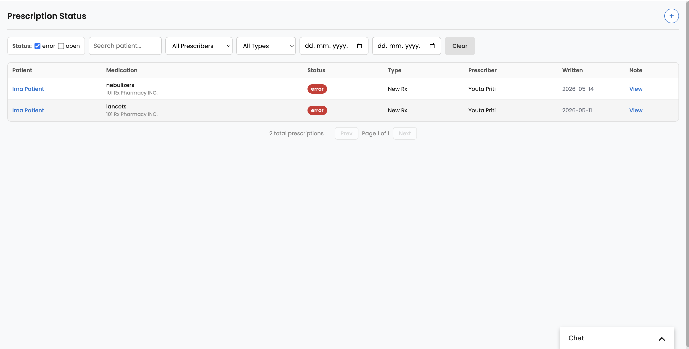

# rx_status

A Canvas plugin that surfaces e-prescribing status across all patients and lets staff create rule-based task notifications when prescriptions hit — or linger in — a given status.

## What it does

`rx_status` provides:

1. A **global-scope dashboard** listing prescriptions with filters (status, prescriber, patient, type, date range) and pagination. Status pills are color-coded and hovering an `error` pill reveals the prescription's error message. Each row deep-links into the patient note.
2. A **notification-rule engine** that creates Canvas Tasks:
   - **Immediate rules** fire the moment a prescription enters the target status (via event handler).
   - **Duration rules** fire when a prescription has been in the target status for more than N hours/days (via hourly cron).
3. Per-rule assignee (staff or team), optional task label, and a note-deep-link comment on every auto-created task.

### Components

| Kind | Class | File |
|---|---|---|
| Application (`scope: global`, `show_in_panel: false`) | `RxDashboard` | `applications/rx_dashboard.py` |
| REST API (`StaffSessionAuthMixin`) | `RxApi` | `applications/rx_api.py` |
| Event handler (12 `PRESCRIPTION_*` events) | `RxNotificationProtocol` | `protocols/rx_notifications.py` |
| Cron (`0 * * * *`) | `RxNotificationCron` | `protocols/rx_cron.py` |
| UI template | — | `templates/rx_dashboard.html` |

## Problem it solves

Electronic prescriptions don't always confirm immediately — they sit in `pending`, `inqueue`, `error`, or other intermediate statuses, sometimes for hours or days, with no proactive visibility. Staff either poll a screen or miss stalled prescriptions entirely.

This plugin replaces the poll loop with a filterable, all-patient dashboard plus a rule engine that creates Canvas Tasks automatically when a prescription enters a target status (immediate) or lingers there past a threshold (duration). The result is fewer missed prescriptions, faster follow-up on errors, and a documented workflow instead of tribal knowledge.

## Who it's for

- **Pharmacy and clinical operations staff** who currently chase prescription status manually
- **Prescribers** who want to be alerted when their own prescriptions stall (the dashboard auto-pre-selects the logged-in prescriber as a filter)
- **Practices with high e-prescribing volume** where waiting for individual errors to surface is operationally expensive

## How to install

```bash
canvas install rx-status --host <instance>
canvas logs --host <instance>
```

After install, set the required secret in the Canvas admin (see **Configuration options** below).

## Configuration options

### Required secret

- `INSTANCE_BASE_URL` — base URL for the Canvas instance (e.g. `https://your-instance.canvasmedical.com`). Used to build patient-note deep-links inside the comments added to auto-created tasks. Configure in the Canvas admin after install.

### API endpoints

All routes are prefixed with `/plugin-io/api/rx_status`.

| Method | Path | Purpose |
|---|---|---|
| GET | `/prescriptions` | Paginated list with filters |
| GET | `/filters` | Available filter options (distinct prescribers / statuses / types) |
| GET | `/rules` | List notification rules |
| POST | `/rules` | Create a rule (server-side validated) |
| DELETE | `/rules/<rule_id>` | Delete a rule |
| GET | `/me` | Current logged-in staff user (name + `is_prescriber` flag) |
| GET | `/staff` | Active staff members |
| GET | `/teams` | All teams |
| GET | `/labels` | Active task labels |

### Rule schema (POST `/rules`)

```json
{
  "status": "pending",
  "task_title": "Follow up on pending Rx",
  "duration_value": 24,
  "duration_unit": "h",
  "assignee_type": "staff",
  "assignee_id": "<staff_uuid>",
  "assignee_name": "Dr. Smith",
  "label": "<label_id>"
}
```

`duration_value = 0` ⇒ immediate rule. `duration_unit` must be `"h"` or `"d"`. `status` must be one of the known prescription statuses. `task_title` is required and capped at 255 characters.

### Cache keys (plugin-scoped, in-memory)

| Key | Shape | Purpose |
|---|---|---|
| `rx_status_notification_rules` | `[Rule, ...]` | Rule definitions |
| `rx_status_fired_notifications` | `{ "<rx_id>_<rule_id>": <iso timestamp> }` | Dedup. Pruned every cron run after 30 days. |
| `rx_status_status_timestamps` | `{ "<rx_id>": {"status": str, "since": <iso>} }` | Per-prescription last-status-change time for duration rules. |

## Screenshots or screen recordings



The dashboard, filtered to `error` status — each row shows the patient, medication and pharmacy, current e-prescribing status, prescription type, prescriber, written date, and a `View` deep-link into the originating note. The `+` button in the top right opens the notification-rule config panel.

## Known limitations

- **Cache-only storage.** Rules, dedup entries, and status timestamps live in the plugin cache (`get_cache()`), not the database. A cache flush or plugin redeploy loses them. Durable storage would require moving to `Secret` or a custom model.
- **Pre-existing prescriptions.** Rx records that existed before this plugin was installed have no entry in `rx_status_status_timestamps`. The cron falls back to the Django `modified` field for those, which can over-fire if a pre-existing Rx is edited for an unrelated reason.
- **Sandbox duplication.** The Canvas sandbox blocks cross-module relative imports, so cache helpers (`_get_rules`, `_already_fired`, `_mark_fired`, `_create_task`, `_get_note_link`) are duplicated between `rx_notifications.py` and `rx_cron.py`. Keep them in sync by hand.

## Tests

```bash
cd extensions/rx-status
pytest tests/ -v
```

If Canvas SDK's `django.setup()` blocks local imports, run `canvas test` from the plugin directory instead.

## Info

*This plugin was developed and contributed by [Vicert](https://vicert.com).*
Contact: engineering@vicert.com
