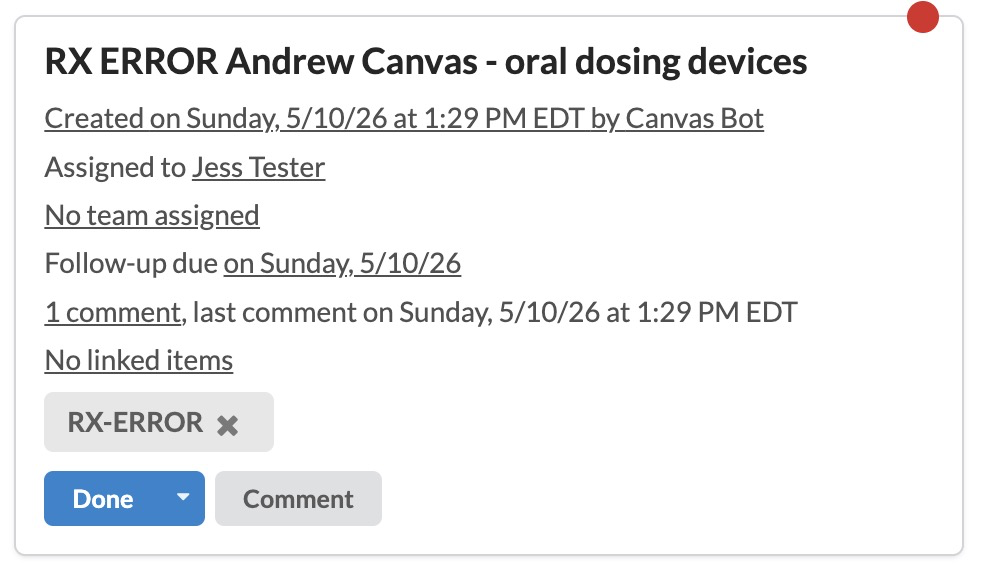

# rx-error-notification

Automatically creates a task for the prescriber when a prescription returns an error status, so providers find out about failed prescriptions the moment they happen instead of when a patient calls.

## Problem It Solves

When a prescription fails (insurance rejection, pharmacy error, formulary issue, missing prior auth), the prescriber often doesn't find out until the patient calls back days later. The error message is buried in the prescription record - nothing notifies the prescriber, nothing puts it in front of them.

This plugin closes that loop. The moment the prescription errors, a task lands on the prescriber's task list with the patient name, medication, and the actual error message - ready to triage, fix, and resend.

## Who It's For

- **Prescribers** (MDs, NPs, PAs) who want to be notified the moment their prescriptions fail rather than discovering it from a patient call.
- **Care teams in any specialty that prescribes regularly** - primary care, behavioral health, weight management, chronic care, and anyone running e-prescribing at volume.
- **Practice administrators** who want a paper trail of failed prescriptions and visible accountability for resolution.

## How It Works

- **Event:** Listens for `PRESCRIPTION_ERRORED` events
- **Action:** Creates an `AddTask` assigned to the prescribing provider with an `AddTaskComment` containing prescription details

## Task Format

- **Title:** `RX ERROR {Patient Name} - {Medication Name}`
- **Due:** Immediately
- **Label:** `RX-ERROR`
- **Comment:** Medication name, sig, dose/dispense quantities, refills, pharmacy, and error message

## Screenshots

Task created when a prescription errors:



## Configuration

No secrets or configuration required. The plugin works automatically once installed and enabled.

## Data Access

- **Read:** Prescription, Patient, Staff, Medication

## Installation

```bash
canvas install rx_error_notification
```

## Running Tests

```bash
uv run pytest tests/
```

## License

[MIT](LICENSE)
