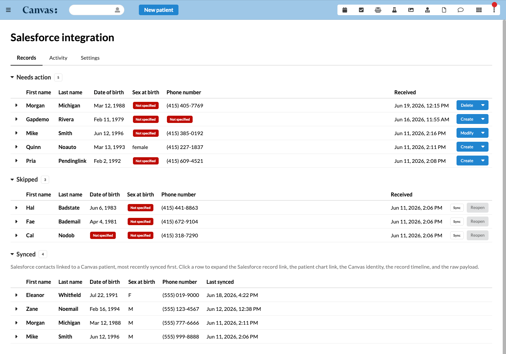

# Salesforce to Canvas Integration

## What it does

Reference Canvas plugin that captures patient sync events from Salesforce and
surfaces them in a Canvas side audit table. The Salesforce contact carries one
Canvas Sync field with two meaningful values, so the wire carries two events,
Sync and Delete. Any Salesforce Flow or Apex action posts the flagged record to
one endpoint and the plugin captures the payload as one immutable row tagged
with the event it arrived as.

A human operator inside Canvas resolves each row. The action button shows the
verb, what acting on the row will do right now, derived from the live patient
link. A Sync with no linked patient reads Create, a Sync with one reads Modify,
a Delete on a linked patient reads Delete. Records collapses each contact to a
single row, the newest pending event, since a one directional sync means the
latest Salesforce state is the truth. The events that newest one overrides,
anything that arrived since the last applied change, read as a history list
inside the row Details rather than as separate rows. A Delete with no linked
Canvas patient has nothing to delete, so it drops off the list and stays only in
the Activity ledger. Skip closes a row with no Canvas side change and rides on
every row. At ingestion a configurable filter decides each Sync event, a record
that clears the filter applies automatically and anything else holds in needs
action for a human. The filter only ever promotes a sync to automatic, deletes
still hold for a human, and the defaults gate conservatively, which keeps the
integration safe for clinical data. See Configuration options below.

## Problem it solves

Teams that run Salesforce as the front of house keep patient demographics there,
yet Canvas needs those same demographics to open and maintain a chart. Hand
keying every new or changed contact into Canvas is slow and drifts out of sync.
This plugin closes that gap with a one directional feed from Salesforce to
Canvas, while keeping a human in control of anything that touches a clinical
record. Every inbound event is captured as an immutable audit row, nothing is
applied blindly, and the operator always sees what an action will do before it
runs.

## Who it's for

Clinics and care teams that treat Salesforce as the system of record for patient
contact details and want those details to flow into Canvas without manual
re-entry. It fits an operations or front desk role that reviews incoming changes
and decides what lands in Canvas, and an administrator who tunes how much of that
flow is automatic. It is published as a reference implementation, so it also
serves engineering teams that want a worked example of an audited, human gated,
inbound demographics sync.

## How to install

1. Install the plugin onto a Canvas instance.

   ```bash
   canvas install salesforce_to_canvas_integration --host <your-canvas-host>
   ```

2. Configure the plugin secrets. At minimum the Salesforce identifiers, the
   shared webhook secret, and the admin staff allowlist are required. The full
   list, including the optional and conditional secrets, is in Configuration
   options below.

3. Set up the Salesforce side, the Canvas Sync picklist, the Record Triggered
   Flow, and the Apex emitter that signs and posts the payload. A deployable
   worked example ships in the `salesforce/` folder next to the plugin package.
   See Salesforce side setup below.

4. Open the Salesforce Integration admin app from the Canvas provider menu to
   review captured rows and tune the Sync automation on the Settings tab.

## Configuration options

### Plugin secrets

| Secret                            | Required        | Purpose                                                                          |
| --------------------------------- | --------------- | -------------------------------------------------------------------------------- |
| `SF_CLIENT_ID`                    | yes             | Salesforce External Client App consumer key                                      |
| `SF_CLIENT_SECRET`                | yes             | Salesforce External Client App consumer secret                                   |
| `SF_LOGIN_URL`                    | yes             | `https://login.salesforce.com` for production, `https://test.salesforce.com` for sandbox |
| `SF_WEBHOOK_SECRET`               | yes             | Shared secret used by Salesforce Apex to sign webhook payloads                   |
| `SF_ADMIN_STAFF_IDS`              | yes             | Comma separated Canvas staff keys allowed to open the admin app                  |
| `SF_SOURCE_SOBJECT`               | optional        | Default `Contact`. Use `Lead`, `Account`, or a custom sObject if needed          |
| `SF_FIELD_MAPPING_JSON`           | optional        | JSON map of Salesforce field name to Canvas target, see Field mapping below      |
| `CANVAS_API_CLIENT_ID`            | conditional     | Canvas External Client App key, required for Mark inactive and Unlink only       |
| `CANVAS_API_CLIENT_SECRET`        | conditional     | Canvas External Client App secret, required for Mark inactive and Unlink only    |
| `FUMAGE_BASE_URL`                 | conditional     | Canvas FUMAGE base URL, required for Mark inactive and Unlink only               |
| `CANVAS_INSTANCE_URL`             | optional        | Override for the Canvas OAuth token host URL, useful when the Canvas FHIR and auth ports differ (local dev stacks) |
| `SF_INSTANCE_URL`                 | optional        | Salesforce org base URL fallback used to build record links while disconnected or when no live OAuth token is cached |
| `simpleapi-api-key`               | yes, auto       | Canvas SimpleAPI key, set automatically by Canvas at install                     |
| `namespace_read_write_access_key` | yes, auto       | Custom data namespace key, set automatically by Canvas at install                |

`SF_ADMIN_STAFF_IDS` accepts Canvas Staff `key` values, the 32 character hex
identifier surfaced in the `canvas-logged-in-user-id` header.

The three Canvas FHIR secrets gate the Mark inactive and Unlink only
resolution actions. Tag deleted and Skip work without them. Set them only
if those resolution paths are needed.

### Field mapping

Demographics are mapped via `SF_FIELD_MAPPING_JSON`. The default map covers
the common Salesforce Contact fields.

```json
{
  "FirstName":             {"target": "first_name"},
  "LastName":              {"target": "last_name"},
  "Birthdate":             {"target": "date_of_birth"},
  "Email":                 {"target": "email"},
  "Phone":                 {"target": "phone"},
  "MobilePhone":           {"target": "telecom.mobile"},
  "MailingStreet":         {"target": "address_line_1"},
  "MailingCity":           {"target": "city"},
  "MailingState":          {"target": "state"},
  "MailingPostalCode":     {"target": "postal_code"},
  "MailingCountry":        {"target": "country"},
  "Gender":                {"target": "sex_at_birth"},
  "Preferred_Language__c": {"target": "metadata.preferred_language"},
  "Referral_Source__c":    {"target": "metadata.referral_source"},
  "MRN__c":                {"target": "metadata.mrn"}
}
```

Targets prefixed with `metadata.` write to patient metadata so customer
specific fields can ship without code changes.

### Sync filtering and auto apply

> Every event runs through this filter now, the create and modify verbs of the
> Sync event and the Delete event. A delete holds for a human by default because
> auto delete is off in the defaults below, and when auto delete is enabled it
> dispatches the configured delete action. A delete for a record with no linked
> Canvas patient has nothing to act on, so it stays in the Activity feed and never
> becomes an actionable row. The filter reads the code defaults shown below
> until an admin changes them on the Settings tab, where the Sync automation card
> tunes every value in this section.

A configurable filter decides whether a captured record applies automatically
or holds for a human. A filter only ever promotes a sync to automatic, it never
auto applies something a human would otherwise have to gate. The evaluation runs
in three ordered stages, hard gates first, then the per event toggles, then the
promotion rules. A held record stays in needs action with its reasons recorded,
so the operator sees exactly what to fix, and an auto applied record runs the
same Canvas effect the matching manual resolution would.

#### Hard gates, always hold

These never bend and cannot be turned off. A record that trips one always waits
for a human.

| Gate               | Holds when                                                              |
| ------------------ | ----------------------------------------------------------------------- |
| Mapping failed     | The payload could not be mapped and was captured raw only               |
| Previously skipped | The most recent decision for this contact was a Skip                    |
| Link pending       | A create was already accepted and its patient link has not landed yet   |
| Duplicate match    | An unlinked create matches an existing patient on last name and birthdate |

The link pending and duplicate gates apply to the create verb only.

#### Layer one, per event automation

The first layer turns automation on or off per event. A toggle that is off
lands that path in needs action exactly as a manual resolution would.

| Event             | Setting                                                       | Default       |
| ----------------- | ------------------------------------------------------------ | ------------- |
| Sync, create verb | Auto apply                                                   | On            |
| Sync, modify verb | Auto apply                                                   | On            |
| Delete            | Auto apply                                                   | Off           |
| Delete            | Automatic action, Mark inactive, Tag deleted, or Unlink only | Mark inactive |

The delete action only matters while delete auto apply is on. Unlink is
selectable but never the default, since the next sync for an unlinked contact
derives a create and would spawn a duplicate patient.

When delete auto apply is on, Mark inactive and Unlink only call the Canvas
FHIR Patient endpoint synchronously from the webhook, the same call the manual
resolutions make. If the three Canvas FHIR secrets are unset, or the call fails
on auth or transport, the delete degrades to a manual hold with a reason naming
the failure and the row waits in needs action, exactly as a delete would with
auto apply off. The webhook always answers 202, a degradation is never an error
returned to Salesforce. Tag deleted is effect based and needs no FHIR
configuration, so it never degrades.

#### Layer two, promotion rules

The second layer gates the Sync event only, both verbs. Delete writes no
demographics, so these rules never touch it.

| Rule                    | Shape                                                | Default                              |
| ----------------------- | ---------------------------------------------------- | ------------------------------------ |
| Required field set      | Every named field must be populated                  | First name, last name, date of birth, phone |
| Address group integrity | All or nothing over street, city, state, postal code | On                                   |
| Validity checks         | A populated value must survive the writer coercion   | On                                   |

Every field in the required set is an operator toggle except last name, which is
always required to create a patient and cannot be turned off. The create writer
refuses a patient with no last name, so the evaluator floors it for creates, a
create with no last name holds with a clear reason instead of auto applying into
a writer rejection. The Settings checkbox for last name is shown checked and
locked to reflect that. Modify is unaffected, it is a delta on a linked patient
that already carries a last name. Country stays out of the address group,
the writer defaults it to US. The validity
checks cover, the birthdate parses and is not in the future, sex at birth
normalises, email carries a plausible shape, phone carries at least ten digits,
and when the country reads as US or empty the state is two letters and the
postal code is five or nine digits. Each failing rule names its field so the
held row reads as a precise fix list.

#### Tuning the filter, the Settings tab

The admin app carries a Settings tab with a Sync automation card that tunes
every value in this section without a code change or a secret edit. The card
exposes the layer one auto apply toggles for create, modify, and delete, the
delete action radio group which stays disabled and dimmed while delete auto
apply is off, the required field checkboxes where every field is a toggle except
last name which is checked and locked, and the two layer two rule toggles for
address group integrity and validity. The settings are stored as one row in the
plugin's custom data namespace, so they survive uninstall and reinstall like the
audit rows do.

Until an admin saves the card, the filter runs on the code defaults shown in
the tables above, so the integration behaves the moment it is installed. The
required set must name at least one field, an empty set is refused. A failed save shows an error banner
scoped to the card, a successful save is silent and clears any stale banner.
Reading and saving the settings is gated to the `SF_ADMIN_STAFF_IDS` allowlist
behind a live Canvas staff session, the same gate the resolution actions use.

## Screenshots or screen recordings



The Salesforce Integration admin app, reached from the Canvas provider menu,
lists every captured row with its live action verb, the Activity ledger, and the
Settings tab that tunes the Sync automation.

## How it works

```
Salesforce Flow ── HTTPS POST ──► /webhooks/patient/sync
                                    │  body {intent, record:{Id, fields}}
                                    ├─ HMAC SHA256 verify
                                    ├─ Validate Id is present
                                    ├─ Derive action from intent, delete intent
                                    │  gives delete, sync gives create or modify
                                    ├─ Dedup against newest row for the same
                                    │  (external_id, action, content_hash)
                                    ├─ Capture as IncomingPatientRecord
                                    └─ 202 Accepted with entry_id

Canvas operator opens the Salesforce Integration admin app
    │
    ├─ Reviews the row, picks a resolution
    └─ Resolution endpoint runs the matching Canvas effect or FHIR call
```

Capture and resolution are fully decoupled. A retry that lands the same
payload is dropped. A new payload for the same record lands as a new immutable
row, but the list surfaces only the newest per contact. The older ones ride as
the overridden history inside that row Details and in the Activity ledger, so
nothing is lost.

## Components

| Component                  | Type        | Purpose                                                                                  |
| -------------------------- | ----------- | ---------------------------------------------------------------------------------------- |
| `SalesforceWebhookSync`    | SimpleAPI   | `POST /webhooks/patient/sync`, one endpoint for both the Sync and Delete events           |
| `SalesforceOAuthAPI`       | SimpleAPI   | `GET /oauth/start`, `GET /oauth/callback`, Salesforce OAuth authorization code flow      |
| `SalesforceStatusAPI`      | SimpleAPI   | `GET /status`, `GET /activity`, `GET /synced`, audit row resolution endpoints, `POST /disconnect` |
| `SalesforceAdminPage`      | SimpleAPI   | `GET /admin`, serves the console HTML to any logged in staff, gating inside              |
| `SalesforceAdminApp`       | Application | Provider menu item full page admin UI, audit table plus settings                         |
| `SalesforceChartBanner`    | Protocol    | Patient chart banner under the patient name linking to the linked Salesforce record      |
| `SalesforceCanvasIdWriteback` | Protocol | On patient creation, writes the new Canvas patient id back to the linked Salesforce record over OAuth |

## Webhook endpoints

| URL                         | Method | Intent          | Required payload fields                       |
| --------------------------- | ------ | --------------- | --------------------------------------------- |
| `/webhooks/patient/sync`    | POST   | `sync`          | `record.Id`, full demographics per mapping    |
| `/webhooks/patient/sync`    | POST   | `delete`        | `record.Id`                                   |

One endpoint serves both events. The body is nested, `{"intent": "sync" |
"delete", "record": {"Id": ..., mapped fields}}`. The action is derived server
side, a delete intent captures a delete row, a sync intent captures a modify
when a Canvas patient is already linked else a create. The `record` is stored
as the immutable raw payload. The `X-Signature` header carries `sha256=<hmac>`
over the raw body computed with the shared `SF_WEBHOOK_SECRET`. Responses are
`202 Accepted` on success, `401` on bad HMAC, `400` on a missing `Id` or
unparseable JSON, and `503` when the plugin is missing required secrets.

Public URL on a Canvas instance is
`https://<your-canvas>.canvasmedical.com/plugin-io/api/salesforce_to_canvas_integration/webhooks/patient/sync`.

## Audit UI resolution actions

The admin app lists every captured row. Each row carries three actions in a
fixed order, Details, Skip, and the verb. The verb is derived from the live
patient link at render time, so the same stored row reads Create before a
patient exists and Modify after one does. Resolution routes live under
`/records/<external_id>/<route>` and each verb maps to one route.

| Verb    | Route                  | When it shows                                          |
| ------- | ---------------------- | ------------------------------------------------------ |
| Create  | `accept` or `promote`  | A Sync row with no linked Canvas patient               |
| Modify  | `review-and-update`    | A Sync row with a linked Canvas patient                |
| Delete  | `tag-deleted` and friends | A Delete row with a linked Canvas patient           |

The verb is a live button on the one row per contact, the newest pending event
of any action. The older events it overrides do not appear as rows, they read as
a history list in the row Details, and a Delete with no linked Canvas patient
drops off the list entirely. The server also refuses a resolution on any row a
newer pending change has superseded, so a stale event can never apply even if
posted directly. Skip and Details ride on every row regardless. A Modify opens
the editable audit modal where the operator edits any field and commits the
update.

Tag deleted writes a `salesforce_deleted_at` metadata entry on the linked
Canvas patient via `PatientMetadata`. The patient stays active and visible
in Canvas search. Unlink only removes the `salesforce` external identifier
from the patient via Canvas FHIR PUT, the clinical record stays untouched.
Mark inactive flips `Patient.active=false` via Canvas FHIR PUT, the patient
disappears from default Canvas search. Skip closes the row with no Canvas
side change, and a skipped row can be reopened.

## Custom data namespace

The plugin owns one custom data namespace, `vicert__salesforce_integration`,
with `read_write` access. Inbound webhook payloads land here as
`IncomingPatientRecord` rows tagged with action, content hash, status, and
resolution metadata. The namespace survives uninstall and reinstall.

## Canvas side setup

### External Client App for the FHIR resolutions

Mark inactive and Unlink only call the Canvas FHIR Patient endpoint, which
requires a Canvas External Client App.

1. In Canvas, create an External Client App.
2. Grant at least the `Patient.read` and `Patient.write` scopes.
3. Store the consumer key in `CANVAS_API_CLIENT_ID`, the consumer secret in
   `CANVAS_API_CLIENT_SECRET`.
4. Set `FUMAGE_BASE_URL` to the FUMAGE base URL of the Canvas instance.

Tag deleted does not need this app. If the plugin will only ever Tag deleted
or Skip delete rows, the three Canvas FHIR secrets can be left unset.

### Admin staff allowlist

`SF_ADMIN_STAFF_IDS` holds the comma separated `Staff.key` values that may
open the admin app and call the resolution endpoints. Look the key up in
Canvas, it is the 32 character hex string under each staff user.

## Salesforce side setup

The plugin does not call into Salesforce on the inbound path, Salesforce
pushes. The contract any org must satisfy is small.

- One picklist on the source sObject, Canvas Sync, with the values Sync and
  Delete and a blank default meaning do nothing. The field is the rep's
  deliberate intent, nothing emits without it.
- One Record Triggered Flow that fires while the field reads Sync or Delete
  and hands the record id and the lowercased field value to Apex.
- One Apex emitter that builds the nested body
  `{"intent": "sync" | "delete", "record": {"Id": ..., mapped fields}}`,
  signs the exact bytes with HMAC SHA256 against the shared
  `SF_WEBHOOK_SECRET`, and POSTs to the single webhook endpoint with the
  signature in `X-Signature` as `sha256=<hex>`.

A complete worked example of this configuration ships with the plugin in
the `salesforce/` folder next to the plugin package, a deployable
Salesforce CLI project carrying the field, the Flow, the emitter and its
test, the validation rule, the secret store, and the permission set. It is
a reference implementation, not a managed package. Tailor it to the org and
deploy it with one CLI command, or use the files as the exact blueprint for
manual Setup work. The folder README walks through every artifact, the CLI
deploy, the manual Setup equivalents, the tailoring points, and how
Contacts flow day to day once the integration is live. See
[salesforce/README.md](../salesforce/README.md).

When a create lands a new Canvas patient, the plugin writes that patient's id
back onto the Salesforce record's `Canvas_Patient_ID__c` field. The writeback
fires on the Canvas patient creation event, since the id does not exist until
the patient lands, and it pushes the value over the stored OAuth connection. If
the plugin is not connected, the writeback logs and skips, patient creation is
never affected, so connecting is what turns the reverse link on.

The OAuth writeback of `Canvas_Patient_ID__c` needs a Salesforce External
Client App with the `api`, `refresh_token`, and `offline_access` scopes. Its
consumer key and secret go into the plugin secrets `SF_CLIENT_ID` and
`SF_CLIENT_SECRET`, and the callback URL is
`https://<your-canvas>.canvasmedical.com/plugin-io/api/salesforce_to_canvas_integration/oauth/callback`.

### Other sObjects

The same one field, one Flow, one emitter pattern works for any sObject.
`SF_SOURCE_SOBJECT` tells the plugin which sObject identifier to embed in
the captured row. The plugin only supports one source sObject at a time per
install. If a customer needs Contact plus Lead, the recommendation is two
separate plugin installs, each with its own source sObject and its own
Salesforce field set.

## Development

```bash
uv sync
uv run pytest
uv run mypy salesforce_to_canvas_integration
```

## Info

*This plugin was developed and contributed by [Vicert](https://vicert.com).*
Contact: engineering@vicert.com
