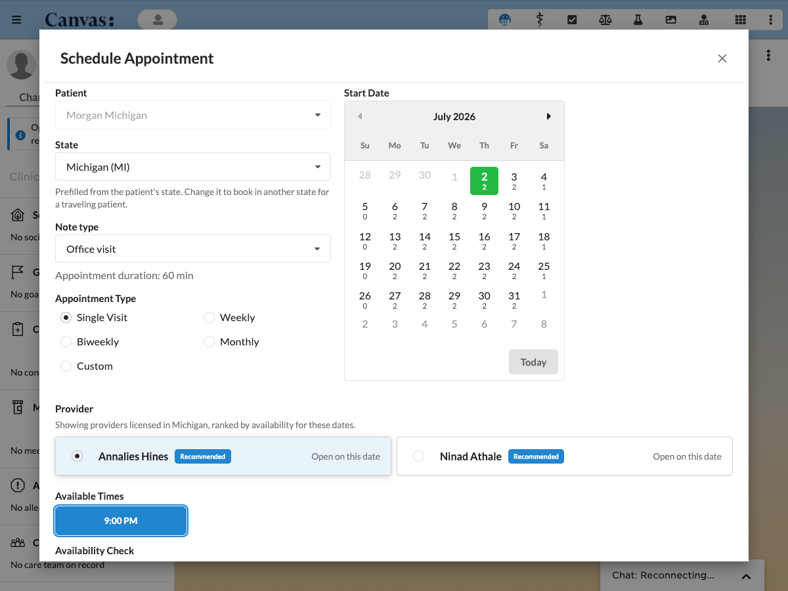

# Scheduling Modal with Recurring Support

## What it does

Scheduling Modal with Recurring Support lets Canvas staff book single or recurring appointments for a patient from one modal. It filters the provider list to providers licensed in the patient's state, ranks them by real availability on the exact dates being booked, and reads live availability from the Canvas FHIR `Slot` endpoint. Every availability figure on screen, the calendar day counts, the provider cards, and the per time ratios, answers one question on one basis, can this booking happen on these dates at this duration, so no number on the screen contradicts another.

The plugin installs two application buttons.

- `SchedulingApp`, `patient_specific` scope, appears in the patient chart sidebar panel and opens pre-seeded with the current patient.
- `GlobalSchedulingApp`, `global` scope, appears in the bento grid launcher at the top right of Canvas and opens without a patient so the user searches for one.

Both buttons open the modal through a `LaunchModalEffect`. Staff then work through a single form where the when comes before the who.

1. Patient, selected from the chart context or searched by name.
2. Note type, which sets the appointment duration used by every availability figure below.
3. Appointment type and start date, single visit or recurring, weekly, biweekly, monthly, or a custom rule. The calendar marks each day with how many licensed providers can cover the whole series starting that day, so a day no one can start reads zero and is a visible dead end rather than a trap.
4. Provider. Once the cadence and start date are set, the list ranks providers by the real series each can take on those exact dates at the real duration, not by a generic load proxy. Each card reads an honest count, for example five of five dates open or three of five, and the top providers carry a Recommended badge. The list is filtered to providers licensed in the patient's home state.
5. Times and review. The Available Times pills show the chosen provider's openings on the start date. For recurring visits the modal projects the occurrence dates forward, checks FHIR availability per occurrence, and lets staff review or adjust each row before booking.
6. Confirm and book. On confirm the plugin validates the whole series against the provider's current appointments, then books one occurrence per request, creating one `AppointmentEffect` each. If another scheduler takes one of the chosen times while the series is booking, that occurrence is set aside, the rest book normally, and staff land back on the row list holding only the taken occurrences to pick new times or skip them.

## Problem it solves

Booking a recurring course of visits in a bare scheduling grid is slow and error prone. Staff have to check each provider's license, guess who has room across a run of dates, and reconcile availability numbers that come from different places and disagree. This plugin does that work in one modal. It filters providers by license, scores real availability across the whole projected series, surfaces the most available providers up front, and reconciles every figure on the screen to a single availability question, so a scheduler can commit a recurring booking in one pass with confidence.

## Who it's for

Front desk staff, schedulers, and any care team member who books appointments in Canvas, especially recurring series such as weekly therapy or a course of follow ups. The chart button suits booking for the patient already open, and the global button suits a scheduler working across many patients.

## How to install

Install the plugin with the Canvas CLI, pointing it at the plugin package directory, the one that holds `CANVAS_MANIFEST.json`.

```
canvas install path/to/scheduling_modal_with_recurring_support --host <your-instance>
```

The plugin reads provider availability through the Canvas FHIR API, so it needs the FHIR and OAuth secrets in the Configuration options section set before it can list availability or book.

## Configuration options

Four secrets must be set in the plugin settings before the plugin can reach the Canvas FHIR API.

| Secret | Purpose |
|--------|---------|
| `CANVAS_FHIR_BASE_URL` | Base URL of the Canvas FHIR API |
| `CANVAS_INSTANCE_URL` | Canvas instance URL used for OAuth token requests |
| `CANVAS_OAUTH_CLIENT_ID` | OAuth client ID, client credentials grant |
| `CANVAS_OAUTH_CLIENT_SECRET` | OAuth client secret |

The OAuth application must be registered in Canvas as a confidential client with the `client_credentials` grant type. No redirect URI is required. OAuth tokens for FHIR calls are acquired via client credentials and cached in plugin Redis for 50 minutes.

One optional secret tunes booking duration.

`DEFAULT_APPOINTMENT_DURATION_MINUTES` sets the duration in minutes the plugin uses when booking appointments and when asking Canvas for free slots. It accepts an integer between 5 and 240 and defaults to 60 when unset, blank, or invalid. The same duration applies to every booking made through this plugin, per booking override is not supported in this version. Common values match typical Canvas ScheduleDuration configurations, for example 15 for short follow ups, 20 for the Canvas default, 30 for standard visits, 60 for the plugin default, and 90 for new patient intake. The plugin cannot validate this value against the tenant's configured durations because that data is not exposed through the Canvas SDK, and Canvas's appointment write path does not enforce the relation either.

## Screenshots

The Schedule Appointment modal, showing the patient and note type controls on the left, the start date calendar on the right, the state filtered provider list ranked by availability with Recommended badges, and the available times below.



## API endpoints

All endpoints are under `/plugin-io/api/scheduling_modal_with_recurring_support/scheduling/` and require an active staff session.

| Method | Path | Purpose |
|--------|------|---------|
| GET | `/ui` | Returns the modal HTML page |
| GET | `/providers` | Returns providers filtered by patient state or by an optional session `state` override. With a `start_date` plus a `recurrence` rule it ranks by the real series each provider can take on those dates, otherwise it falls back to a load proxy |
| GET | `/patients` | Search patients by name |
| GET | `/note-types` | Returns scheduleable encounter note types |
| GET | `/availability` | Returns per-occurrence availability for a recurring schedule |
| GET | `/available-times` | Returns available time slots for a provider on a single date |
| GET | `/availability-window` | Returns slots bucketed by local date for a date range |
| GET | `/candidate-times` | Returns per-time aggregated availability across a recurrence |
| GET | `/free-slots` | Returns upcoming free slots for the direct slot picker |
| POST | `/candidate-first-dates` | Scores candidate first dates by recurrence availability. With a `provider_id` it scores one provider, with a `patient_id` and no provider it counts how many licensed providers can cover the whole series from each day |
| POST | `/check-slots` | Confirms whether requested slots are still free and returns the full free time list for each occurrence date |
| POST | `/book` | Books all confirmed appointments. Rejects a provider with no NPI on file with a 422, since the appointment effect would be rejected downstream otherwise |
| POST | `/book/validate` | Validates a booking request without creating appointments |
| POST | `/book/verify` | Reads requested appointments back from the database after a book and reports which persisted, so the modal confirms success rather than trusting the asynchronous effect |

## External dependencies

Google Fonts (Lato) is loaded in the modal HTML. The browser makes a request to `fonts.googleapis.com` at modal open time. This requires internet access from the client browser, not from the Canvas server.

## Info

_This plugin was developed and contributed by [Vicert](https://vicert.com)._
