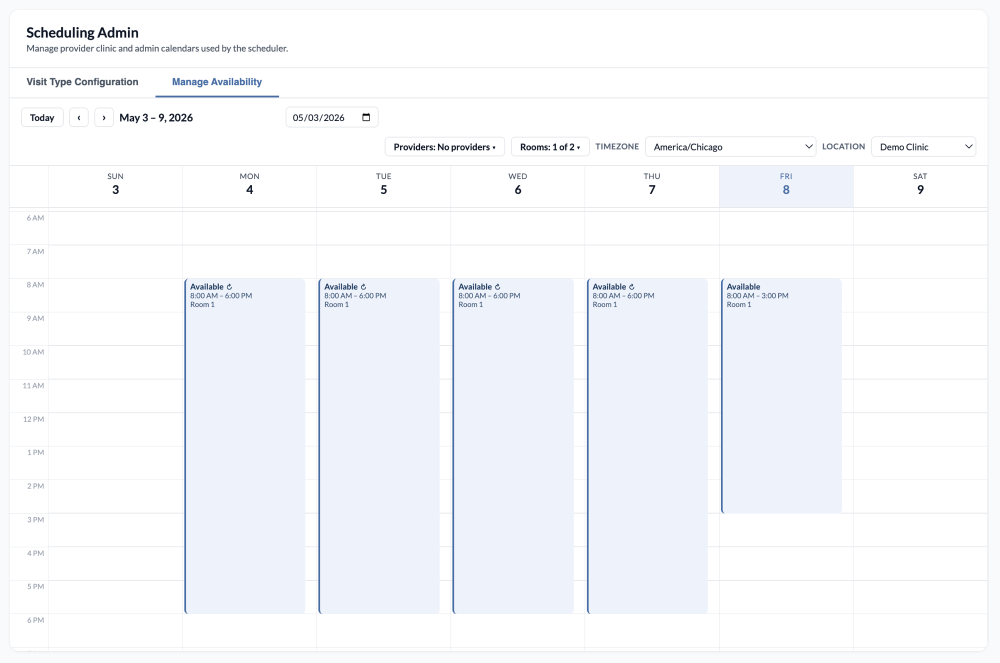

scheduling-with-rooms
=====================

## Description

Custom scheduling modal that coordinates provider and resource (room)
availability. Patients are booked against a provider's calendar, and when
the visit type requires a room, a corresponding `ScheduleEvent` is created
on the room's calendar in lockstep. The room event is structurally linked
to the patient appointment via `parent_appointment_id`, so cancelling the
patient appointment cascades to the linked room event automatically.

The Scheduling Admin app exposes a visit-type configuration matrix
(allowed durations, eligible rooms, room-event note types, per-staff
concurrent-slot capacity) persisted under the `scheduling_with_rooms`
Custom Data namespace.

## Problem it solves

Booking a visit that needs a room means coordinating two calendars at once: the provider's and the room's. Done by hand, staff book the patient, then separately block the room, and have to remember to free the room if the appointment is cancelled, which is easy to miss and leads to double-booked or phantom-held rooms. This plugin books the provider and the room together and deletes the linked room event automatically when the patient appointment is cancelled.

## Who it's for

Front-desk and scheduling staff at clinics where visits consume a shared physical resource, such as procedure rooms, infusion chairs, or imaging suites. It fits practices that need provider and room availability reconciled in a single booking step, including pediatric, specialty, and multi-room primary care groups.

## How to install

```
canvas install scheduling_with_rooms
```

The `FHIR_BASE_URL`, `FHIR_CLIENT_ID`, `FHIR_CLIENT_SECRET`, `SCHEDULABLE_STAFF_ROLES`, and `SCHEDULE_DURATIONS` secrets must be set in plugin settings.

## Components

| Component                                            | Purpose                                                                |
| ---------------------------------------------------- | ---------------------------------------------------------------------- |
| `applications/scheduling_with_rooms_app.py`          | Global menu app — opens the scheduling modal                           |
| `applications/patient_chart_app.py`                  | Patient-chart app — opens the modal pre-filled with the chart patient  |
| `applications/scheduling_admin_app.py`               | Provider-menu admin app for the visit-type/room matrix                 |
| `api/scheduling_api.py`                              | Patient/provider/slot/booking endpoints                                |
| `api/scheduling_admin_api.py`                        | Admin endpoints for visit-type configuration                           |
| `api/calendar.py`, `api/events.py`                   | Provider calendar + availability event endpoints                       |
| `protocols/rfv_origination.py`                       | Originates the RFV command on `APPOINTMENT_CREATED`                    |
| `protocols/rr_event_origination.py`                  | Creates the linked room `ScheduleEvent` on `APPOINTMENT_CREATED`       |
| `protocols/appointment_cascade.py`                   | Deletes the linked room `ScheduleEvent` when its parent is cancelled   |
| `handlers/availability_web_app.py`                   | Serves the availability manager UI                                     |
| `models/`                                            | CustomModels: visit-type durations, room mappings, concurrent limits   |
| `utils/fhir_client.py`                               | Minimal FHIR client (uses `FHIR_*` plugin secrets)                     |

## Availability manager

Open the **Scheduling Admin** app from the provider menu and switch to
the **Manage Availability** tab. Staff use this view to define when each
provider and room is bookable; the slot and `/book` endpoints intersect
these events with existing appointments to compute openings.



| Calendar type           | Effect                                              |
| ----------------------- | --------------------------------------------------- |
| Available (`Clinic`)    | Time is bookable                                    |
| Busy (`Administrative`) | Time is blocked off (breaks, meetings, OOO, etc.)   |

Events on each calendar may be one-off or recurring (daily / weekly), and
each event can be restricted to a list of note types — a "well-child
only" window will not surface for a follow-up visit type. The tab is
served by `handlers/availability_web_app.py` and embedded as an iframe in
the Scheduling Admin page; events are managed via `api/events.py`
(GET/POST/PATCH/DELETE) and calendars via `api/calendar.py`.

**Rooms** are modeled as Staff with the `RR` (Room Resource) role and are
managed in the same UI through a separate "Rooms" picker; the booking
flow lands the room `ScheduleEvent` on the room's calendar and consumes
one of its Available windows. The `SCHEDULABLE_STAFF_ROLES` secret
controls who appears in the provider picker; `RR` is always unioned in
for rooms.

## Required secrets

| Secret                    | Purpose                                                            |
| ------------------------- | ------------------------------------------------------------------ |
| `FHIR_BASE_URL`           | Base URL for the Canvas FHIR API                                   |
| `FHIR_CLIENT_ID`          | OAuth2 client id for FHIR access                                   |
| `FHIR_CLIENT_SECRET`      | OAuth2 client secret for FHIR access                               |
| `SCHEDULABLE_STAFF_ROLES` | Comma-separated list of role codes treated as schedulable          |
| `SCHEDULE_DURATIONS`      | Default appointment-duration list (minutes), comma-separated/JSON  |

### FHIR OAuth scopes

When registering the OAuth application that backs `FHIR_CLIENT_ID` /
`FHIR_CLIENT_SECRET`, grant **read-only** access to the resources this plugin
uses — nothing more:

- `Patient.read` — patient timezone lookup for the patient picker
- `Appointment.read` — finding linked room ScheduleEvents during cascade
- `Schedule.read`, `Slot.read` — slot resolution helpers
- `Practitioner.read` — provider lookups for FHIR appointment participants

The plugin does not write via FHIR; do not grant any `*.write` scopes.

## Cancel / reschedule cascade

When `/book` creates a patient appointment that requires a room, the room
`ScheduleEvent` is created moments later by `RREventOrigination` on the
`APPOINTMENT_CREATED` event, with `parent_appointment_id` pointing at the
patient appointment. Cancellation cascades use this link:

- **Cancel via this plugin or Canvas UI** — `APPOINTMENT_CANCELED` fires on
  the patient appointment; `AppointmentCascadeHandler` walks
  `appointment.children` and deletes any `schedule_event`-typed children.
- **Reschedule via this plugin's `/book`** — the new appointment goes
  through the standard booking flow, so a fresh room `ScheduleEvent` is
  created and linked to the new appointment. The old room event is
  deleted by the cascade when the original appointment is cancelled.

### Known limitation: native Canvas reschedule

If a user reschedules a patient appointment via Canvas's native
reschedule UI (rather than re-booking through this plugin), the cascade
will delete the old room `ScheduleEvent` but **a new one will not be
created**, because the native flow does not pass through `/book` and
therefore does not stash the room booking intent. The patient appointment
will still be valid; the room calendar will simply not show it. To
restore the room event, re-book the appointment via this plugin.

### Important Note!

`CANVAS_MANIFEST.json` is used when installing your plugin. Update it if
you add, remove, or rename protocols, applications, or secrets.
