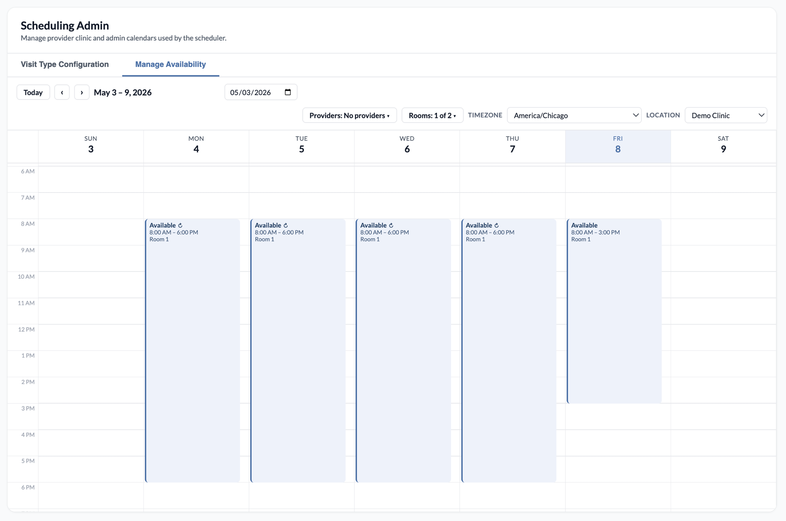

scheduling-with-rooms
=====================

## Description

Custom scheduling modal that coordinates provider and resource (room)
availability. Patients are booked against a provider's calendar, and when
the visit type requires a room, a corresponding `ScheduleEvent` is created
on the room's calendar in lockstep. Cancelling the patient appointment
cascades to the room event, so a cancelled visit releases its room.

The Scheduling Admin app exposes a visit-type configuration matrix
(allowed durations, eligible rooms, room-event note types, per-staff
concurrent-slot capacity) persisted under the `scheduling_with_rooms`
Custom Data namespace.

## Problem it solves

Booking a visit that needs a room means coordinating two calendars at once: the provider's and the room's. Done by hand, staff book the patient, then separately block the room, and have to remember to free the room if the appointment is cancelled, which is easy to miss and leads to double-booked or phantom-held rooms. This plugin books the provider and the room together and deletes the linked room event automatically when the patient appointment is cancelled.

## Who it's for

Front-desk and scheduling staff at clinics where visits consume a shared physical resource, such as procedure rooms, infusion chairs, or imaging suites. It fits practices that need provider and room availability reconciled in a single booking step, including pediatric, specialty, and multi-room primary care groups.

## How to install

```
canvas install scheduling_with_rooms
```

The `SCHEDULABLE_STAFF_ROLES` and `SCHEDULE_DURATIONS` variables must be set in plugin settings.

## Components

| Component                                            | Purpose                                                                |
| ---------------------------------------------------- | ---------------------------------------------------------------------- |
| `applications/scheduling_with_rooms_app.py`          | `SchedulingApplication` — replaces the built-in scheduling modal        |
| `applications/global_panel_app.py`                   | Global panel button — opens an empty scheduling modal                   |
| `applications/scheduling_admin_app.py`               | Provider-menu admin app for the visit-type/room matrix                 |
| `api/scheduling_api.py`                              | Patient/provider/slot/booking endpoints                                |
| `api/scheduling_admin_api.py`                        | Admin endpoints for visit-type configuration                           |
| `api/calendar.py`, `api/events.py`                   | Provider calendar + availability event endpoints                       |
| `handlers/rfv_origination.py`                        | Originates the RFV command on `APPOINTMENT_CREATED`                    |
| `handlers/rr_event_origination.py`                   | Creates the linked room `ScheduleEvent` on `APPOINTMENT_CREATED`       |
| `handlers/appointment_cascade.py`                    | Deletes the linked room `ScheduleEvent` when its parent is cancelled   |
| `handlers/availability_web_app.py`                   | Serves the availability manager UI                                     |
| `models/`                                            | CustomModels: visit-type durations, room mappings, concurrent limits   |
| `utils/scheduling_context.py`                        | Turns the scheduling launch context into modal prefill data            |
| `utils/patient_timezone.py`                          | Reads the `preferredSchedulingTimezone` PatientSetting                  |
| `utils/room_link.py`                                 | Records which room a visit holds, as note metadata                      |
| `utils/scheduling_logic.py`                          | Slot generation, plus the bulk prefetches the month view needs           |
| `utils/calendar_availability.py`                     | Availability windows from Clinic/Administrative calendars                |
| `utils/theming.py`                                   | Emits the CSS custom properties the stylesheets consume                 |
| `utils/staff_lookup.py`                              | Resolves providers and rooms, and parses the roles variable             |
| `utils/rfv_cache.py`, `utils/rr_event_cache.py`      | Hand booking intent from `/book` to the `APPOINTMENT_CREATED` handlers   |
| `static/scheduling_modal.css`, `static/scheduling_admin.css` | Stylesheets, served as cacheable assets                        |

## Scheduling entry points

`SchedulingWithRoomsApp` subclasses
[`SchedulingApplication`](https://docs.canvasmedical.com/sdk/handlers-embedded-applications/#scheduling-applications),
so installing this plugin routes *every* scheduling action in Canvas through
this modal — no separate launcher to click. Each surface hands over a
different slice of context, which `utils/scheduling_context.py` resolves into
the entity objects the modal pre-selects:

| Origin                | Surface                                | Mode         | Pre-populated from context                  |
| --------------------- | -------------------------------------- | ------------ | ------------------------------------------- |
| `schedule_page`       | New appointment from the schedule page | `schedule`   | date                                        |
| `patient_chart`       | New appointment from a patient chart   | `schedule`   | patient (locked), date                      |
| `calendar`            | Drag-to-create on the calendar         | `schedule`   | provider, location, date + slot, duration   |
| `calendar_reschedule` | Reschedule from the calendar           | `reschedule` | appointment, provider, visit type, duration |
| `note_reschedule`     | Reschedule from within a note          | `reschedule` | appointment, note, patient, visit type      |

One panel button sits alongside those Canvas-driven entry points:
`applications/global_panel_app.py` (global scope, opens an empty modal), for
customers who reach scheduling from their own landing page rather than
Canvas's schedule page. It tags its launch with a non-SDK
`origin=global_panel`, which is how the modal knows to close itself after a
successful booking — there's no page underneath it expecting to be returned
to. Canvas's own origins stay open and refresh their slots instead, so a
scheduler can book again without relaunching; reschedules always close, since
re-submitting would just move the appointment again.

There's deliberately no patient-chart panel button — the `patient_chart`
origin above already covers that surface, with the patient resolved and
locked. Both launchers build their URL with `scheduling_context.modal_url()`,
so they share one cache-bust value and one set of query-param names.

Anything the surface didn't send is backfilled off the appointment being
rescheduled — visit type, location, provider, patient and duration all come
from there. A prefilled duration stays selectable even when it isn't one of
the visit type's configured choices, so a reschedule keeps its length.

In `reschedule` mode the modal moves the existing appointment: `/book` with an
`appointment_id` issues `Appointment.reschedule()` (not an update, so Canvas
records the move via `appointment_rescheduled_from`) and
`ScheduleEvent.reschedule()` for the room. Because `APPOINTMENT_CREATED` doesn't
fire for a move, those effects are emitted inline rather than going through
`handlers/rr_event_origination.py`.

`ScheduleEvent.reschedule()` nulls `parent_appointment_id`, so from the second
reschedule onward the room event can't be found through `children`. The room a
visit holds is therefore also recorded as note metadata (`utils/room_link.py`) —
the note is the only identifier stable across a reschedule chain — and the event
is recovered from that when the parent link is gone.

Changing the visit type during a reschedule is not applied to the existing
appointment.

## Availability manager

Open the **Scheduling Admin** app from the provider menu and switch to
the **Manage Availability** tab. Staff use this view to define when each
provider and room is bookable; the slot and `/book` endpoints intersect
these events with existing appointments to compute openings.



| Calendar type           | Effect                                              |
| ----------------------- | --------------------------------------------------- |
| Available (`Clinic`)    | Time is bookable                                    |
| Busy (`Administrative`) | Time is blocked off (breaks, meetings, OOO, etc.)   |

Events on each calendar may be one-off or recurring (daily / weekly), and
each event can be restricted to a list of note types — a "well-child
only" window will not surface for a follow-up visit type. The tab is
served by `handlers/availability_web_app.py` and embedded as an iframe in
the Scheduling Admin page; events are managed via `api/events.py`
(GET/POST/PATCH/DELETE) and calendars via `api/calendar.py`.

**Rooms** are modeled as Staff with the `RR` (Room Resource) role and are
managed in the same UI through a separate "Rooms" picker; the booking
flow lands the room `ScheduleEvent` on the room's calendar and consumes
one of its Available windows. The `SCHEDULABLE_STAFF_ROLES` variable
controls who appears in the provider picker; `RR` is always unioned in
for rooms.

## Required variables

| Variable                  | Purpose                                                            |
| ------------------------- | ------------------------------------------------------------------ |
| `SCHEDULABLE_STAFF_ROLES` | Comma-separated list of role codes treated as schedulable          |
| `SCHEDULE_DURATIONS`      | Default appointment-duration list (minutes), comma-separated/JSON  |

The `BRAND_*` variables are optional theming overrides (see
`utils/theming.py`). No credentials are needed — the plugin reads everything
through the SDK data models and makes no outbound HTTP calls.

## Patient timezone

The modal renders slot times in the patient's timezone. The authoritative
value is the `preferredSchedulingTimezone` `PatientSetting` row, read via
`utils/patient_timezone.py`. It's fetched once, by `/patient-timezone`, when a
patient is actually selected — search results carry the cheaper
`Patient.last_known_timezone` instead, and the browser's own timezone is the
final fallback.

## How the room event is linked to the appointment

On booking, `/book` stashes the room intent in the plugin cache and
`RREventOrigination` creates the room `ScheduleEvent` on
`APPOINTMENT_CREATED`, setting `parent_appointment_id` to the patient
appointment. The same handler records the chosen room as note metadata via
`utils/room_link.py`.

Two links, because neither is sufficient alone:

| Link | Set by | Survives a reschedule? |
| ---- | ------ | ---------------------- |
| `parent_appointment_id` on the room event | Canvas, at create | **No** — `ScheduleEvent.reschedule()` nulls it |
| `scheduling_with_rooms:room_staff_key` note metadata | this plugin | **Yes** — the note is stable across the whole chain |

Both the reschedule path and `AppointmentCascadeHandler` locate the room
event through the same helper, `room_link.find_room_events()`, so they can't
disagree about which room a visit holds. Cancelling an appointment releases its
room whether or not it has ever been rescheduled.

`parent_appointment_id` cannot be repaired after the fact — the SDK rejects it
outside a create ("parent_appointment_id can only be set when creating an
appointment") — which is why the note metadata exists rather than the link
being restored.

No reschedule guard is needed in the cascade: Canvas emits
`APPOINTMENT_UPDATED`, not `APPOINTMENT_CANCELED`, for the appointment a
reschedule supersedes.

### Important Note!

`CANVAS_MANIFEST.json` is used when installing your plugin. Update it if
you add, remove, or rename handlers, applications, or variables.
