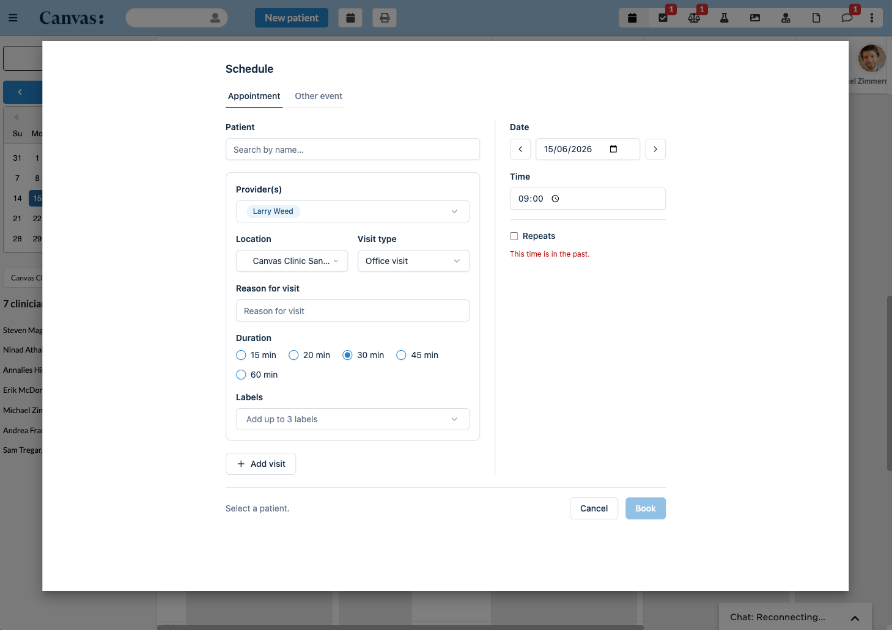

# Scheduling App

A custom scheduling experience that **replaces Canvas's built-in scheduling
modal**. When this plugin is installed, Canvas opens its appointment-booking UI
instead of the native modal at every scheduling entry point — the schedule-page
button, calendar drag-and-drop, the patient chart, and the reschedule flows. It
is a reference implementation of the `scheduling` application type, built
entirely from public SDK building blocks. If no `scheduling` plugin is
installed, the built-in modal works unchanged.

> **Requires the `scheduling` application type**, which is not yet available in
> a released Canvas SDK (latest published is `0.167.0`, which does not include
> `SchedulingApplication`). Until that ships, the plugin can't be installed on a
> standard instance, and the Python tests must run against an SDK build that
> includes the feature — see [Running tests](#running-tests).



## What it does

Renders its own scheduling UI (a React app) in place of the built-in modal,
prefilled from whatever context the entry point supplied (provider, location,
patient, time, or the appointment being rescheduled). From that UI a user can:

- **Create** a patient appointment for one or multiple providers — concurrent
  (same time) or sequential (back-to-back) — with location, visit type, reason
  for visit, duration, and labels.
- **Reschedule** an existing appointment (single appointment).
- Book **"Other Events"** (`schedule_event`) — non-patient calendar blocks.
- Create a **recurring series** (daily / weekly / monthly, by occurrence count
  or end date). Child occurrences are linked to the parent so Canvas's native
  cancel / reschedule-following cascade applies to the whole series.

All dropdown data (providers, locations, visit types, reasons for visit, labels)
is read through the SDK ORM, and all bookings are written through appointment
effects — no FHIR calls and no raw SQL.

## Problem it solves

The built-in scheduling modal is fixed: teams can't change its fields, layout,
or booking behavior. This plugin is the worked example of overriding it end to
end — taking over every scheduling entry point and booking real appointments
with only the SDK. A team can fork it and shape scheduling to their own
workflow (custom fields, durations, multi-provider visits, recurring series)
without waiting on changes to Canvas core.

## Who it's for

Canvas plugin developers and implementation teams who need to customize the
scheduling/booking experience beyond what the native modal allows. It is a
developer reference, not a turnkey end-user feature.

## How to install

```bash
canvas install scheduling_app
```

Installing the plugin makes it the active scheduling modal automatically;
uninstalling restores the built-in modal. No secrets are required.

## Configuration options

This plugin has no secrets. One behavior is configured in code, because the
value it mirrors isn't exposed to plugins at runtime:

| Setting | Where | Default | Purpose |
| --- | --- | --- | --- |
| `STRUCTURED_REASON_FOR_VISIT` | `scheduling_app/handlers/scheduling_web_app.py` | `False` | Mirror your instance's `STRUCTURED_REASON_FOR_VISIT_ENABLED` flag. `True` renders a coded reason-for-visit dropdown; `False` renders a free-text field (the shipped Canvas default). |

## How it works

- `applications/scheduling_app.py` — `SchedulingApp` (a `SchedulingApplication`,
  declared under `components.protocols`, discovered at runtime). Its `on_open`
  forwards the resolved context (`mode`, `origin`, and
  `patient`/`provider`/`location`/`appointment` as `{id}` objects, plus
  `start`/`end`/`duration`) to the UI as query params.
- `handlers/scheduling_web_app.py` — a `SimpleAPI` app (staff session auth) that
  serves the UI and its data/booking endpoints:
  - `GET /app/modal` — the UI shell; `GET /app/assets/<filename>` — the built
    JS/CSS bundle.
  - `GET /app/reference?category=appointment|schedule_event` — dropdown data
    (providers, locations, visit types, reasons-for-visit, labels), read via the
    SDK ORM.
  - `GET /app/patients?q=…` (or `?id=…`) — patient typeahead search / lookup.
  - `GET /app/appointment?id=…` — existing appointment details to prefill a
    reschedule.
  - `POST /app/book` — turns the submitted form into appointment effects.
- `booking.py` — pure payload→effects: builds `Appointment` / `ScheduleEvent`
  create & reschedule effects (plus the reason-for-visit command) from the form
  payload (see its docstring for the payload shape).
- `recurrence.py` + `handlers/recurrence.py` — stamp the recurrence rule onto
  the series parent as a namespaced external identifier, then expand the linked
  child appointments on `APPOINTMENT_CREATED`.
- `frontend/` — the React (Vite) source for the UI. `yarn build` compiles it and
  base64-embeds the bundle into `scheduling_app/_assets.py`, which the SimpleAPI
  serves as raw bytes. (The plugin sandbox blocks file I/O, and `render_to_string`
  would corrupt a minified bundle containing `{{` / `{%`.)

## Supported flows

- Create a patient appointment (single or multiple providers).
- Reschedule an existing appointment (single appointment).
- Multi-provider visits — concurrent (same time) or sequential (back-to-back).
- "Other Events" (`schedule_event`) via the `ScheduleEvent` effect.

## v1 limitations (vs. the built-in modal)

This is a faithful-but-not-identical reproduction. Some modal behaviors depend
on home-app internals a plugin can't reach today:

- **Reason for visit is persisted** via a separate `ReasonForVisitCommand`
  originated into the appointment's note (free-text comment, or a coded reason).
  The SDK `Appointment` effect itself carries no RFV field, so the appointment is
  given a known `instance_id` and the RFV command targets the note by that id.
- **Coded-vs-free-text RFV is a hard-coded constant** — the built-in modal
  switches on the `STRUCTURED_REASON_FOR_VISIT_ENABLED` constance flag, which
  isn't exposed to plugins. Mirror your instance's value via
  `STRUCTURED_REASON_FOR_VISIT` in `handlers/scheduling_web_app.py`.
- **No availability / open-slot grid** — time is entered manually (like the
  modal's "manual override"); there's no slot suggestion or conflict checking.
- **Reschedule is single-appointment** — no recurring "this / this and
  following" scope.
- **Multi-provider appointments aren't linked as one "scheduled together"
  group** — each is created independently.
- **Provider list isn't filtered to "schedulable"** (no such flag in the SDK),
  and **durations** come from a selected structured reason-for-visit or a
  default list (per-visit-type durations aren't exposed to the SDK).
- **No follow-up flow.**

## Running tests

Python tests (require an SDK build that includes the `scheduling` application
type — see the note at the top):

```bash
uv run pytest tests/
```

Frontend tests:

```bash
cd frontend && yarn install && yarn test
```

Rebuild the embedded UI bundle after changing the frontend:

```bash
cd frontend && yarn build   # regenerates scheduling_app/_assets.py
```
