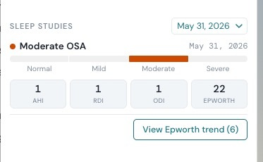

# sleep-study-visualizer

Gives providers a single Canvas workflow to order home sleep tests (HSTs), capture scored results as structured data, and view those results plus Epworth sleepiness trends directly on the patient chart.

## Problem it solves

Sleep study results typically arrive as unstructured PDFs, leaving providers without a quick, structured view of a patient's apnea indices or any way to trend sleepiness over time. Ordering a home sleep test is also a manual, easily-dropped step. This plugin closes both gaps: it turns the home sleep test order into a one-field action on the Diagnose command, stores scored results as structured data, and surfaces the latest study plus an Epworth trend directly in the chart.

## Who it's for

Sleep medicine and primary care teams that order home sleep tests and want scored results and Epworth sleepiness trends available at a glance on the patient chart, rather than buried in attached documents.

## What it does

### 1. Order a home sleep test from the Diagnose command

When a provider adds a Diagnose command to a note, the plugin appends an **"Order home sleep study?"** field (Yes/No, default No). On note commit, if the provider selected Yes, the plugin creates a Task assigned to the configured Sleep Studies team. The task title includes the patient name, MRN, and the ICD-10 from the Diagnose command.

> Forward-looking: the task is a placeholder for an outbound API call to an HST vendor. `_build_order_task` in `handlers/diagnose_order.py` is isolated so that call can be added later without touching the event wiring.

### 2. Capture scored results via the Sleep Study Result questionnaire

The plugin ships a **Sleep Study Result** questionnaire (`questionnaires/sleep_study_result.yml`, code `INTERNAL / SLEEP-STUDY-RESULT`). A provider or intake staffer records the scored study: study date, AHI, RDI, ODI, a clinician-asserted severity classification, and the Epworth score.

When that questionnaire is committed, `SleepStudyQuestionnaireHandler` (on `QUESTIONNAIRE_COMMAND__POST_COMMIT`) parses the answers from the event payload and persists a `SleepStudyResult` row linked to the patient. It is idempotent per patient + study date, so a re-fired commit will not create a duplicate.

> The structured questionnaire replaced an earlier PDF-parsing approach. The source report PDF, if one exists, can live independently in Canvas as a `DocumentReference`; the plugin does not parse or transform files.

### 3. Visualize results on the patient chart

The **Sleep Studies** custom chart-summary section (`SleepStudyChartSection`) renders the latest study at the top of the patient chart:

- Study date and severity classification (Normal / Mild / Moderate / Severe), shown as a severity bar
- AHI / RDI / ODI / Epworth stat tiles
- A study selector when more than one study is on file
- A **View Epworth trend** button that opens a modal charting Epworth scores over time, merging two sources: the Epworth captured on each sleep study, and any standalone Epworth Sleepiness Scale questionnaire (LOINC `69732-3`) responses on the patient.

`SleepStudyChartSectionConfiguration` registers the section first in the patient chart summary layout.

## Configuration

This plugin uses one configuration variable, declared in `CANVAS_MANIFEST.json`:

| Variable | Value |
|----------|-------|
| `SLEEP_STUDIES_TEAM_ID` | The FHIR Group ID of the staff team that should receive HST order tasks. Looked up by ID (stable across environments), not by name. |

If `SLEEP_STUDIES_TEAM_ID` is unset, or the team is not found, the order handler **fails closed**: it logs a warning and creates no task, so no order is silently misrouted.

## Data model

Results are stored as `SleepStudyResult` records in the plugin's custom data namespace (`sleep_study__results`). Each row carries the study date, the three respiratory indices, the severity label, and the Epworth score, linked to the patient via a foreign key.

## Installation

```bash
canvas install sleep-study-visualizer --host <your-instance>
```

After install, set `SLEEP_STUDIES_TEAM_ID` for the plugin in the Canvas admin, and confirm the Sleep Studies section appears in the patient chart summary.

## Screenshots

The **Sleep Studies** section on the patient chart, showing the latest study's severity classification, AHI / RDI / ODI / Epworth stat tiles, and the **View Epworth trend** button:



## Testing

```bash
uv run pytest --cov=sleep_study_visualizer --cov-report=term-missing --cov-branch
```
