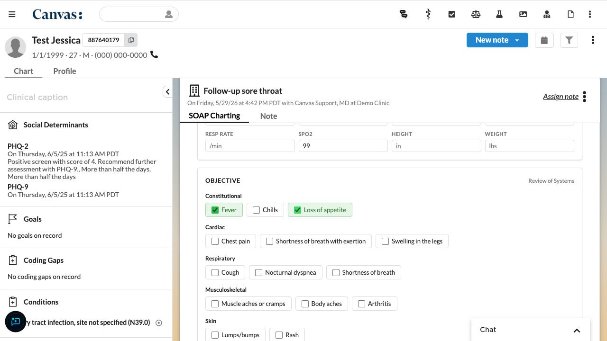
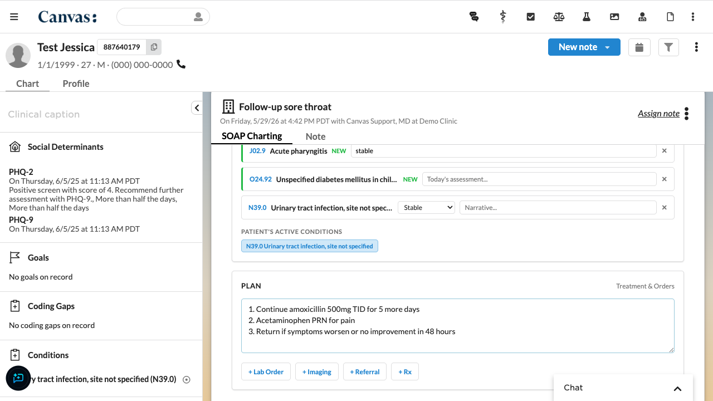

# SOAP Note Charting App

A reference Canvas NoteApplication plugin that provides a structured SOAP (Subjective, Objective, Assessment, Plan) charting interface as a note tab. Providers fill in structured clinical sections, and the plugin originates the corresponding Canvas SDK commands into the note.

## Problem

Canvas provides powerful command-based charting, but building a custom charting workflow requires understanding how to originate commands, load questionnaires, search diagnoses, and manage clinical data through the plugin SDK. This reference plugin demonstrates all of these patterns in a single, working application that can be installed on any Canvas instance.

## Who it's for

- **Plugin developers** learning how to build NoteApplication charting apps with the Canvas SDK
- **Implementation teams** needing a starting point for custom charting workflows
- **Practices** wanting a simplified SOAP-format charting interface

## Screenshots

### Vitals and Review of Systems


### Assessment and Plan


## Features

### Commands originated

| Section | Command | Details |
|---------|---------|---------|
| Reason for Visit | `ReasonForVisitCommand` | Free-text reason, becomes note title |
| Subjective | `HistoryOfPresentIllnessCommand` | Free-text HPI narrative |
| Objective — Vitals | `VitalsCommand` | BP, pulse, temp, resp rate, SpO2, height, weight |
| Objective — ROS | `ReviewOfSystemsCommand` | Bundled Brief ROS questionnaire (5 organ systems) |
| Objective — Exam | `PhysicalExamCommand` | Bundled Brief Exam questionnaire (6 exam systems) |
| Assessment | `DiagnoseCommand` | ICD-10 search for new diagnoses |
| Assessment | `AssessCommand` | Status update for existing patient conditions |
| Plan | `PlanCommand` | Free-text treatment plan |
| Orders | `LabOrderCommand` | Originate blank lab order via button |
| Orders | `ImagingOrderCommand` | Originate blank imaging order via button |
| Orders | `ReferCommand` | Originate blank referral via button |
| Orders | `PrescribeCommand` | Originate blank prescription via button |

### Bundled questionnaires

The plugin bundles two questionnaires that are installed automatically:

- **SOAP Brief ROS** (`questionnaires/brief_ros.yml`) — Review of Systems with 5 organ systems: Constitutional, Cardiac, Respiratory, Musculoskeletal, Skin. Each system has multi-select findings (e.g., Fever, Chills, Cough).
- **SOAP Brief Exam** (`questionnaires/brief_exam.yml`) — Physical Exam with 6 systems: Constitutional, Skin, Pulmonary, Cardiovascular, Extremities, Other. Each system has a text field pre-populated with the normal finding.

### Assessment features

- **ICD-10 search** — Debounced search via the Canvas ontologies API
- **Patient's existing conditions** — Shown as clickable pills for quick assessment
- **New vs. existing differentiation** — New diagnoses show a green "NEW" badge with a "Today's assessment" field; existing conditions show a status dropdown (Improved/Stable/Deteriorated) with a narrative field

### Order buttons

Four buttons below the Plan section originate blank command shells in the note: Lab Order, Imaging, Referral, and Rx. Each button shows a green checkmark confirmation when clicked. The provider fills in details using Canvas's native command UI.

## Install

```bash
canvas install <instance-hostname> plugins/soap_note/
```

No secrets or environment variables are required. The plugin uses custom data namespace `soap_note__v1` for persisting form state between sessions.

## Configuration

None required. The plugin works out of the box on any Canvas instance.

## SDK patterns demonstrated

This plugin serves as a reference for the following Canvas SDK patterns:

- **NoteApplication** with `LaunchModalEffect` for note-tab companion apps
- **SimpleAPI** with `StaffSessionAuthMixin` for authenticated endpoints
- **Command origination** via `_BaseCommand.originate()` for 10+ command types
- **Questionnaire bundling** via YAML + `questionnaire_from_yaml()` + manifest declaration
- **ICD-10 search** via `ontologies_http.get_json()`
- **Patient data access** via `Condition.objects.for_patient().committed().prefetch_related()`
- **CustomModel** with `OneToOneField` to Note for persistent form data
- **Canvas plugin UI design system** — Lato font, Canvas color palette, spacing tokens
- **RESIZE MessageChannel** for controlling iframe height
- **Cache busting** via module-level timestamp token

## Built with

- Canvas SDK `0.152.0`
- Canvas Plugin UI design system (Lato, Canvas tokens)
