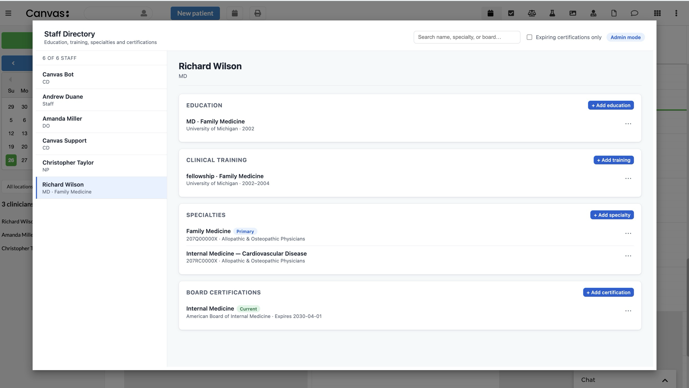

# Staff Directory

A Canvas plugin that stores and displays detailed professional information for every staff member: education history, clinical training, NUCC-coded specialties, and board certifications with expiration tracking. Adds a **Staff Directory** application to the global Canvas menu.

## Screenshot



## Features

- Two-pane layout: searchable staff list on the left, detailed profile on the right.
- Four profile sections per staff member:
  - **Education** - medical school, degree, graduation year.
  - **Clinical training** - residencies, fellowships, internships with start/end years.
  - **Specialties** - selected from the NUCC Healthcare Provider Taxonomy with primary-specialty designation.
  - **Board certifications** - issuing board, specialty, dates, and expiration alerts.
- Live search across staff names, roles, and specialties.
- "Expiring certifications only" filter for renewal oversight.
- Role-based editing: admins create/update/delete entries; non-admins view only.

## Requirements

- A Canvas instance with the Custom Data feature enabled.
- Python 3.11 or newer (for local development and tests).

## Installation

```bash
canvas install --host <your-instance>.canvasmedical.com staff_directory
```

After install, the **Staff Directory** app appears in the global app menu for all staff. Profiles are empty until populated by an admin.

## Configuration

This plugin reads one optional secret:

| Secret | Default | Description |
|---|---|---|
| `ADMIN_ROLE_CODES` | `ADMIN,OWNER` | Comma-separated staff role codes allowed to edit profiles. Case-insensitive. Example: `ADMIN,OWNER,MD,DO,NP,PA`. |

Set secrets through the Canvas admin UI or via `canvas` CLI before opening the app for the first time if you want to override the default.

## Permissions

| Action | Required role |
|---|---|
| Open and view profiles | Any authenticated staff |
| Add/edit/delete profile entries | A role listed in `ADMIN_ROLE_CODES` |

The plugin enforces this server-side on every write. Non-admin users see a read-only view with no edit affordances.

## Custom data

This plugin owns the namespace `staff_directory__staff_profiles` (read/write). Four tables back the profile sections:

- `education` - degree records linked to a staff member.
- `clinicaltraining` - residency / fellowship / internship records.
- `staffspecialty` - join between staff and an NUCC taxonomy code.
- `boardcertification` - certification with optional expiration date.
- `nucctaxonomycode` - reference table seeded from the bundled NUCC snapshot.

Staff data itself is **not** duplicated. The plugin extends Canvas's built-in `Staff` records via a proxy model, so deleting or deactivating a staff record in Canvas does not cascade to profile entries (kept intentionally for audit history).

## NUCC taxonomy

A curated snapshot of the NUCC (National Uniform Claim Committee) Healthcare Provider Taxonomy ships with the plugin and powers the specialty dropdown. The snapshot is loaded once on first use and is not auto-refreshed; to update, replace `staff_directory/data/nucc_taxonomy.py` and bump the plugin version.

## API endpoints

All endpoints are mounted under `/plugin-io/api/staff_directory/`. Every endpoint requires the caller to be authenticated to Canvas; write endpoints additionally require an admin role.

### Application shell

| Method | Path | Purpose |
|---|---|---|
| GET | `/app/directory` | HTML shell for the Staff Directory app |
| GET | `/app/styles.css` | Stylesheet |
| GET | `/app/directory.js` | Client-side JS bundle |

### Staff list and profile

| Method | Path | Purpose |
|---|---|---|
| GET | `/staff/` | List all staff with summary rows |
| GET | `/staff/{staff_dbid}/` | Full profile for one staff member |

### Education

| Method | Path | Purpose |
|---|---|---|
| POST | `/staff/{staff_dbid}/education/` | Add an education entry |
| PATCH | `/staff/{staff_dbid}/education/{entry_id}/` | Update an entry |
| DELETE | `/staff/{staff_dbid}/education/{entry_id}/` | Remove an entry |

### Training

| Method | Path | Purpose |
|---|---|---|
| POST | `/staff/{staff_dbid}/training/` | Add a training entry |
| PATCH | `/staff/{staff_dbid}/training/{entry_id}/` | Update an entry |
| DELETE | `/staff/{staff_dbid}/training/{entry_id}/` | Remove an entry |

### Specialty

| Method | Path | Purpose |
|---|---|---|
| POST | `/staff/{staff_dbid}/specialty/` | Add a specialty (by NUCC code) |
| POST | `/staff/{staff_dbid}/specialty/{entry_id}/primary/` | Mark specialty as primary |
| DELETE | `/staff/{staff_dbid}/specialty/{entry_id}/` | Remove a specialty |

### Certification

| Method | Path | Purpose |
|---|---|---|
| POST | `/staff/{staff_dbid}/certification/` | Add a certification |
| PATCH | `/staff/{staff_dbid}/certification/{entry_id}/` | Update a certification |
| DELETE | `/staff/{staff_dbid}/certification/{entry_id}/` | Remove a certification |

### NUCC search

| Method | Path | Purpose |
|---|---|---|
| GET | `/nucc/search?q={term}` | Typeahead lookup against the NUCC taxonomy |

## Project layout

```
staff_directory/
├── CANVAS_MANIFEST.json
├── applications/                # Staff Directory app handler
├── assets/icon.png              # App menu icon
├── data/
│   ├── nucc_taxonomy.py         # Bundled NUCC snapshot (Python module)
│   └── nucc_seeder.py           # Idempotent seed loader
├── models/                      # Custom data models
├── routes/                      # SimpleAPI handlers
├── services/                    # Business logic (testable in isolation)
├── static/                      # Directory CSS + JS
└── templates/directory.html     # Directory HTML shell
tests/                           # Unit tests
pyproject.toml
```

## Running tests

```bash
uv run pytest tests/
```

The test suite stubs Canvas SDK and Django so it runs without a live Canvas environment.

## License

MIT. See [LICENSE](LICENSE).

## Contributing

Issues and pull requests are welcome. Please open an issue describing the change before submitting a large PR.
