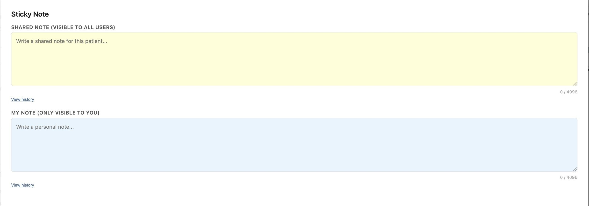

sticky_note
===========

## Description

Sticky notes on the patient chart, right where your team already works. Adds an action button to the patient chart header that opens a modal with two sticky note areas per patient:

- **Shared Note** (yellow) - visible to all staff, with "last edited by" attribution
- **My Note** (blue) - visible only to the current user

Both notes auto-save as you type and show edit history for the last 10 versions.



## Problem it solves

Important non-clinical context about a patient - "always calls from her daughter's number", "prefers afternoon visits" - usually lives in one person's head or a private note nobody else can see. The manual workaround is a paper sticky on a monitor or repeated messages to the team. This plugin keeps a shared note and a private note on the patient chart itself, auto-saved and attributed, so the whole team sees the same context in the place they already work.

## Who it's for

Front-desk, care coordination, and clinical staff who need quick, shared context on a patient without cluttering the clinical chart. The shared note is visible to the whole team; the private note is scoped to the individual staff member.

## Installation

```
canvas install sticky_note
```

## Features

- **Two note types per patient**: one shared across the team, one private to the signed-in staff member
- **Debounced auto-save** (800ms) with flush-on-close via `keepalive` fetch - no manual save button
- **Edit history** (last 10 versions) with author attribution, viewable per note
- **Attribution**: shared notes display "Last edited by [name] on [date]"
- **Character limit**: 4096 characters per note

## Storage

Uses Canvas Custom Data (`canvas_medical__sticky_note` namespace) with a `StickyNote` model:

| Field | Type | Purpose |
|-------|------|---------|
| `patient` | FK (Patient) | Which patient chart |
| `owner` | FK (Staff), nullable | NULL = shared, staff = user-specific |
| `content` | TextField | Note text (max 4096 chars) |
| `updated_by` | TextField | Display name of last editor |
| `updated_at` | DateTimeField | Auto-updated timestamp |
| `history` | JSONField | Last 10 previous versions |

A unique constraint on `(patient, owner)` ensures exactly one shared note and one personal note per staff member per patient.

## API Endpoints

- `GET /sticky-note/notes?patient_id=<uuid>&staff_id=<uuid>` - returns `shared_note`, `shared_meta`, `user_note`
- `POST /sticky-note/notes` - saves a note (`type: "shared" | "user"`)
- `GET /sticky-note/history?patient_id=<uuid>&staff_id=<uuid>&type=shared|user` - returns edit history

## Secrets

- `namespace_read_write_access_key` - auto-generated by Canvas on first install, used by the plugin's API routes to read and write the `canvas_medical__sticky_note` namespace.

## Running Tests

```
uv run pytest tests/
```
