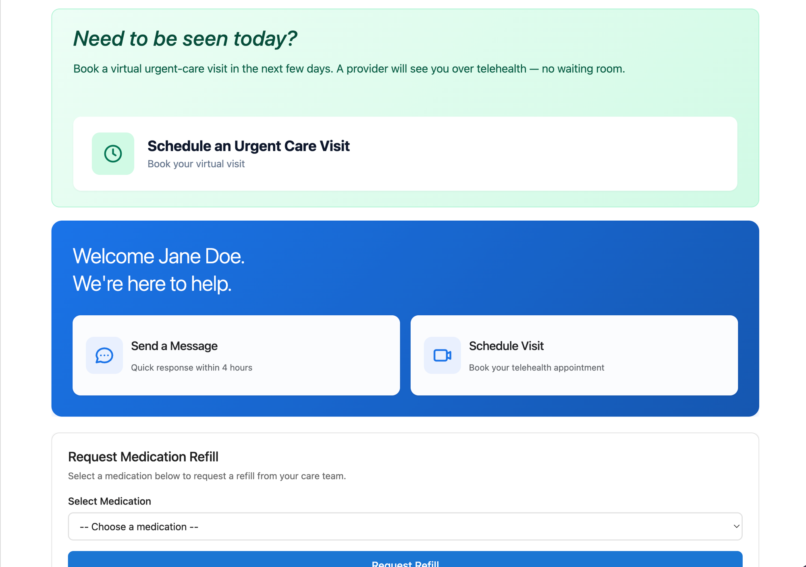
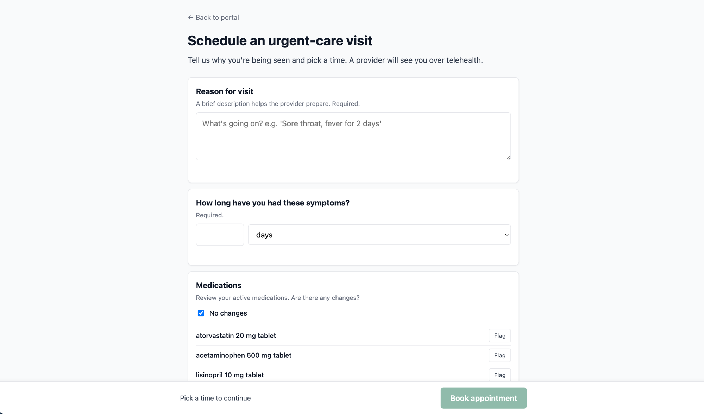
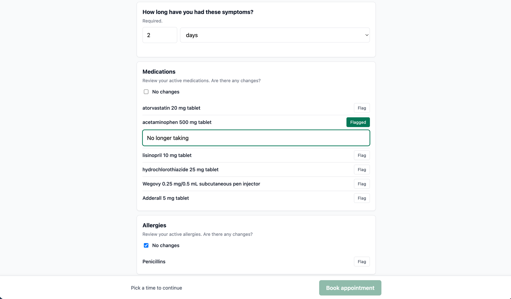
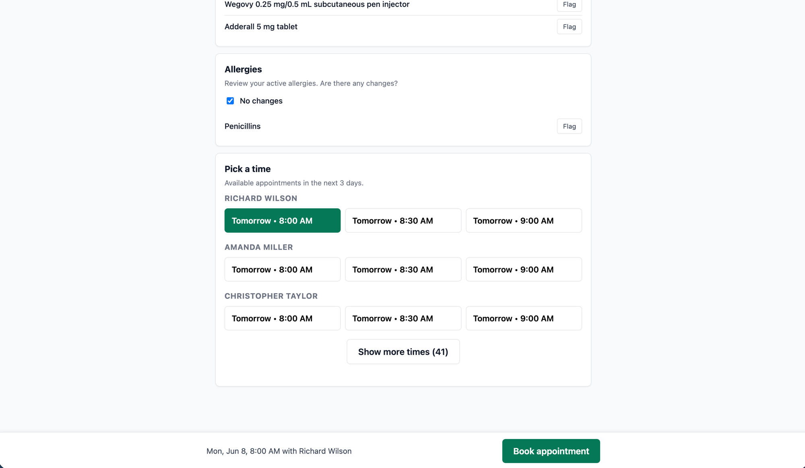
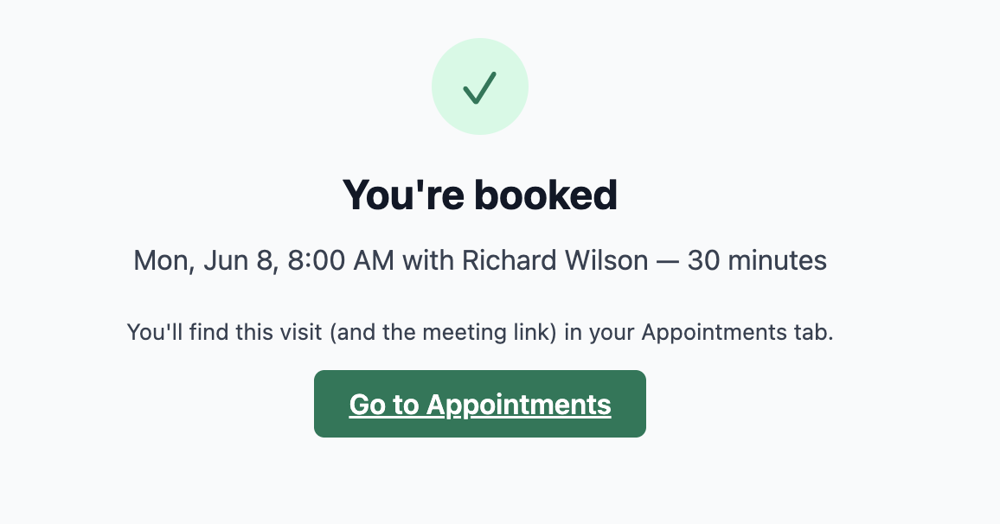
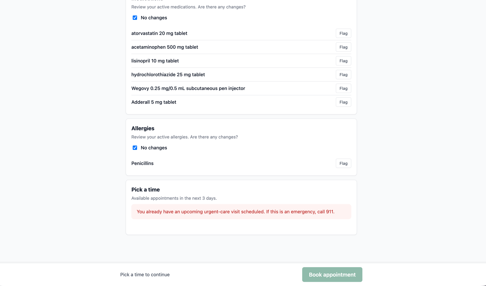
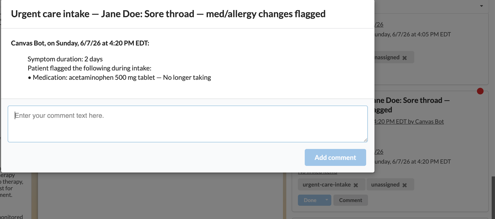
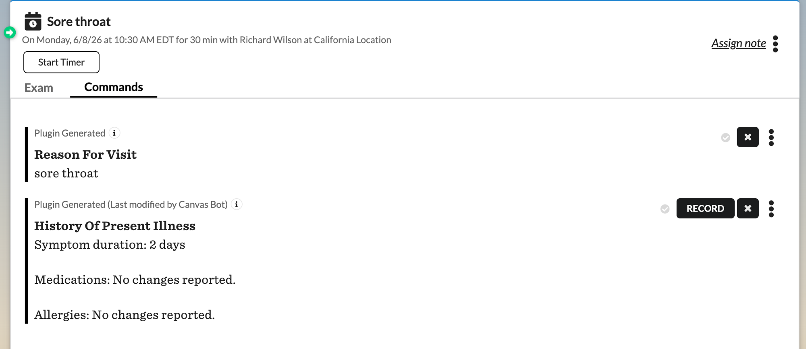

urgent-care-self-scheduler
==========================

## What it does

Adds a "Need to be seen today?" card to the patient portal home page. Patients click it, fill out a short form (reason for visit, how long they've had symptoms, any medication or allergy changes), pick an open time slot in the next three days, and book a virtual urgent-care visit themselves — no phone call, no waiting room.

The visit lands on the provider's schedule, and the encounter note is pre-populated with a **Reason for Visit** command and a **History of Present Illness** command (symptom duration plus the patient's medication/allergy review). At the same time an **intake task** drops into the care team's queue, carrying the same summary (symptom duration and any flagged med/allergy changes) as a comment so it's visible while triaging. Only credentialed providers are offered as bookable — exam rooms and other scheduling resources are filtered out — and a patient who already has an upcoming urgent-care visit is blocked from booking a second one and told to call 911 if it's an emergency.

## Problem it solves

Today, getting same-day urgent care usually means one of two things for the patient: drive to a clinic and wait, or call the practice and hope a staff member can find an open slot. Both consume staff time on the phone, leak revenue when patients give up and go to a competitor, and frustrate patients who just want to be seen. The manual workaround is a phone tree: patient calls front desk, front desk checks provider availability, front desk books the visit in Canvas, front desk relays the meeting link, front desk pages the provider with the chief complaint.

This plugin removes staff from the booking step entirely. The patient self-serves end-to-end, and the provider walks into the visit with the chief complaint and intake context already in the note. Subscription / DPC / direct-care practices in particular get a measurable reduction in front-desk volume without giving up clinical context.

## Who it's for

- **Practices that want to offer same-day virtual urgent care without the phone-booking overhead.** Highest impact for subscription / DPC / direct-care models where patients expect frictionless access as part of the membership.
- **Specialties:** primary care, family medicine, internal medicine, urgent care, telehealth-first practices. Not a fit for specialties that require in-person triage or non-trivial pre-visit prep (cardiology, ortho, surgery).
- **Patient population:** any portal-registered patient with a known set of active medications and allergies and a working email address on file. The wizard reads existing meds/allergies from the chart, so it's most useful when the chart is already populated.

## How to install

```bash
canvas install urgent_care_self_scheduler --host <your-instance>
```

### Pre-conditions on the Canvas instance

Three things must exist on the Canvas side before the plugin can return slots:

1. **Urgent-care `NoteType`** configured with:
   - `category = encounter`
   - `is_scheduleable = True`
   - `is_scheduleable_via_patient_portal = True`
   - `is_active = True`
   - `online_duration` set to your desired slot length (minutes)
   - `is_telehealth = True` **for video visits** (so Canvas generates the join link and surfaces it on the patient's Appointments tab). For an in-person urgent-care offering, use an `is_telehealth = False` NoteType and set `URGENT_CARE_VISIT_MODALITY=in_person` (see *Configuration options*).
2. **Provider availability calendars.** For each provider in the urgent-care pool, a `Clinic`-type `Calendar` titled `"{Provider Name}: Clinic"` (or `"{Provider Name}: Clinic: {Location Name}"`) with at least one `Event` whose `allowed_note_types` includes the urgent-care `NoteType`. A provider may have several Clinic calendars (e.g. one per location) — the scheduler offers the **union** of all of them, each interpreted in its own `Calendar.timezone`, deduplicated by absolute instant so the same moment is never offered twice.
3. **Calendar timezone.** Each `Calendar` carries its own `Calendar.timezone`, which the scheduler uses to interpret that calendar's availability. The active `PracticeLocation`'s `last_known_timezone` is used only as a fallback when a calendar's timezone can't be resolved.

The scheduler removes a slot when it conflicts with a booked appointment **or** with a block on the provider's `Administrative` calendar — one-off blocks, recurring blocks, holds, lead-time blocks, and appointment buffers (e.g. those written by the `provider_availability` plugin) are all honored.

### Set the secrets

```bash
canvas config set urgent_care_self_scheduler \
  URGENT_CARE_NOTE_TYPE_NAME="Urgent Care" --host <your-instance>
```

> **`URGENT_CARE_NOTE_TYPE_NAME` must exactly match the `name` of a NoteType that already exists on the instance** (the one you configured in pre-condition 1 above). The secret holds only the *name* — the plugin looks the NoteType up by it at request time; it does not create one. The match is exact and case-sensitive, and exactly one active, portal-scheduleable NoteType must carry that name. If no such NoteType exists, more than one does, or the matched one is misconfigured (missing a required flag or `online_duration <= 0`), the scheduler returns **"scheduler unavailable / misconfigured"** and shows the patient no slots — so set this secret only after the NoteType is in place, and update it if you ever rename the NoteType.

Optional secrets — see *Configuration options*.

## Configuration options

All configuration is via plugin secrets and Canvas-side data — no code changes required.

### Secrets

| Secret | Required | Default | Purpose |
|---|---|---|---|
| `URGENT_CARE_NOTE_TYPE_NAME` | yes | — | Exact, case-sensitive name of an **existing** urgent-care `NoteType` on the instance (e.g. `Urgent Care`). The plugin resolves the NoteType by this name at request time — it does not create one. The named NoteType must exist, be unique among active note types, and be `is_scheduleable`, `is_scheduleable_via_patient_portal`, with non-zero `online_duration`. If it can't be resolved, the scheduler returns "unavailable / misconfigured" and offers no slots. |
| `URGENT_CARE_VISIT_MODALITY` | no | `telehealth` | One of two exact values (lowercase, underscore): **`telehealth`** or **`in_person`**. Drives the patient-facing presentation: `telehealth` shows just the time and tells the patient their video join link will appear on the Appointments tab; `in_person` **labels each open slot with its location** (so a multi-site practice's patients can tell which site a slot is at) and tells them the location is on the Appointments tab. Regardless of this setting, the appointment is always booked into the location its slot belongs to. The visit's actual video-vs-in-person nature comes from the configured NoteType's `is_telehealth` flag, so set this secret to match it. Unrecognized values — including the hyphenated `in-person` — fall back to `telehealth`. |
| `URGENT_CARE_LEAD_TIME_MINUTES` | no | `30` | Minimum minutes between "now" and the earliest bookable slot. Buffer for the care team before a visit. |
| `URGENT_CARE_TASK_TEAM_ID` | no | unassigned | UUID of the `Team` that receives the intake task. If unset, the task lands unassigned with an `unassigned` label. |
| `URGENT_CARE_FALLBACK_PHONE` | no | hidden | Phone number shown to the patient on the no-slots-available screen. |

### Slot length

Slot length is taken from `note_type.online_duration` on the configured `NoteType` — change it on the `NoteType`, no plugin redeploy needed.

### Adding or removing a provider from the urgent-care pool

Add or remove the urgent-care `NoteType` from the `allowed_note_types` of a provider's calendar event. No plugin redeploy needed; the change takes effect on the next `/api/slots` call.

### Provider eligibility (rooms and resources are excluded)

Only staff who hold a **Provider** role (`StaffRole.role_type == "PROVIDER"`) are offered as bookable. Canvas commonly models exam rooms and system/bot accounts as active `Staff` that can own scheduling calendars; those carry non-Provider roles and are filtered out, so a patient is never asked to "book with Room 1." A provider must therefore (a) hold a Provider role, (b) have a `"{full_name}: Clinic"` calendar, and (c) have at least one availability `Event` allowing the urgent-care `NoteType`.

### One urgent-care visit at a time

If the patient already has an upcoming, non-cancelled urgent-care visit anywhere in the booking window, the wizard blocks booking another and shows: *"You already have an upcoming urgent-care visit scheduled. If this is an emergency, call 911."* This is enforced both in the wizard and server-side in the booking endpoint. Visits of other note types do not trigger the block.

### Slot wall-clock alignment

Slot start times are aligned to clean wall-clock boundaries based on the `NoteType`'s `online_duration`:

| `online_duration` | Slot starts at |
|---|---|
| 15 min | `:00`, `:15`, `:30`, `:45` |
| 20 min | `:00`, `:20`, `:40` |
| 30 min | `:00`, `:30` |
| 60 min | `:00` |

**Tradeoff:** any availability between an event-window edge and the next aligned slot is unused. Configure availability events on whole-clock boundaries (e.g., 8:00–10:00 AM, not 8:25–10:25 AM) to avoid losing slots to alignment.

## Running Tests

```bash
uv run pytest tests/
```

## Screenshots

End-to-end walkthrough of the patient → provider experience. All screenshots are in [`docs/screenshots/`](./docs/screenshots/).

### Patient discovers the widget on the portal



The "Need to be seen today?" card sits on the patient portal home. Clicking it opens the scheduling wizard.

### Patient fills out the wizard



The wizard collects a reason for visit, symptom duration, and a medication/allergy review.



When a patient flags a medication or allergy as changed, an inline "What changed?" textarea appears and the item shows a green "Flagged" badge.

### Patient picks a slot



Available appointments for the next few days, grouped by provider (rooms and other non-provider resources are excluded), with a "Show more times" button.

### Patient confirms the booking



The success pane confirms the visit time and provider, and points the patient to their Appointments tab for the meeting link.

### Booking is blocked if a visit already exists



If the patient already has an upcoming urgent-care visit, the wizard blocks booking another and shows: *"You already have an upcoming urgent-care visit scheduled. If this is an emergency, call 911."*

### The care team gets an intake task



An **intake task** drops into the care team's queue (labeled `urgent-care-intake`) with a comment summarizing the symptom duration and any flagged medication/allergy changes.

### The encounter note is pre-populated



The new encounter note is pre-populated with a **Reason for Visit** command (the patient's chief complaint) and a **History of Present Illness** command (symptom duration plus the medication/allergy review). Both are originated **staged** (uncommitted), so the provider reviews and commits them during the visit rather than having patient-entered text auto-finalized into the chart.
