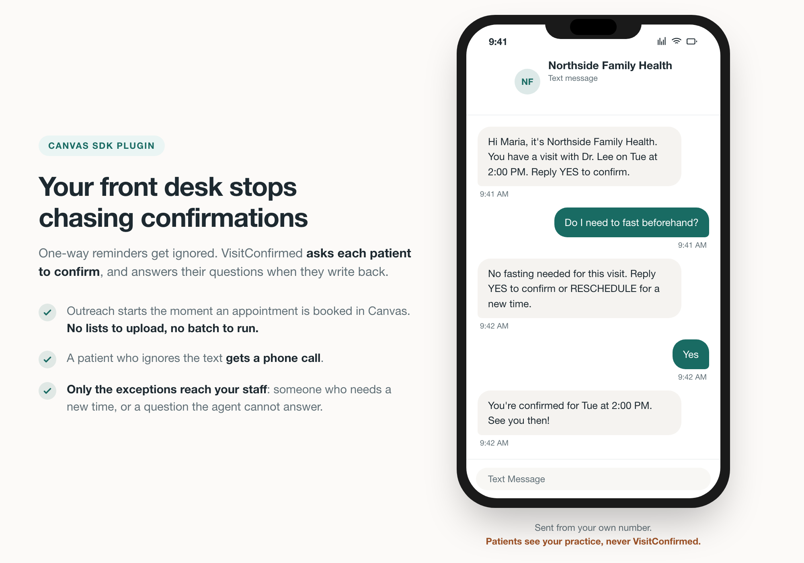

# VisitConfirmed Appointment Reminders and No-Show Prevention

## What it does

VisitConfirmed turns every appointment in Canvas into a two-way conversation
with the patient. When an appointment is booked, rescheduled, cancelled, or
marked as a no-show, this plugin notifies the VisitConfirmed platform, which
then reaches the patient over SMS and voice to confirm the visit and answer
their questions, without a staff member placing a call.

## Problem it solves

Keeping appointments confirmed is manual work today. A cancellation becomes a
task for the front desk to call back. A no-show becomes a reminder for someone
to follow up. Confirmations go out as one-way reminder texts that nobody is on
the other end to answer, so when a patient replies "can I move it to Thursday?"
the message sits in a queue until a human gets to it. VisitConfirmed answers
those replies as they arrive, resolves the routine ones on its own, and passes
only the exceptions to your staff.

## Who it's for

Scheduling coordinators and front-desk staff who own appointment confirmation,
and the providers whose cancelled or no-showed visits need to be filled. It is
specialty-agnostic and works for any practice that schedules appointments in
Canvas.

## How to install

```
canvas install visit_confirmed
```

After installing, open the plugin's settings page and set the two variables
under **Configuration options** below. You will also authorize VisitConfirmed
against your Canvas FHIR API, so it can read the patient demographics it needs
in order to make contact. See **Privacy** below for exactly what moves where.

## Configuration options

Set these on the plugin settings page after install
(`<emr_base_url>/admin/plugin_io/plugin/<plugin_id>/change/`):

| Variable | Required | Description |
|---|---|---|
| `VISIT_CONFIRMED_API_URL` | required | The events endpoint for your VisitConfirmed account, provided during onboarding. |
| `VISIT_CONFIRMED_API_KEY` | required | The API key for your VisitConfirmed account. Sent as a `Bearer` token on every request. |

Both are marked sensitive and are write-only once saved. If either is unset the
plugin fails closed: it logs an error and makes no outbound call.

## How it works

The handler responds to `APPOINTMENT_CREATED`, `APPOINTMENT_CANCELED`, and
`APPOINTMENT_NO_SHOWED`. For each event it sends VisitConfirmed a small JSON
payload containing the appointment id, patient id, provider id, start time, and
duration. A create that links back to a prior appointment is reported as a
reschedule.

A patient who asks for a new time is handed to your staff. This plugin is
inbound only: it does not write appointments back into Canvas.

## Privacy

Two separate channels carry different things, and it is worth being precise
about which is which.

- **This plugin** sends only Canvas resource identifiers and scheduling
  metadata. No names, no phone numbers, no email addresses, no clinical data.
  It does not log patient data either.
- **VisitConfirmed** reads the patient demographics it needs, name and contact
  details, directly from your Canvas FHIR API over a scoped, credentialed
  connection, under a Business Associate Agreement with your practice.

So patient data does leave Canvas, through the FHIR connection that you
authorize and can revoke, rather than through this plugin's event payload.

The point of that split is not that less patient data moves, because the same
demographics reach VisitConfirmed either way. It is that all of it moves over a
credentialed channel you granted, can audit, and can revoke in one action, while
the plugin running inside your instance holds no patient data and writes none to
its logs.

## Screenshots

A patient confirming a Canvas appointment over two-way SMS, with a question
answered along the way. The conversation goes out in the practice's name, and a
patient who needs a new time is handed to staff rather than booked automatically:



The image is generated from [`docs/canvas-appointment-confirmation.source.html`](docs/canvas-appointment-confirmation.source.html),
so it can be re-rendered when the flow changes. It is an illustration of the
conversation, not a capture of real patient data.

## About VisitConfirmed

VisitConfirmed is an AI scheduling agent that confirms patient appointments over
SMS and voice. [visitconfirmed.com](https://visitconfirmed.com/)

## License

MIT. See [LICENSE](../LICENSE).
