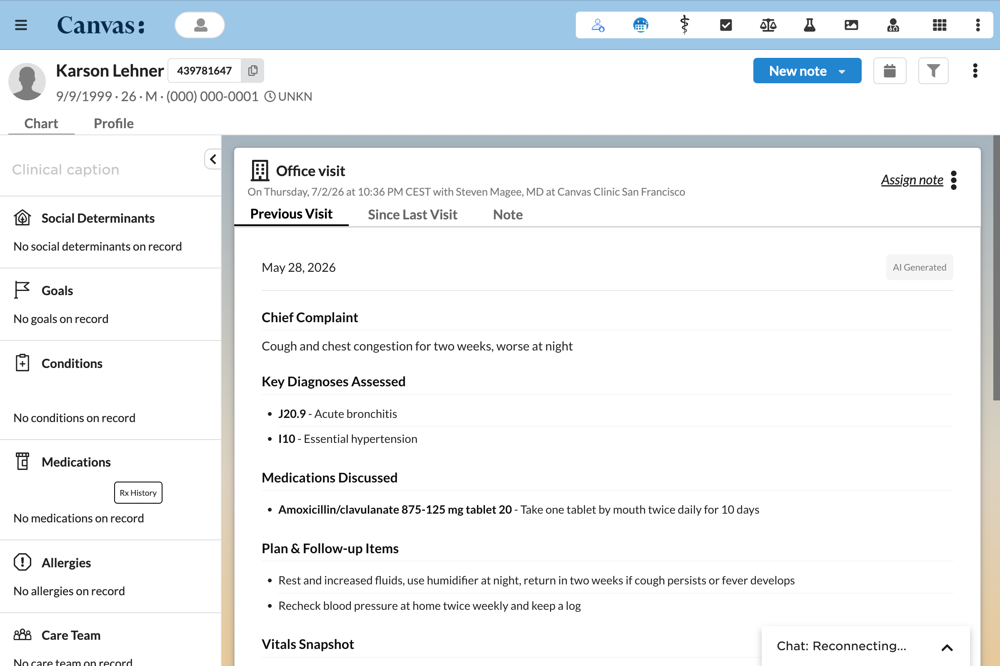

# Visit Summaries

## What it does

Visit Summaries adds three AI generated clinical summaries to Canvas. Previous Visit renders a note body tab that summarizes the patient's most recent locked note, pulling the chief complaint, ICD coded diagnoses, vitals, medications, and plan into a concise recap. Since Last Visit renders a note body tab that summarizes interim clinical activity between that locked note and the current one, covering labs, medication changes, new and resolved conditions, completed tasks, and other encounters. Generate AVS is a note footer button that produces a patient friendly After Visit Summary written at a sixth grade reading level, with an edit mode and a print view. A global config app toggles each feature, and the LLM provider is configurable across Anthropic, OpenAI, and Google, plus a mock mode for keyless local testing.

## Problem it solves

Reviewing a patient's prior visit and everything that happened since takes a clinician time at the top of every encounter, and writing a plain language after visit summary takes time at the end. Visit Summaries does both automatically from data already in the chart. The provider opens the note and reads a one screen recap of the last visit and the interim activity, and generates a patient ready summary with one click, so the documentation that patients and care teams rely on is produced without manual transcription.

## Who it's for

Providers and clinical staff who want a fast recap of a patient's history at the point of care, and who want to hand patients a clear after visit summary they can actually read. The config app suits an administrator choosing which of the three features a clinic turns on. The mock mode suits developers integrating or styling the plugin without LLM credentials.

## How to install

Install the plugin with the Canvas CLI, pointing it at the plugin package directory, the one that holds `CANVAS_MANIFEST.json`.

```
canvas install path/to/visit_summaries --host <your-instance>
```

Set the LLM secrets in the Configuration options below so the summaries can generate, then open Visit Summary Config from the app drawer to choose which features are on.

## Configuration options

Summaries call a configurable LLM provider. Set these as plugin secrets. When a required secret is missing, every summary panel renders a self contained warning listing what to configure rather than failing silently, so the plugin is safe to install before the credentials are ready.

| Secret | Required | Description |
|--------|----------|-------------|
| `LLM_PROVIDER` | Yes, unless mock | One of `anthropic`, `openai`, `google`, or `mock` |
| `LLM_API_KEY` | Yes, unless mock | API key for the selected provider |
| `LLM_MODEL` | No | Model override. Defaults to `claude-sonnet-4-5-20250929` for Anthropic, `gpt-4o` for OpenAI, and `models/gemini-2.0-flash` for Google |

Which of the three summary features are active is controlled from the Visit Summary Config app, opened from the bento grid app drawer in the top right corner. Each feature can be toggled independently. Configuration is stored in the plugin cache and persists across restarts and reinstalls.

| Feature toggle | Default | Description |
|--------|---------|-------------|
| Previous Visit Summary | On | Show the AI summary of the last locked note as a note body tab |
| Since Your Last Visit | On | Show the interim clinical activity summary as a note body tab |
| Generate AVS Button | On | Show the After Visit Summary button in the note footer |

## Screenshots

The Previous Visit tab inside a note, showing an AI generated recap of the patient's most recent locked visit with chief complaint, ICD coded diagnoses, medications discussed, and plan items.



## Mock mode

For local development and testing without API keys, set `LLM_PROVIDER` to `mock`. This returns fixed HTML for all three summary types so layout, styling, and integration work needs no LLM calls. Mock responses carry a small disclaimer that the data is not real. Set `LLM_PROVIDER` to `mock`, leave `LLM_API_KEY` blank, and any summary tab or button renders the mock content immediately.

## How it works

The Previous Visit and Since Last Visit features render as tabs in the note body tab bar. Each tab opens a loading page with a spinner, then a JavaScript fetch calls a generate endpoint that does the slow LLM work and returns structured JSON, which the plugin renders into deterministic HTML. The panels use an iframe resize protocol, a MutationObserver sends resize messages to the parent frame so the tab height tracks its content. A Regenerate button resets the panel and refetches, which matters because Canvas reuses iframe content rather than reloading it.

The Generate AVS button opens a centered modal with a spinner, then renders a patient friendly summary. The modal has an edit mode that swaps text for auto sizing textareas with add and remove controls on the list sections, an accept path that writes edits back and marks the summary AI Assisted, and a print view that hides controls and enables color output.

## Tab visibility

The note body tabs have visibility conditions beyond the feature toggle. Previous Visit checks whether a locked note exists chronologically before the current note, filtering on the service date so future notes are never returned, and hides itself for a new patient or a first note. Since Last Visit checks for that prior locked note and also for interim activity in the window, running an existence check across labs, medication starts, medication stops, conditions, completed tasks, and appointments, short circuiting on the first match, and hides itself when no activity exists.

## Data extraction notes

Canvas diagnose commands store data in a nested format with ICD-10 and SNOMED entries. The plugin filters for ICD codes and falls back to the diagnose text when coding is absent. Conditions frequently have a null onset date, so the Since Last Visit query falls back to the created column using a table qualified raw SQL clause, because the SDK Condition model does not expose that column as an ORM field, and it uses datetime strings rather than date strings to catch same day conditions. Questionnaire commands embed the options and the selected numeric answer, and the plugin resolves the number to its label.

## Project structure

```
visit_summaries/
  applications/
    config_app.py          Application entry point, global scope, bento grid
    previous_visit.py      PreviousVisitApp, NoteApplication
    since_last_visit.py    SinceLastVisitApp, NoteApplication
  protocols/
    avs_button.py          GenerateAvsButton, note footer, modal
    config_api.py          ConfigApi, SimpleAPI endpoints
    summary_api.py         SummaryApi loading pages and SummaryGenerateApi generation
  helpers/
    config_store.py        Feature toggle read and write via plugin cache
    llm_service.py         LLM client wrapper, prompt templates, config validation
    mock_llm.py            Fixed mock responses for all three summary types
    note_queries.py        Data queries for note context, interim activity, visibility
    styles.py              Shared CSS variables, base rules, print media styles
    summary_renderer.py    Deterministic HTML rendering from structured LLM JSON
  templates/
    summary_loading.html   Shared loading page with spinner, fetch, and resize
    config_panel.html      Feature toggle configuration panel
  assets/
    visit-summary-config-icon.png
    visit-summaries-screenshot.png
  CANVAS_MANIFEST.json
  README.md
```

## Testing

The plugin ships a pytest suite covering the note applications, the footer button, the configuration and summary endpoints, summary generation, data extraction, deterministic rendering, edit mode markup, and the mock responses.

```
cd plugins/visit-summaries
uv run pytest tests/ -q
```
