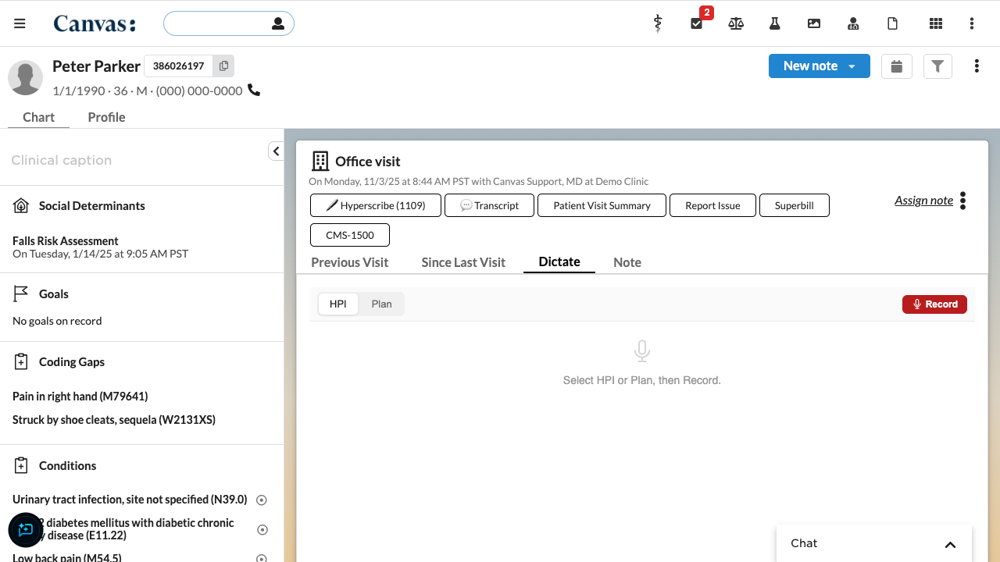
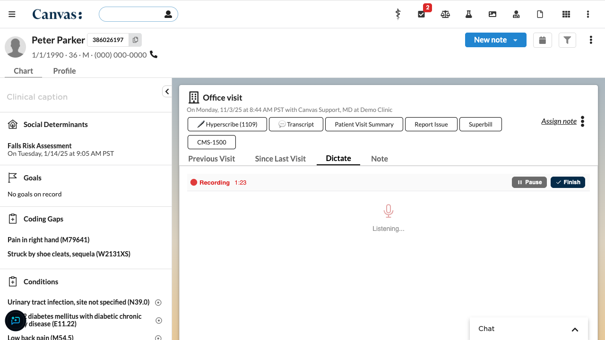
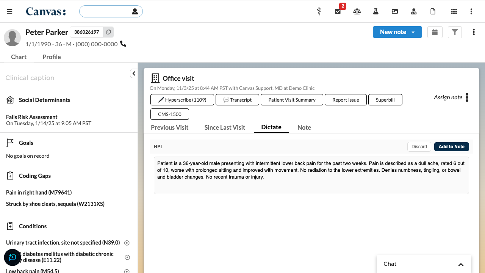

# Voice Dictation

## What it does

Adds a "Dictate" tab to patient notes where providers can record voice dictation and create HPI (History of Present Illness) or Plan commands from the transcript. Audio is transcribed using ElevenLabs Scribe v1 speech-to-text. After recording, providers can review and edit the transcript before adding it to the note as a command.

## Problem it solves

Providers often prefer speaking over typing when documenting clinical encounters. Without dictation, they must manually type narrative text into HPI and Plan commands, which slows down charting. This plugin lets providers dictate directly into their notes with a familiar record/pause/resume workflow, reducing documentation time.

## Who it's for

Any provider who documents patient encounters in Canvas notes — primary care, specialists, and other clinicians who write HPI and Plan narratives.

## How to install

```bash
canvas install voice_dictation --host <your-instance>
canvas config set voice_dictation ELEVENLABS_API_KEY=<your-key> --host <your-instance>
```

## Configuration

| Secret | Description |
|--------|-------------|
| `ELEVENLABS_API_KEY` | Your ElevenLabs API key. Get one at [elevenlabs.io](https://elevenlabs.io). Required for transcription. |

No other configuration is needed. The plugin works with any note type.

## How it works

1. Open a patient note — the **Dictate** tab appears alongside other note tabs
2. Select **HPI** or **Plan** to choose the command type
3. Click **Record** and speak your dictation
4. Use **Pause** and **Resume** as needed
5. Click **Finish** (two clicks to confirm) to send audio for transcription
6. Review and edit the transcript in the text area
7. Click **Add to Note** to create the command

The recording dot pulses with your voice level. If no audio is detected for 7.5 seconds, a warning banner appears prompting you to check your microphone.

## Screenshots


*Select HPI or Plan, then click Record*


*Audio level dot pulses while recording, with Pause and Finish controls*


*Review and edit the transcript before adding to the note*
