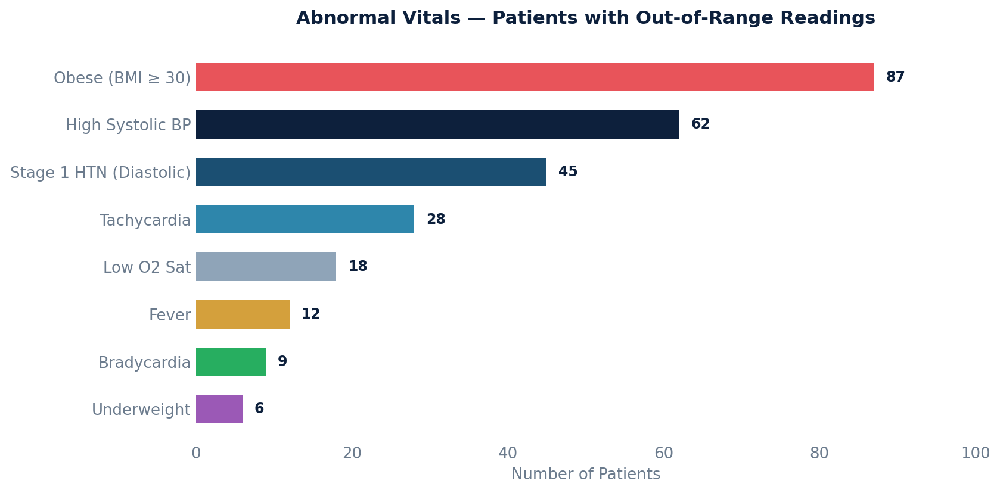

# Abnormal Vitals Report

Patients with out-of-range vital signs based on their most recent reading. Uses standard clinical thresholds to flag abnormalities (e.g., systolic > 140, pulse > 100, O2 sat < 95%, BMI >= 30). Only rows with an abnormality are returned.

## SQL

```sql
SELECT
    patient_id,
    patient_key,
    first_name,
    last_name,
    sign            AS vital_type,
    value,
    units,
    date_recorded,
    CASE
        WHEN sign = 'systole'           AND CAST(value AS NUMERIC) > 140   THEN 'High Systolic BP (> 140)'
        WHEN sign = 'systole'           AND CAST(value AS NUMERIC) < 90    THEN 'Low Systolic BP (< 90)'
        WHEN sign = 'diastole'          AND CAST(value AS NUMERIC) > 90    THEN 'High Diastolic BP (> 90)'
        WHEN sign = 'diastole'          AND CAST(value AS NUMERIC) < 60    THEN 'Low Diastolic BP (< 60)'
        WHEN sign = 'pulse'             AND CAST(value AS NUMERIC) > 100   THEN 'Tachycardia (> 100)'
        WHEN sign = 'pulse'             AND CAST(value AS NUMERIC) < 60    THEN 'Bradycardia (< 60)'
        WHEN sign = 'oxygen_saturation' AND CAST(value AS NUMERIC) < 95   THEN 'Low O2 Saturation (< 95%)'
        WHEN sign = 'body_temperature'  AND CAST(value AS NUMERIC) > 100.4 THEN 'Fever (> 100.4°F)'
        WHEN sign = 'respiration_rate'  AND CAST(value AS NUMERIC) > 20   THEN 'High Resp Rate (> 20)'
        WHEN sign = 'respiration_rate'  AND CAST(value AS NUMERIC) < 12   THEN 'Low Resp Rate (< 12)'
        WHEN sign = 'bmi'              AND CAST(value AS NUMERIC) >= 30   THEN 'Obese (BMI >= 30)'
        WHEN sign = 'bmi'              AND CAST(value AS NUMERIC) < 18.5  THEN 'Underweight (BMI < 18.5)'
    END AS abnormality
FROM (
    SELECT
        p.id            AS patient_id,
        p.key           AS patient_key,
        p.first_name,
        p.last_name,
        vs.sign,
        vs.value,
        vs.units,
        vs.date_recorded,
        ROW_NUMBER() OVER (PARTITION BY p.id, vs.sign ORDER BY vs.date_recorded DESC) AS rn
    FROM api_vitalsign vs
    JOIN api_vitalsignreading vsr ON vs.reading_id = vsr.id
    JOIN api_patient p           ON vsr.patient_id = p.id
    WHERE vsr.deleted = FALSE
      AND vsr.entered_in_error_id IS NULL
      AND vsr.committer_id IS NOT NULL
      AND vs.sign IN (
          'systole', 'diastole', 'pulse',
          'oxygen_saturation', 'body_temperature',
          'respiration_rate', 'bmi'
      )
      AND vs.value ~ '^\d+\.?\d*'   -- only numeric values
) latest
WHERE rn = 1
  AND (
      (sign = 'systole'           AND (CAST(value AS NUMERIC) > 140 OR CAST(value AS NUMERIC) < 90))
   OR (sign = 'diastole'          AND (CAST(value AS NUMERIC) > 90  OR CAST(value AS NUMERIC) < 60))
   OR (sign = 'pulse'             AND (CAST(value AS NUMERIC) > 100 OR CAST(value AS NUMERIC) < 60))
   OR (sign = 'oxygen_saturation' AND  CAST(value AS NUMERIC) < 95)
   OR (sign = 'body_temperature'  AND  CAST(value AS NUMERIC) > 100.4)
   OR (sign = 'respiration_rate'  AND (CAST(value AS NUMERIC) > 20 OR CAST(value AS NUMERIC) < 12))
   OR (sign = 'bmi'              AND (CAST(value AS NUMERIC) >= 30 OR CAST(value AS NUMERIC) < 18.5))
  )
ORDER BY last_name, first_name, sign;
```

## Columns Returned

| Column | Description |
|--------|-------------|
| `patient_id` | Internal patient ID |
| `patient_key` | Patient MRN / external key |
| `first_name` | Patient first name |
| `last_name` | Patient last name |
| `vital_type` | Vital sign type |
| `value` | Most recent recorded value |
| `units` | Unit of measure |
| `date_recorded` | Date/time of the reading |
| `abnormality` | Description of the out-of-range finding |

## Abnormality Thresholds

| Vital | Low Threshold | High Threshold |
|-------|--------------|----------------|
| Systolic BP | < 90 mmHg | > 140 mmHg |
| Diastolic BP | < 60 mmHg | > 90 mmHg |
| Pulse | < 60 bpm (bradycardia) | > 100 bpm (tachycardia) |
| O2 Saturation | < 95% | — |
| Temperature | — | > 100.4°F (fever) |
| Respiration Rate | < 12 breaths/min | > 20 breaths/min |
| BMI | < 18.5 (underweight) | >= 30 (obese) |

## Sample Output

*Synthetic data for illustration purposes.*

| Patient          | Vital Type   | Value  | Units  | Date       | Abnormality              |
|------------------|-------------|-------:|--------|------------|--------------------------|
| Adams, Karen     | bmi         |  32.4  |        | 2026-02-10 | Obese (BMI >= 30)        |
| Chen, Robert     | systole     |   152  | mmHg   | 2026-02-08 | High Systolic BP (> 140) |
| Garcia, Maria    | pulse       |   108  | bpm    | 2026-02-12 | Tachycardia (> 100)      |
| Johnson, David   | oxygen_sat  |    92  | %      | 2026-02-05 | Low O2 Saturation (< 95%)|
| Miller, Sarah    | body_temp   | 101.2  | °F     | 2026-02-14 | Fever (> 100.4°F)        |
| Park, James      | diastole    |    94  | mmHg   | 2026-02-11 | High Diastolic BP (> 90) |
| Wilson, Emily    | bmi         |  17.8  |        | 2026-01-28 | Underweight (BMI < 18.5) |
| Young, Michael   | pulse       |    52  | bpm    | 2026-02-09 | Bradycardia (< 60)       |

### Visualization



## Notes

- Only each patient's **most recent** reading per vital type is evaluated.
- Non-numeric values are excluded via regex filter (`value ~ '^\d+\.?\d*'`).
- Adjust thresholds in the `CASE` and `WHERE` clauses to match your organization's clinical protocols.
