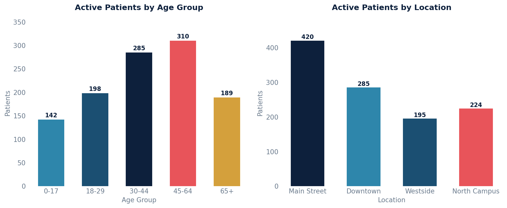

# Active Patient List

All active patients with key demographics, default provider, and default location.

## SQL

```sql
SELECT
    p.id              AS patient_id,
    p.key             AS patient_key,
    p.mrn,
    p.first_name,
    p.last_name,
    p.birth_date,
    DATE_PART('year', AGE(CURRENT_DATE, p.birth_date))::int AS age,
    p.sex_at_birth,
    p.sex,
    p.biological_race_terms  AS race,
    p.cultural_ethnicity_terms AS ethnicity,
    s.first_name || ' ' || s.last_name AS default_provider,
    loc.full_name     AS default_location
FROM api_patient p
LEFT JOIN api_staff s           ON s.id   = p.default_provider_id
LEFT JOIN api_practicelocation loc ON loc.id = p.default_location_id
WHERE p.active = TRUE
  AND p.under_construction = FALSE
ORDER BY p.last_name, p.first_name;
```

## Columns Returned

| Column | Description |
|--------|-------------|
| `patient_id` | Internal patient identifier |
| `patient_key` | Unique patient key |
| `mrn` | Medical record number |
| `first_name` | Patient's first name |
| `last_name` | Patient's last name |
| `birth_date` | Date of birth |
| `age` | Calculated age in years |
| `sex_at_birth` | Sex at birth |
| `sex` | Current sex/gender |
| `race` | Biological race terms (array) |
| `ethnicity` | Cultural ethnicity terms (array) |
| `default_provider` | Assigned default provider's full name |
| `default_location` | Assigned default practice location |

## Sample Output

*Synthetic data for illustration purposes.*

| Patient Key | Name           | DOB        | Age | Sex | Provider        | Location       |
|-------------|----------------|------------|----:|-----|-----------------|----------------|
| PT-10042    | Adams, Karen   | 1985-03-14 |  40 | F   | Dr. Sarah Chen  | Main Street    |
| PT-10038    | Chen, Robert   | 1952-11-22 |  73 | M   | Dr. James Wilson| Downtown       |
| PT-10035    | Garcia, Maria  | 1990-07-08 |  35 | F   | Dr. Maria Lopez | Westside       |
| PT-10031    | Johnson, David | 1968-01-30 |  58 | M   | Dr. David Park  | North Campus   |
| PT-10028    | Miller, Sarah  | 2010-05-19 |  15 | F   | Dr. Sarah Chen  | Main Street    |
| PT-10024    | Park, James    | 1975-09-03 |  50 | M   | Dr. James Wilson| Downtown       |

### Visualization



## Notes

- Patients still being built in the system are excluded via `under_construction = FALSE`.
- Patients with no assigned provider or location will show NULL in those columns.
