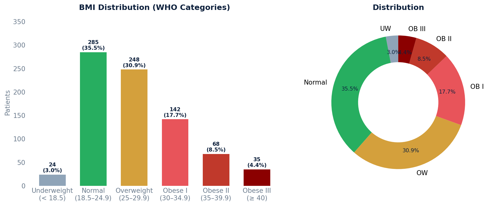

# BMI Distribution Report

Patient population breakdown by WHO BMI categories. Uses each patient's most recent BMI reading to assign a category and shows both count and percentage.

## SQL

```sql
SELECT
    bmi_category,
    patient_count,
    ROUND(100.0 * patient_count / SUM(patient_count) OVER (), 1) AS pct_of_total
FROM (
    SELECT
        CASE
            WHEN CAST(value AS NUMERIC) < 18.5                          THEN '1 - Underweight (< 18.5)'
            WHEN CAST(value AS NUMERIC) >= 18.5 AND CAST(value AS NUMERIC) < 25  THEN '2 - Normal (18.5–24.9)'
            WHEN CAST(value AS NUMERIC) >= 25   AND CAST(value AS NUMERIC) < 30  THEN '3 - Overweight (25–29.9)'
            WHEN CAST(value AS NUMERIC) >= 30   AND CAST(value AS NUMERIC) < 35  THEN '4 - Obese Class I (30–34.9)'
            WHEN CAST(value AS NUMERIC) >= 35   AND CAST(value AS NUMERIC) < 40  THEN '5 - Obese Class II (35–39.9)'
            WHEN CAST(value AS NUMERIC) >= 40                           THEN '6 - Obese Class III (≥ 40)'
        END AS bmi_category,
        COUNT(DISTINCT patient_id) AS patient_count
    FROM (
        SELECT
            vsr.patient_id,
            vs.value,
            ROW_NUMBER() OVER (PARTITION BY vsr.patient_id ORDER BY vs.date_recorded DESC) AS rn
        FROM api_vitalsign vs
        JOIN api_vitalsignreading vsr ON vs.reading_id = vsr.id
        WHERE vsr.deleted = FALSE
          AND vsr.entered_in_error_id IS NULL
          AND vsr.committer_id IS NOT NULL
          AND vs.sign = 'bmi'
          AND vs.value ~ '^\d+\.?\d*'
    ) most_recent
    WHERE rn = 1
    GROUP BY bmi_category
) categorized
ORDER BY bmi_category;
```

## Columns Returned

| Column | Description |
|--------|-------------|
| `bmi_category` | WHO BMI classification bucket |
| `patient_count` | Number of patients in this category |
| `pct_of_total` | Percentage of total patient population |

## WHO BMI Categories

| Category | BMI Range |
|----------|-----------|
| Underweight | < 18.5 |
| Normal | 18.5 – 24.9 |
| Overweight | 25 – 29.9 |
| Obese Class I | 30 – 34.9 |
| Obese Class II | 35 – 39.9 |
| Obese Class III | ≥ 40 |

## Sample Output

*Synthetic data for illustration purposes.*

| BMI Category                  | Patients | % of Total |
|-------------------------------|--------:|-----------:|
| 1 - Underweight (< 18.5)     |      24 |       3.0% |
| 2 - Normal (18.5–24.9)       |     285 |      35.5% |
| 3 - Overweight (25–29.9)     |     248 |      30.9% |
| 4 - Obese Class I (30–34.9)  |     142 |      17.7% |
| 5 - Obese Class II (35–39.9) |      68 |       8.5% |
| 6 - Obese Class III (≥ 40)   |      35 |       4.4% |

### Visualization



## Notes

- Uses each patient's **most recent** BMI reading only.
- Non-numeric BMI values are excluded via regex filter.
- Categories are prefixed with numbers (1–6) to ensure correct sort order.
