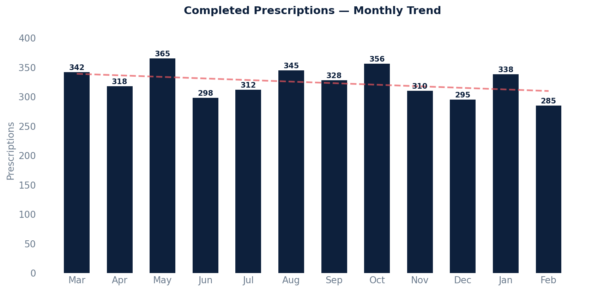

# Completed Prescriptions

Retrieves all prescriptions that have been committed (finalized), filtering out deleted prescriptions, uncommitted drafts, and test patient records.

Only includes medications coded in the FDB Health system.

## SQL

```sql
SELECT
    ap.mrn AS patient_medrecordnumber,
    ap.key AS patient_key,
    ap.first_name AS patient_first_name,
    ap.last_name AS patient_last_name,
    ap.birth_date AS patient_DOB,
    DATE(rx.written_date) AS written_date,
    am.display AS medication_display,
    rx.sig_original_input AS SIG,
    rx.dispense_quantity AS quantity_to_dispense,
    rx.count_of_refills_allowed AS refills,
    rx.status AS erx_status,
    st.first_name || ' ' || st.last_name AS prescriber_name
FROM
    api_prescription rx
LEFT JOIN api_patient ap ON rx.patient_id = ap.id
LEFT JOIN public.api_medicationcoding am ON rx.medication_id = am.medication_id
LEFT JOIN public.api_medication a ON rx.medication_id = a.id
LEFT JOIN public.api_staff st ON rx.prescriber_id = st.id
WHERE
    rx.committer_id IS NOT NULL
    AND rx.deleted = 'false'
    AND rx.entered_in_error_id IS NULL
    AND ap.last_name NOT ILIKE '%test%'
    AND rx.prescriber_id IS NOT NULL
    AND am.system = 'http://www.fdbhealth.com/';
```

## Columns Returned

| Column | Description |
|--------|-------------|
| `patient_medrecordnumber` | Patient's medical record number |
| `patient_key` | Unique patient identifier |
| `patient_first_name` | Patient's first name |
| `patient_last_name` | Patient's last name |
| `patient_DOB` | Patient's date of birth |
| `written_date` | Date the prescription was written |
| `medication_display` | Display name of the prescribed medication |
| `SIG` | Original SIG (dosing instructions) as entered |
| `quantity_to_dispense` | Quantity to dispense |
| `refills` | Number of refills allowed |
| `erx_status` | Electronic prescribing status |
| `prescriber_name` | Full name of the prescriber |

## Sample Output

*Synthetic data for illustration purposes.*

| MRN    | Patient        | Written    | Medication                   | SIG                          | Qty | Refills | Prescriber       |
|--------|----------------|------------|------------------------------|------------------------------|----:|--------:|------------------|
| 100042 | Adams, Karen   | 2026-02-15 | Lisinopril 10mg Tablet       | Take 1 tablet by mouth daily |  30 |       5 | Dr. Sarah Chen   |
| 100038 | Chen, Robert   | 2026-02-12 | Metformin 500mg Tablet       | Take 1 tablet twice daily    |  60 |       3 | Dr. James Wilson |
| 100035 | Garcia, Maria  | 2026-02-10 | Albuterol 90mcg Inhaler      | Inhale 2 puffs every 4-6 hrs |   1 |       2 | Dr. Maria Lopez  |
| 100031 | Johnson, David | 2026-02-08 | Atorvastatin 20mg Tablet     | Take 1 tablet at bedtime     |  30 |       5 | Dr. David Park   |
| 100028 | Miller, Sarah  | 2026-02-05 | Amoxicillin 500mg Capsule    | Take 1 capsule 3 times daily |  21 |       0 | Dr. Sarah Chen   |

### Visualization



## Notes

- Test patients (last name containing "test") are excluded.
- Only committed prescriptions with a valid prescriber are included.
- Medication coding is filtered to the FDB Health system (`http://www.fdbhealth.com/`).
