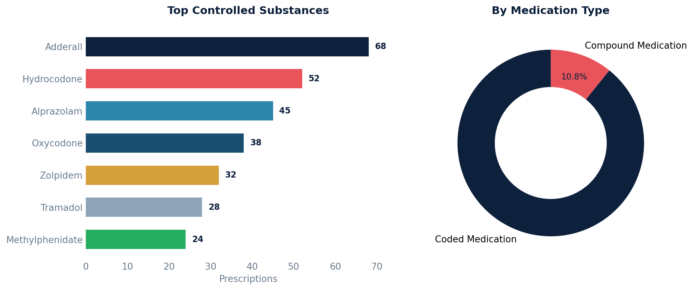

# Controlled Substance Report

Identifies all controlled substance prescriptions from two sources: coded medications flagged as EPCS, and compound medications with an explicit DEA schedule.

## SQL

```sql
-- Coded medication prescriptions flagged as EPCS
SELECT
    'Coded Medication'                       AS medication_type,
    mc.display                               AS medication_name,
    m.national_drug_code                     AS ndc,
    p.is_epcs                                AS is_epcs,
    s.first_name || ' ' || s.last_name       AS prescriber_name,
    p.patient_id,
    p.written_date,
    p.status,
    p.dispense_quantity,
    p.count_of_refills_allowed,
    p.pharmacy_name
FROM api_prescription p
JOIN api_medication m ON p.medication_id = m.id
JOIN api_medicationcoding mc ON mc.medication_id = m.id
LEFT JOIN api_staff s ON p.prescriber_id = s.id
WHERE p.deleted = false
  AND p.committer_id IS NOT NULL
  AND p.entered_in_error_id IS NULL
  AND p.is_epcs = true

UNION ALL

-- Compound medication prescriptions with an explicit controlled substance schedule
SELECT
    'Compound Medication'                    AS medication_type,
    cm.formulation                           AS medication_name,
    cm.controlled_substance_ndc              AS ndc,
    NULL::boolean                            AS is_epcs,
    s.first_name || ' ' || s.last_name       AS prescriber_name,
    p.patient_id,
    p.written_date,
    p.status,
    p.dispense_quantity,
    p.count_of_refills_allowed,
    p.pharmacy_name
FROM api_prescription p
JOIN api_compoundmedication cm ON p.compound_medication_id = cm.id
LEFT JOIN api_staff s ON p.prescriber_id = s.id
WHERE p.deleted = false
  AND p.committer_id IS NOT NULL
  AND p.entered_in_error_id IS NULL
  AND cm.controlled_substance <> 'N'

ORDER BY written_date DESC;
```

## Columns Returned

| Column | Description |
|--------|-------------|
| `medication_type` | "Coded Medication" or "Compound Medication" |
| `medication_name` | Drug name (display name or compound formulation) |
| `ndc` | National Drug Code (or controlled substance NDC for compounds) |
| `is_epcs` | Whether this is an EPCS prescription (NULL for compounds) |
| `prescriber_name` | Prescriber's full name |
| `patient_id` | Internal patient identifier |
| `written_date` | Date the prescription was written |
| `status` | Current e-prescribing status |
| `dispense_quantity` | Quantity to dispense |
| `count_of_refills_allowed` | Number of refills allowed |
| `pharmacy_name` | Name of the pharmacy |

## Sample Output

*Synthetic data for illustration purposes.*

| Type              | Medication               | NDC           | EPCS | Prescriber       | Written    | Qty | Refills | Pharmacy          |
|-------------------|--------------------------|---------------|:----:|------------------|------------|----:|--------:|-------------------|
| Coded Medication  | Adderall 20mg Tablet     | 57844-0120-01 | Yes  | Dr. Sarah Chen   | 2026-02-14 |  30 |       2 | CVS Pharmacy      |
| Coded Medication  | Hydrocodone 5-325mg Tab  | 00406-0123-01 | Yes  | Dr. James Wilson | 2026-02-12 |  20 |       0 | Walgreens         |
| Coded Medication  | Alprazolam 0.5mg Tablet  | 00781-1062-01 | Yes  | Dr. Maria Lopez  | 2026-02-10 |  30 |       1 | Rite Aid          |
| Compound Medication| Custom Ketamine 10% Cream|              |      | Dr. David Park   | 2026-02-08 |   1 |       2 | Compounding Rx    |

### Visualization



## Notes

- For coded medications, the DEA schedule is determined dynamically via an external drug database lookup and is not stored as a column. The `is_epcs` flag is the best on-record indicator.
- For compound medications, the controlled substance schedule (II–V) is stored directly in the `controlled_substance` field. A value of `'N'` means not controlled (excluded from this report).
