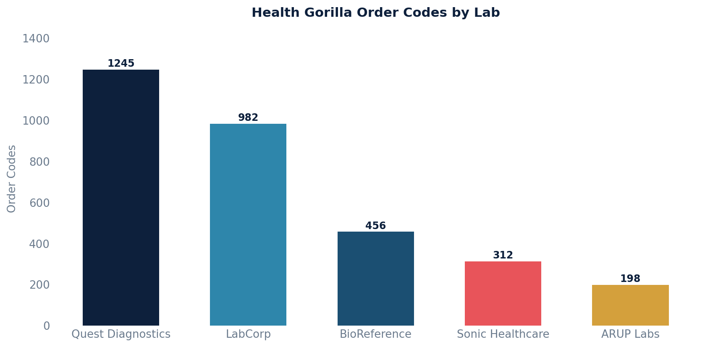

# Health Gorilla Order Codes

Retrieves Health Gorilla lab order codes, including associated order names and lab names.

Only includes records where the order code is not null.

## SQL

```sql
SELECT
    hgl.order_code AS health_gorilla_order_code,
    hgl.order_name,
    lab.name AS lab_name
FROM
    health_gorilla_labtest hgl
LEFT JOIN health_gorilla_lab lab ON hgl.lab_id = lab.id
WHERE
    hgl.order_code IS NOT NULL;
```

## Columns Returned

| Column | Description |
|--------|-------------|
| `health_gorilla_order_code` | The Health Gorilla order code for the lab test |
| `order_name` | Name of the lab order |
| `lab_name` | Name of the laboratory |

## Sample Output

*Synthetic data for illustration purposes.*

| Order Code | Order Name                        | Lab              |
|------------|-----------------------------------|------------------|
| HG-001245  | Comprehensive Metabolic Panel     | Quest Diagnostics|
| HG-001246  | Complete Blood Count (CBC)        | Quest Diagnostics|
| HG-002310  | Lipid Panel                       | LabCorp          |
| HG-002311  | Hemoglobin A1c                    | LabCorp          |
| HG-003102  | Thyroid Stimulating Hormone (TSH) | BioReference     |
| HG-004050  | Urinalysis                        | Sonic Healthcare |

### Visualization


