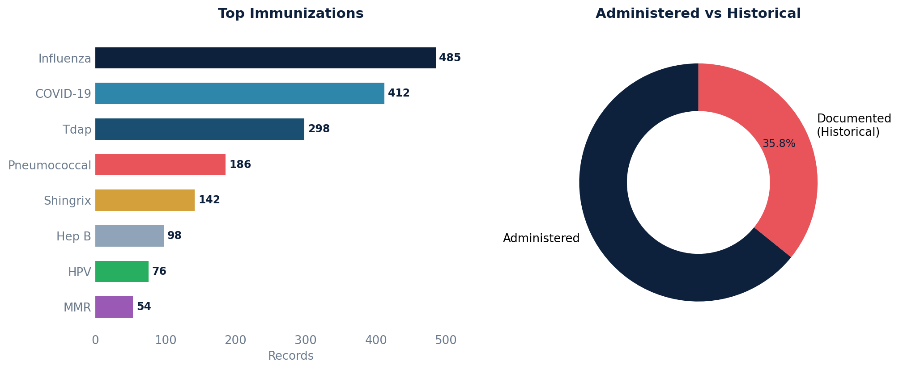

# Immunizations

Retrieves a combined list of historical (documented) and administered immunizations for active patients, including patient details and immunization metadata.

Uses a UNION to merge two sources: historical immunizations (from `api_immunizationstatement`, coded in CPT) and administered immunizations (from `api_immunization`, coded in CVX).

## SQL

```sql
SELECT
    patient_key,
    first_name,
    last_name,
    dob,
    immunization_type,
    code,
    CASE
        WHEN immunization_type = 'Documented (Historical)' THEN 'CPT'
        WHEN immunization_type = 'Administered' THEN 'CVX'
        ELSE NULL
    END AS coding_system,
    display,
    immunization_date,
    lot_number,
    manufacturer,
    expiration_date,
    signature

FROM (
    -- Historical immunizations
    SELECT
        ap.key AS patient_key,
        ap.first_name,
        ap.last_name,
        date(ap.birth_date) AS dob,
        'Documented (Historical)' AS immunization_type,
        a.code,
        a.display,
        ai.date AS immunization_date,
        NULL AS lot_number,
        NULL AS manufacturer,
        NULL AS expiration_date,
        NULL AS signature
    FROM
        api_immunizationstatement ai
    LEFT JOIN public.api_immunizationstatementcoding a ON ai.id = a.immunization_statement_id
    LEFT JOIN api_patient ap ON ai.patient_id = ap.id
    WHERE
        ai.deleted = 'false'
        AND ap.active = 'true'
        AND ai.entered_in_error_id IS NULL

    UNION ALL

    -- Administered immunizations
    SELECT
        ap.key AS patient_key,
        ap.first_name,
        ap.last_name,
        date(ap.birth_date) AS dob,
        'Administered' AS immunization_type,
        ic.code,
        ic.display,
        date(im.created) AS immunization_date,
        im.lot_number,
        im.manufacturer,
        im.exp_date_original AS expiration_date,
        im.sig_original AS signature
    FROM
        api_immunization im
    JOIN api_immunizationcoding ic ON im.id = ic.immunization_id
    JOIN api_patient ap ON im.patient_id = ap.id
    WHERE
        ap.active = 'true'
        AND im.deleted = 'false'
        AND im.entered_in_error_id IS NULL
) AS combined_immunizations
ORDER BY
    patient_key DESC,
    immunization_date DESC;
```

## Columns Returned

| Column | Description |
|--------|-------------|
| `patient_key` | Unique patient identifier |
| `first_name` | Patient's first name |
| `last_name` | Patient's last name |
| `dob` | Patient's date of birth |
| `immunization_type` | "Documented (Historical)" or "Administered" |
| `code` | Immunization code (CPT for historical, CVX for administered) |
| `coding_system` | Code system used — CPT or CVX |
| `display` | Display name of the immunization |
| `immunization_date` | Date the immunization was given or documented |
| `lot_number` | Lot number (administered only) |
| `manufacturer` | Manufacturer name (administered only) |
| `expiration_date` | Vaccine expiration date (administered only) |
| `signature` | Original signature (administered only) |

## Sample Output

*Synthetic data for illustration purposes.*

| Patient Key | Name          | Type                  | Code  | System | Vaccine                | Date       | Lot        | Manufacturer |
|-------------|---------------|-----------------------|-------|--------|------------------------|------------|------------|-------------|
| PT-10042    | Adams, Karen  | Administered          | 197   | CVX    | Influenza, injectable  | 2026-01-15 | FL2026A    | Sanofi      |
| PT-10042    | Adams, Karen  | Administered          | 213   | CVX    | COVID-19 (Moderna)     | 2025-10-08 | CM2025B    | Moderna     |
| PT-10038    | Chen, Robert  | Documented (Historical)| 90715 | CPT    | Tdap                   | 2024-06-20 |            |             |
| PT-10035    | Garcia, Maria | Administered          | 33    | CVX    | Pneumococcal (PCV13)   | 2025-11-12 | PC2025C    | Pfizer      |
| PT-10031    | Johnson, David| Administered          | 187   | CVX    | Shingrix (RZV)         | 2025-09-05 | SH2025A    | GSK         |

### Visualization



## Notes

- Historical immunizations will have NULL values for `lot_number`, `manufacturer`, `expiration_date`, and `signature`.
- Only active patients with non-deleted, non-EIE records are included.
