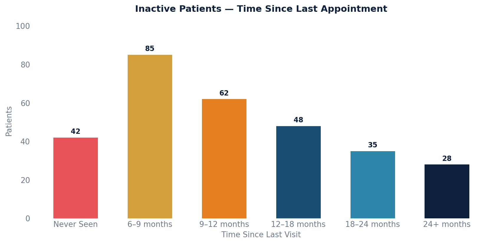

# Inactive Patient Report

Active patients who haven't had a completed appointment in the last 6 months (or have never been seen). Useful for identifying patients who may need outreach.

## SQL

```sql
SELECT
    p.id         AS patient_id,
    p.key        AS patient_key,
    p.mrn,
    p.first_name,
    p.last_name,
    p.birth_date,
    MAX(a.start_time)  AS last_appointment_date,
    DATE_PART('day', CURRENT_TIMESTAMP - MAX(a.start_time))::int AS days_since_last_visit
FROM api_patient p
LEFT JOIN api_appointment a
    ON a.patient_id = p.id
   AND a.status NOT IN ('cancelled', 'noshowed')
   AND a.entered_in_error_id IS NULL
   AND a.start_time <= CURRENT_TIMESTAMP
WHERE p.active = TRUE
  AND p.under_construction = FALSE
GROUP BY p.id, p.key, p.mrn, p.first_name, p.last_name, p.birth_date
HAVING MAX(a.start_time) < CURRENT_TIMESTAMP - INTERVAL '6 months'
    OR MAX(a.start_time) IS NULL
ORDER BY last_appointment_date ASC NULLS FIRST;
```

## Columns Returned

| Column | Description |
|--------|-------------|
| `patient_id` | Internal patient identifier |
| `patient_key` | Unique patient key |
| `mrn` | Medical record number |
| `first_name` | Patient's first name |
| `last_name` | Patient's last name |
| `birth_date` | Date of birth |
| `last_appointment_date` | Date/time of the most recent completed appointment (NULL if never seen) |
| `days_since_last_visit` | Number of days since the last visit (NULL if never seen) |

## Tips

- Adjust `INTERVAL '6 months'` to any desired threshold (e.g., `'3 months'`, `'12 months'`).
- Patients who have never had an appointment appear first (sorted with NULLs first).

## Sample Output

*Synthetic data for illustration purposes.*

| Patient Key | Name           | DOB        | Last Appointment    | Days Since |
|-------------|----------------|------------|---------------------|----------:|
| PT-10015    | Taylor, Robert |1982-04-12  |                     |           |
| PT-10019    | Brown, Lisa    |1975-11-28  |                     |           |
| PT-10023    | Wilson, Mark   |1968-07-03  | 2024-08-15 09:00    |       554 |
| PT-10027    | Lee, Jennifer  |1990-02-14  | 2025-01-22 14:30    |       394 |
| PT-10032    | Martinez, Ana  |1985-09-20  | 2025-05-10 10:00    |       286 |
| PT-10036    | Clark, James   |1958-12-05  | 2025-07-18 11:15    |       217 |

### Visualization



## Notes

- Only considers completed appointments — cancelled and no-showed appointments are excluded.
- Entered-in-error appointments are excluded.
- Future appointments are excluded (only past visits count).
