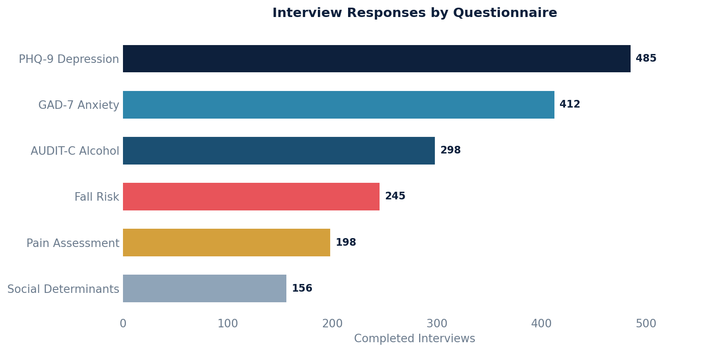

# Interview Responses

Retrieves completed interview responses, including patient details, questionnaire names, question names, and the selected response values.

Only includes committed interviews (finalized), excluding deleted or entered-in-error records.

## SQL

```sql
SELECT
    i.patient_id AS patient_id,
    i.created AS interview_created,
    i.note_id AS interview_note_id,
    q.name AS questionnaire_name,
    qn.name AS question_name,
    iq.response_option_value AS response_value
FROM
    api_interview i
LEFT JOIN public.api_interviewquestionresponse iq ON i.id = iq.interview_id
LEFT JOIN public.api_questionnaire q ON iq.questionnaire_id = q.id
LEFT JOIN public.api_question qn ON iq.question_id = qn.id
LEFT JOIN public.api_responseoption ro ON iq.response_option_id = ro.id
WHERE
    i.committer_id IS NOT NULL
    AND i.deleted = 'false'
    AND i.entered_in_error_id IS NULL
ORDER BY
    i.id DESC;
```

## Columns Returned

| Column | Description |
|--------|-------------|
| `patient_id` | Internal patient identifier |
| `interview_created` | Timestamp when the interview was created |
| `interview_note_id` | ID of the note the interview is associated with |
| `questionnaire_name` | Name of the questionnaire |
| `question_name` | Name of the specific question |
| `response_value` | The response option value selected by the patient |

## Sample Output

*Synthetic data for illustration purposes.*

| Patient ID | Created             | Note ID | Questionnaire      | Question              | Response |
|-----------:|---------------------|--------:|--------------------|-----------------------|----------|
|       1042 | 2026-02-15 10:30:00 |    5621 | PHQ-9 Depression   | Little interest?      | 2        |
|       1042 | 2026-02-15 10:30:00 |    5621 | PHQ-9 Depression   | Feeling down?         | 1        |
|       1038 | 2026-02-12 14:15:00 |    5598 | GAD-7 Anxiety      | Feeling nervous?      | 3        |
|       1035 | 2026-02-10 09:00:00 |    5584 | AUDIT-C Alcohol    | How often do you drink?| 1       |
|       1031 | 2026-02-08 11:45:00 |    5570 | Fall Risk           | Fallen in past year?  | No       |

### Visualization



## Notes

- Each row represents a single question-response pair. An interview with multiple questions will produce multiple rows.
- Results are sorted by most recent interview first.
