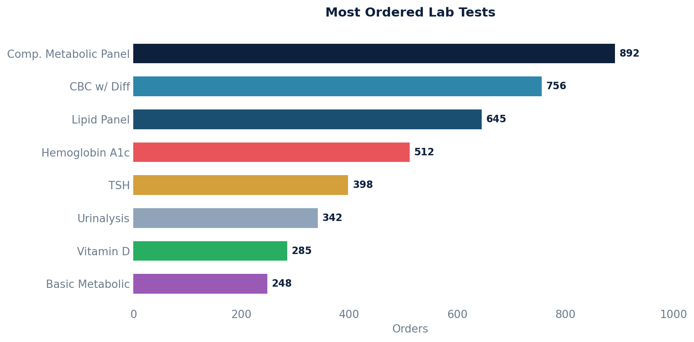

# Lab Test Order Count

Retrieves lab test counts grouped by test name, sorted in descending order by count.

Useful for understanding which lab tests are ordered most frequently.

## SQL

```sql
SELECT
    lt.ontology_test_name,
    COUNT(lt.ontology_test_name) AS test_count
FROM
    api_laborder lo
LEFT JOIN public.api_labtest lt ON lo.id = lt.order_id
GROUP BY
    lt.ontology_test_name
ORDER BY
    test_count DESC;
```

## Columns Returned

| Column | Description |
|--------|-------------|
| `ontology_test_name` | Name of the lab test from the ontology |
| `test_count` | Number of times this test has been ordered |

## Sample Output

*Synthetic data for illustration purposes.*

| Test Name                        | Count |
|----------------------------------|------:|
| Comprehensive Metabolic Panel    |   892 |
| CBC with Differential            |   756 |
| Lipid Panel                      |   645 |
| Hemoglobin A1c                   |   512 |
| Thyroid Stimulating Hormone      |   398 |
| Urinalysis, Complete             |   342 |
| Vitamin D, 25-Hydroxy            |   285 |
| Basic Metabolic Panel            |   248 |

### Visualization


