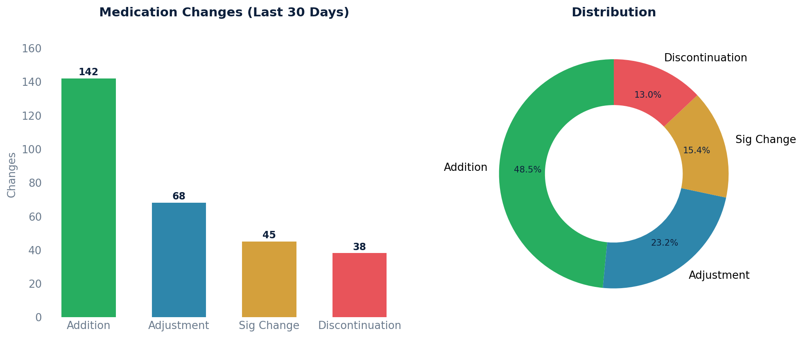

# Medication Changes Report

Combines four types of medication changes from the last 30 days: additions, adjustments, sig changes, and discontinuations.

## SQL

```sql
-- New medication additions (not refills or adjustments)
SELECT
    'Addition (Prescribed)'                  AS change_type,
    p.written_date                           AS change_date,
    mc.display                               AS medication_name,
    p.patient_id,
    s.first_name || ' ' || s.last_name       AS provider_name,
    p.sig_original_input                     AS directions,
    NULL                                     AS rationale
FROM api_prescription p
JOIN api_medication m ON p.medication_id = m.id
JOIN api_medicationcoding mc ON mc.medication_id = m.id
LEFT JOIN api_staff s ON p.prescriber_id = s.id
WHERE p.deleted = false
  AND p.committer_id IS NOT NULL
  AND p.entered_in_error_id IS NULL
  AND p.is_refill = false
  AND p.is_adjustment = false
  AND p.written_date >= NOW() - INTERVAL '30 days'

UNION ALL

-- Medication adjustments (dose/drug changes)
SELECT
    'Adjustment'                             AS change_type,
    p.written_date                           AS change_date,
    mc.display                               AS medication_name,
    p.patient_id,
    s.first_name || ' ' || s.last_name       AS provider_name,
    p.sig_original_input                     AS directions,
    NULL                                     AS rationale
FROM api_prescription p
JOIN api_medication m ON p.medication_id = m.id
JOIN api_medicationcoding mc ON mc.medication_id = m.id
LEFT JOIN api_staff s ON p.prescriber_id = s.id
WHERE p.deleted = false
  AND p.committer_id IS NOT NULL
  AND p.entered_in_error_id IS NULL
  AND p.is_adjustment = true
  AND p.written_date >= NOW() - INTERVAL '30 days'

UNION ALL

-- Medication sig changes (without a new prescription)
SELECT
    'Sig Change'                             AS change_type,
    chg.created                              AS change_date,
    mc.display                               AS medication_name,
    chg.patient_id,
    NULL                                     AS provider_name,
    chg.sig_original_input                   AS directions,
    NULL                                     AS rationale
FROM api_changemedication chg
JOIN api_medication m ON chg.medication_id = m.id
JOIN api_medicationcoding mc ON mc.medication_id = m.id
WHERE chg.deleted = false
  AND chg.committer_id IS NOT NULL
  AND chg.entered_in_error_id IS NULL
  AND chg.created >= NOW() - INTERVAL '30 days'

UNION ALL

-- Discontinuations (stopped medications)
SELECT
    'Discontinuation'                        AS change_type,
    sme.created                              AS change_date,
    mc.display                               AS medication_name,
    sme.patient_id,
    NULL                                     AS provider_name,
    NULL                                     AS directions,
    sme.rationale                            AS rationale
FROM api_stopmedicationevent sme
JOIN api_medication m ON sme.medication_id = m.id
JOIN api_medicationcoding mc ON mc.medication_id = m.id
WHERE sme.deleted = false
  AND sme.committer_id IS NOT NULL
  AND sme.entered_in_error_id IS NULL
  AND sme.created >= NOW() - INTERVAL '30 days'

ORDER BY change_date DESC;
```

## Columns Returned

| Column | Description |
|--------|-------------|
| `change_type` | Type of change: "Addition (Prescribed)", "Adjustment", "Sig Change", or "Discontinuation" |
| `change_date` | Date/time the change occurred |
| `medication_name` | Display name of the medication |
| `patient_id` | Internal patient identifier |
| `provider_name` | Provider who made the change (NULL for sig changes and discontinuations) |
| `directions` | SIG / dosing instructions (NULL for discontinuations) |
| `rationale` | Reason for discontinuation (NULL for other change types) |

## Sample Output

*Synthetic data for illustration purposes.*

| Change Type   | Date       | Medication               | Patient ID | Provider         | Directions                   | Rationale          |
|---------------|------------|--------------------------|------------|------------------|------------------------------|---------------------|
| Addition      | 2026-02-14 | Lisinopril 10mg Tablet   |       1042 | Dr. Sarah Chen   | Take 1 tablet daily          |                     |
| Adjustment    | 2026-02-12 | Metformin 500mg → 1000mg |       1038 | Dr. James Wilson | Take 1 tablet twice daily    |                     |
| Sig Change    | 2026-02-10 | Atorvastatin 20mg Tablet |       1035 |                  | Take at bedtime (was morning)|                     |
| Discontinuation| 2026-02-08| Hydrochlorothiazide 25mg |       1031 |                  |                              | Switched to ACE inh |
| Addition      | 2026-02-05 | Albuterol 90mcg Inhaler  |       1028 | Dr. Maria Lopez  | 2 puffs every 4-6 hrs PRN    |                     |

### Visualization



## Tips

- Adjust `INTERVAL '30 days'` to any desired lookback period.
- The four change types come from different source tables (see below).

## Source Tables

| Change Type | Source Table |
|-------------|-------------|
| Addition / Adjustment | `api_prescription` |
| Sig Change | `api_changemedication` |
| Discontinuation | `api_stopmedicationevent` |
