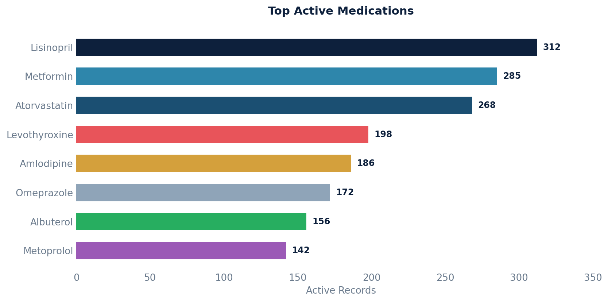

# Medications

Retrieves active patient medication records, including patient details, medication information, SIG (dosing instructions), and coding metadata.

Pulls SIG from either the prescription or medication statement, whichever is available.

## SQL

```sql
SELECT
    p.key AS patient_key,
    p.first_name AS patient_first_name,
    p.last_name AS patient_last_name,
    p.birth_date,
    mc.display AS med_name,
    m.quantity_qualifier_description,
    COALESCE(rx.sig_original_input, ms.sig_original_input) AS sig_original_input,
    m.status,
    DATE(m.created) AS created_date,
    DATE(m.end_date) AS end_date,
    m.national_drug_code AS representative_ndc,
    mc.code AS fdbhealth_code
FROM
    api_medication m
LEFT JOIN api_medicationcoding mc ON m.id = mc.medication_id
LEFT JOIN api_patient p ON m.patient_id = p.id
LEFT JOIN public.api_prescription rx ON m.id = rx.medication_id
LEFT JOIN public.api_medicationstatement ms ON m.id = ms.medication_id
WHERE
    ms.entered_in_error_id IS NULL
    AND ms.deleted = 'false'
    AND rx.deleted = 'false'
    AND rx.entered_in_error_id IS NULL;
```

## Columns Returned

| Column | Description |
|--------|-------------|
| `patient_key` | Unique patient identifier |
| `patient_first_name` | Patient's first name |
| `patient_last_name` | Patient's last name |
| `birth_date` | Patient's date of birth |
| `med_name` | Display name of the medication |
| `quantity_qualifier_description` | Description of the quantity qualifier |
| `sig_original_input` | Dosing instructions (from prescription or medication statement) |
| `status` | Current status of the medication |
| `created_date` | Date the medication record was created |
| `end_date` | End date of the medication (NULL if still active) |
| `representative_ndc` | National Drug Code |
| `fdbhealth_code` | FDB Health medication code |

## Sample Output

*Synthetic data for illustration purposes.*

| Patient Key | Name          | Medication              | SIG                          | Status | Created    | NDC           |
|-------------|---------------|-------------------------|------------------------------|--------|------------|---------------|
| PT-10042    | Adams, Karen  | Lisinopril 10mg Tablet  | Take 1 tablet by mouth daily | active | 2025-08-14 | 68180-0513-01 |
| PT-10038    | Chen, Robert  | Metformin 500mg Tablet  | Take 1 tablet twice daily    | active | 2024-03-22 | 00093-7214-01 |
| PT-10035    | Garcia, Maria | Albuterol 90mcg Inhaler | Inhale 2 puffs every 4-6 hrs | active | 2025-11-10 | 00173-0682-20 |
| PT-10031    | Johnson, David| Atorvastatin 20mg Tab   | Take 1 tablet at bedtime     | active | 2024-09-05 | 00378-3952-77 |
| PT-10028    | Miller, Sarah | Levothyroxine 50mcg Tab | Take 1 tablet every morning  | active | 2025-01-18 | 00781-5072-01 |

### Visualization



## Notes

- The SIG field uses `COALESCE` to pull from the prescription first, falling back to the medication statement.
- Excludes deleted and entered-in-error records from both prescriptions and medication statements.
