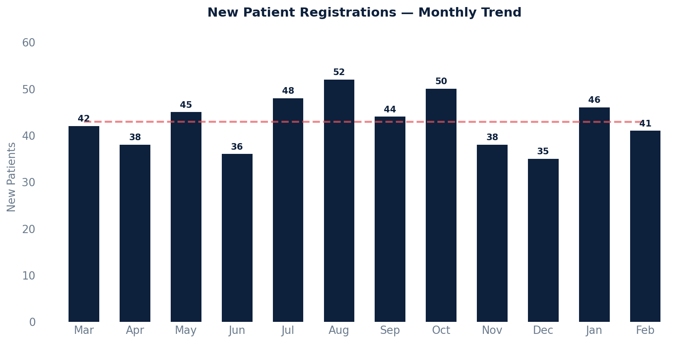

# New Patient Report

New patient registrations grouped by month over the last 12 months.

## SQL

```sql
SELECT
    DATE_TRUNC('month', p.created) AS registration_month,
    COUNT(*) AS new_patients
FROM api_patient p
WHERE p.under_construction = FALSE
  AND p.created >= CURRENT_DATE - INTERVAL '12 months'
GROUP BY DATE_TRUNC('month', p.created)
ORDER BY registration_month DESC;
```

## Columns Returned

| Column | Description |
|--------|-------------|
| `registration_month` | First day of the month the patients were registered |
| `new_patients` | Number of new patient registrations that month |

## Tips

- Change `'month'` in `DATE_TRUNC` to `'week'` or `'day'` for different granularity.
- For a specific date range instead of a rolling window, replace the `INTERVAL` filter:
  ```sql
  AND p.created >= '2024-01-01'
  AND p.created <  '2025-01-01'
  ```

## Sample Output

*Synthetic data for illustration purposes.*

| Registration Month | New Patients |
|-------------------|------------:|
| 2026-02-01        |          41 |
| 2026-01-01        |          46 |
| 2025-12-01        |          35 |
| 2025-11-01        |          38 |
| 2025-10-01        |          50 |
| 2025-09-01        |          44 |
| 2025-08-01        |          52 |
| 2025-07-01        |          48 |
| 2025-06-01        |          36 |
| 2025-05-01        |          45 |
| 2025-04-01        |          38 |
| 2025-03-01        |          42 |

### Visualization



## Notes

- Includes both active and inactive patients — this shows all registrations regardless of current status.
- Patients still being built in the system are excluded via `under_construction = FALSE`.
