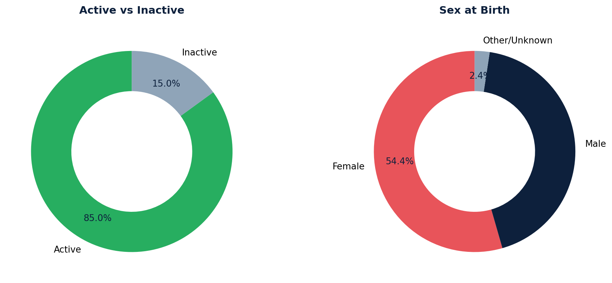

# Patient Demographics

Retrieves a list of patients with key demographic details including name, preferred name, date of birth, medical record number, birth sex, address, and contact information.

Contact details (home phone, mobile phone, email) are aggregated into separate columns.

## SQL

```sql
SELECT
    CASE
        WHEN ap.active = TRUE THEN 'Active'
        ELSE 'Inactive'
    END AS active_status,
    ap.key AS patient_key,
    ap.first_name || ' ' || ap.last_name AS patient_name,
    ap.nickname AS preferred_name,
    ap.birth_date AS DOB,
    ap.mrn AS patient_mrn,
    ap.sex_at_birth AS birth_sex,
    a.use AS address_use,
    a.type AS address_type,
    CONCAT_WS(' ', a.line1, a.line2, a.city || ', ' || a.state_code, a.postal_code) AS patient_address,
    MAX(CASE WHEN p.system = 'phone' AND p.use = 'home' THEN p.value END) AS home_phone,
    MAX(CASE WHEN p.system = 'phone' AND p.use = 'mobile' THEN p.value END) AS mobile_phone,
    MAX(CASE WHEN p.system = 'email' THEN p.value END) AS email_address
FROM api_patient ap
LEFT JOIN public.api_patientaddress a ON ap.id = a.patient_id
LEFT JOIN public.api_patientcontactpoint p ON ap.id = p.patient_id
WHERE ap.last_name NOT ILIKE '%zztest%'
    AND ap.first_name NOT LIKE '%zztest%'
GROUP BY
    ap.key, ap.first_name, ap.last_name, ap.nickname, ap.birth_date, ap.mrn,
    ap.sex_at_birth, ap.active,
    a.use, a.type, a.line1, a.line2, a.city, a.state_code, a.postal_code;
```

## Columns Returned

| Column | Description |
|--------|-------------|
| `active_status` | "Active" or "Inactive" |
| `patient_key` | Unique patient identifier |
| `patient_name` | Patient's full name |
| `preferred_name` | Patient's preferred/nickname |
| `DOB` | Date of birth |
| `patient_mrn` | Medical record number |
| `birth_sex` | Sex at birth |
| `address_use` | Address use type (e.g., home, work) |
| `address_type` | Address type |
| `patient_address` | Full formatted address |
| `home_phone` | Home phone number |
| `mobile_phone` | Mobile phone number |
| `email_address` | Email address |

## Sample Output

*Synthetic data for illustration purposes.*

| Status | Patient Key | Name          | Preferred | DOB        | MRN    | Sex | Address                            | Mobile       | Email                   |
|--------|-------------|---------------|-----------|------------|--------|-----|------------------------------------|--------------|-------------------------|
| Active | PT-10042    | Karen Adams   | Karen     | 1985-03-14 | 100042 | F   | 123 Oak St, Springfield, IL 62704  | 555-0142     | kadams@email.com        |
| Active | PT-10038    | Robert Chen   |           | 1952-11-22 | 100038 | M   | 456 Elm Ave, Springfield, IL 62701 | 555-0138     | rchen@email.com         |
| Active | PT-10035    | Maria Garcia  | Mari      | 1990-07-08 | 100035 | F   | 789 Pine Rd, Springfield, IL 62702 | 555-0135     |                         |
| Active | PT-10031    | David Johnson |           | 1968-01-30 | 100031 | M   | 321 Maple Dr, Springfield, IL 62703| 555-0131     | djohnson@email.com      |

### Visualization



## Notes

- Test patients (names containing "zztest") are excluded.
- Patients with multiple addresses will appear on multiple rows.
- Contact information is pivoted so phone and email appear as separate columns rather than separate rows.
