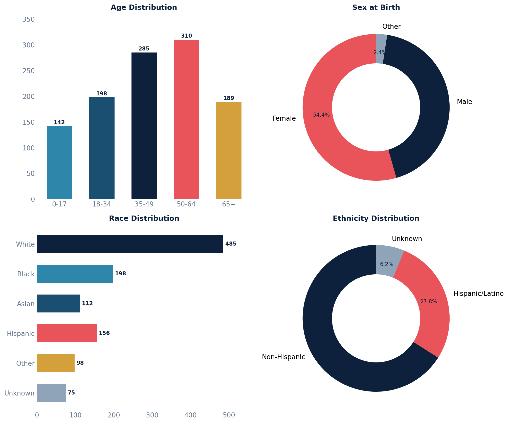

# Patient Demographics Breakdown

Age-group, sex, race, and ethnicity distribution breakdowns for all active patients. Contains four separate queries — run each one independently.

## Age Distribution

```sql
SELECT
    CASE
        WHEN DATE_PART('year', AGE(CURRENT_DATE, p.birth_date)) < 18  THEN '0-17'
        WHEN DATE_PART('year', AGE(CURRENT_DATE, p.birth_date)) BETWEEN 18 AND 34 THEN '18-34'
        WHEN DATE_PART('year', AGE(CURRENT_DATE, p.birth_date)) BETWEEN 35 AND 49 THEN '35-49'
        WHEN DATE_PART('year', AGE(CURRENT_DATE, p.birth_date)) BETWEEN 50 AND 64 THEN '50-64'
        WHEN DATE_PART('year', AGE(CURRENT_DATE, p.birth_date)) >= 65  THEN '65+'
        ELSE 'Unknown'
    END AS age_group,
    COUNT(*) AS patient_count
FROM api_patient p
WHERE p.active = TRUE AND p.under_construction = FALSE
GROUP BY age_group
ORDER BY age_group;
```

| Column | Description |
|--------|-------------|
| `age_group` | Age bucket (0-17, 18-34, 35-49, 50-64, 65+) |
| `patient_count` | Number of active patients in that age group |

## Sex Distribution

```sql
SELECT
    p.sex_at_birth,
    COUNT(*) AS patient_count
FROM api_patient p
WHERE p.active = TRUE AND p.under_construction = FALSE
GROUP BY p.sex_at_birth
ORDER BY patient_count DESC;
```

| Column | Description |
|--------|-------------|
| `sex_at_birth` | Sex at birth value (e.g., male, female) |
| `patient_count` | Number of active patients |

## Race Distribution

```sql
SELECT
    UNNEST(p.biological_race_terms) AS race,
    COUNT(*) AS patient_count
FROM api_patient p
WHERE p.active = TRUE AND p.under_construction = FALSE
GROUP BY race
ORDER BY patient_count DESC;
```

| Column | Description |
|--------|-------------|
| `race` | Individual race value |
| `patient_count` | Number of active patients with that race |

## Ethnicity Distribution

```sql
SELECT
    UNNEST(p.cultural_ethnicity_terms) AS ethnicity,
    COUNT(*) AS patient_count
FROM api_patient p
WHERE p.active = TRUE AND p.under_construction = FALSE
GROUP BY ethnicity
ORDER BY patient_count DESC;
```

| Column | Description |
|--------|-------------|
| `ethnicity` | Individual ethnicity value |
| `patient_count` | Number of active patients with that ethnicity |

## Sample Output

*Synthetic data for illustration purposes.*

### Age Distribution

| Age Group | Patients |
|-----------|--------:|
| 0-17      |     142 |
| 18-34     |     198 |
| 35-49     |     285 |
| 50-64     |     310 |
| 65+       |     189 |

### Sex Distribution

| Sex at Birth | Patients |
|-------------|--------:|
| Female       |     612 |
| Male         |     485 |
| Other        |      27 |

### Race Distribution

| Race     | Patients |
|----------|--------:|
| White    |     485 |
| Black    |     198 |
| Hispanic |     156 |
| Asian    |     112 |
| Other    |      98 |
| Unknown  |      75 |

### Ethnicity Distribution

| Ethnicity        | Patients |
|-----------------|--------:|
| Non-Hispanic     |     742 |
| Hispanic/Latino  |     312 |
| Unknown          |      70 |

### Visualization



## Notes

- Race and ethnicity are stored as arrays — a patient with multiple values will appear in multiple rows. Use `UNNEST` to expand them.
- `sex_at_birth` stores values like `male`, `female`, etc.
- Patients still being built in the system are excluded via `under_construction = FALSE`.
